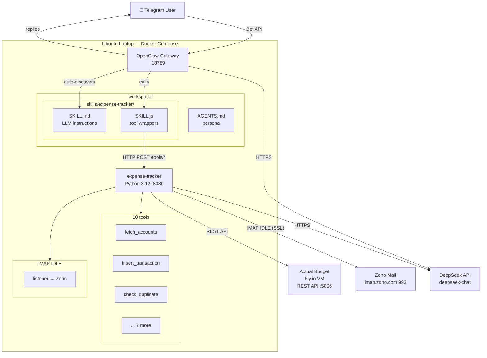

# OpenClaw

LLM-powered personal finance assistant — track expenses from Telegram, auto-ingest bank alerts from email, all into Actual Budget.

## Architecture



### How it works

1. **You message the Telegram bot** → "Track S$12.80 at Toast Box from DBS Yuu"
2. **Gateway receives it** → agent loads your persona + expense-tracker skill
3. **LLM decides what to do** → calls `fetch_accounts`, `fetch_categories`, `check_duplicate`, `insert_transaction`
4. **Python tools execute** → REST calls to Actual Budget, hash lookup in dedup SQLite
5. **Agent replies on Telegram** → "✅ Done! S$12.80 at Toast Box under DBS Yuu (Food)"

**Bonus:** The expense-tracker also runs IMAP IDLE independently — bank alerts forwarded to your Zoho burner inbox are auto-ingested as transactions, no chat needed.

### Repository Structure

```
darren-openclaw/
├── gateway/                     # OpenClaw Gateway config + skills
│   ├── openclaw.json            # Gateway config (channels, model, skills)
│   ├── docker-compose.yml       # Gateway + expense-tracker containers
│   ├── workspace/               # Agent state (sessions, skills, persona)
│   │   ├── AGENTS.md            # Agent personality and behavioral rules
│   │   └── skills/expense-tracker/
│   │       ├── SKILL.md         # LLM instructions for expense tracking
│   │       └── SKILL.js         # Tool wrappers → HTTP calls to Python
│   └── .speckit/                # Spec-Kit artifacts (spec, plan, tasks)
├── modules/expense-tracker/      # Python tool backend
│   ├── src/                      # Source code (agent, client, extractors, imap)
│   ├── tests/                    # Test suite (27 unit + 9 integration)
│   ├── config/                   # Static config (non-secret)
│   ├── docker/Dockerfile         # Container image
│   ├── .env.example              # Environment variable template
│   └── .speckit/                 # Spec-Kit artifacts
└── design.md                     # Full architecture document with Mermaid diagrams
```

---

## Setup

### Prerequisites

- **Docker** and **Docker Compose** installed
- A **Telegram account** (to create a bot and chat with the agent)
- API keys for: **DeepSeek**, **Actual Budget**, **Zoho Mail**

### Step 1: Clone and configure environment

```bash
git clone https://github.com/darrencjh8/darren-openclaw.git
cd darren-openclaw

# Copy and fill in the expense-tracker environment variables
cp modules/expense-tracker/.env.example modules/expense-tracker/.env
```

Edit `modules/expense-tracker/.env` with your credentials:

```env
DEEPSEEK_API_KEY=sk-...
ACTUAL_BUDGET_URL=https://your-actual-budget.fly.dev
ACTUAL_BUDGET_PASSWORD=...
ACTUAL_BUDGET_FILE=my-budget
IMAP_HOST=imap.zoho.com
IMAP_USERNAME=your-burner@zohomail.com
IMAP_PASSWORD=zoho-app-password
NOTIFICATION_SMTP_HOST=smtp.zoho.com
NOTIFICATION_EMAIL=your-main@email.com
```

### Step 2: Create a Telegram bot

1. Open Telegram, message [@BotFather](https://t.me/BotFather)
2. Send `/newbot`, give it a name (e.g. "Darren Expense Tracker")
3. Copy the bot token — looks like `123456:ABC-DEF1234gh...`
4. Message [@userinfobot](https://t.me/userinfobot) to get your Telegram user ID
5. Edit `gateway/openclaw.json`, replace the placeholder:
   ```json
   "allowFrom": ["tg:YOUR_TELEGRAM_USER_ID"]
   ```

### Step 3: Configure gateway and start services

```bash
# Copy and fill in the gateway token
cp gateway/.env.example gateway/.env
# Edit gateway/.env with your Telegram bot token:
#   TELEGRAM_BOT_TOKEN=123456:ABC-DEF1234gh...

cd gateway
docker compose up -d
```

Verify everything is running:

```bash
docker compose ps                    # Both containers should be "Up"
curl http://localhost:18789/health   # Should return 200
docker compose logs openclaw | grep "skill"  # Should show expense-tracker loaded
```

### Step 4: Chat with your agent

Open Telegram, find your bot, and send:

```
What accounts do I have?
```

The agent should respond with your Actual Budget accounts. Then try:

```
Track S$12.80 at Toast Box from DBS Yuu
```

### Step 5: Set up email auto-ingestion (optional)

Forward your bank/payment alert emails to your Zoho burner inbox. The expense-tracker monitors it via IMAP IDLE and auto-creates transactions — no chat needed.

---

## Full Architecture

See [design.md](design.md) for the complete architecture document with Mermaid diagrams, data flow, security design, and cost model.
