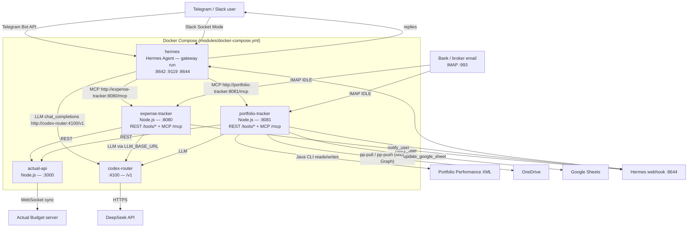

# Friday

Friday is a self-hosted personal finance agent. It tracks expenses and syncs investment portfolios from Telegram or Slack, auto-ingests bank alerts and broker statements from email, and writes the results into Actual Budget and Portfolio Performance.

Friday runs on [Hermes Agent](https://github.com/NousResearch/hermes-agent) in a Docker Compose stack. The agent's name, emoji, vibe, and voice are supplied at deploy time through `IDENTITY_NAME`, `IDENTITY_EMOJI`, `IDENTITY_VIBE`, and the `SOUL_VOICE_*` variables, then rendered into `SOUL.md` from `modules/hermes/SOUL.md.template`.

## What it does

- **Expense tracking.** Watches a mailbox over IMAP, classifies each message, and books transactions into Actual Budget. In chat, you can also ask Friday to look up accounts, check duplicates, or record a purchase directly.
- **Portfolio tracking.** Imports IBKR Flex queries and PDF trade confirmations, keeps Portfolio Performance balances in sync with Actual Budget, and exports taxonomies to Google Sheets.
- **Two chat channels.** Telegram (Bot API) and Slack (Socket Mode, an outbound WebSocket, so no inbound port is required).
- **One agent, many tools.** Hermes connects to both trackers as MCP servers and as plain REST services, so chat requests and automated email workflows share the same tool surface.

## Architecture



`codex-router` is **not** part of this repository. It is a separate repository (`darrencjh8/codex-router`) that CI checks out into `modules/codex-router` at deploy time, and `modules/docker-compose.yml` builds it from that path. The directory does not exist in a plain clone of this repo until the deploy workflow populates it.

## How it works

### Expense tracking

1. **Email arrives.** `modules/expense-tracker/src/imap.js` holds an IMAP IDLE connection to the configured mailbox. Every new message enters the dispatcher in `modules/expense-tracker/src/classify.js`.
2. **Classification.** `classifyEmail` labels the message `statement`, `transaction`, or `skip`. Statements are routed to the reconciliation pipeline in `modules/expense-tracker/src/statement/`; everything else non-skipped goes to the agent orchestrator.
3. **Three-phase pipeline.** `modules/expense-tracker/src/orchestrator.js` does all phases internally, so Hermes only routes email — it does not run the expense logic itself. Per the `expense-tracker` skill: Phase 1 is a low-reasoning LLM call with the `fetch_context` tool to read live accounts, categories, and payees; Phase 2 is code-driven resolution of blanks through memory and `resolve_merchant`; Phase 3 executes the booking.
4. **Card suffix facts.** A fact such as `Card ending 3255 belongs to Epsilon Nova Card` maps the number in an alert to an account and overrides an LLM pick. Facts are managed with `search_facts`, `learn_fact`, `update_fact`, and `cleanup_facts`.
5. **Actual Budget.** Transactions are written through `actual-api` (`ACTUAL_BUDGET_URL=http://actual-api:3000`), which syncs to the Actual Budget server.
6. **Notifications.** `notify_user` posts to the Hermes webhook (`NOTIFY_URL`), which the `webhook` platform in `modules/hermes/config.yaml` relays to the home Telegram channel.
7. **From chat.** Hermes calls the expense-tracker MCP tools directly — for example `fetch_accounts`, `check_duplicate`, `insert_transaction`, `resolve_merchant`, and `fetch_context` (MCP-only).

### Portfolio tracking

1. **Inbound events** arrive as IBKR Flex query XML or PDF trade confirmations, sent to the bot or received over IMAP (`modules/portfolio-tracker/src/email_handler.js`, `src/imap.js`).
2. **Extraction.** `parse_ibkr_flex_query` parses Flex XML; `extract_pdf_text` and `extract_email_content` handle PDFs and message bodies.
3. **Context and matching.** Tools read live Portfolio Performance context (`fetch_pp_accounts`, `fetch_pp_securities`, `fetch_pp_portfolio`) and Actual Budget, then match securities by ISIN/ticker and accounts by broker and currency. Multi-trade imports ask for confirmation via `ask_user_confirmation`.
4. **Writes go through the Java CLI.** `insert_pp_transaction` and `update_pp_balance` are executed by `modules/portfolio-tracker/pp-cli/` (built from `pp-cli/pom.xml` against the Portfolio Performance model JAR), so edits use Portfolio Performance's own model classes.
5. **OneDrive.** `pp-pull` and `pp-push` sync the Portfolio XML through the Microsoft Graph API (`modules/portfolio-tracker/src/onedrive.js`). There is no rclone or `onedrive-sync` container in the runtime stack.
6. **Google Sheets.** `query_pp_taxonomies` reads taxonomy data and `update_google_sheet` exports it using the configured service account and `GOOGLE_SHEET_ID`.
7. **Scheduled sync.** The Hermes container seeds a `portfolio-daily-sync` cron job (`modules/hermes/50-seed-defaults`, schedule `0 12 * * *`) that runs `modules/hermes/scripts/portfolio-sync.sh` as a zero-token call to `POST http://portfolio-tracker:8081/tools/pp-sync-all`.
8. **From chat.** `modules/hermes/config.yaml` defines the `portfolio-sync` and `portfolio-status` quick commands, which curl `pp-sync-all` and `pp-status` directly.

Both trackers expose a **Streamable HTTP MCP server at `/mcp`** in addition to the REST `/tools/*` endpoints. Hermes registers them under `mcp_servers` in `modules/hermes/config.yaml`.

## Repository structure

```
darren-openclaw/
├── modules/
│   ├── docker-compose.yml            # The five runtime services
│   ├── deploy.sh                     # Env validation + build + compose up + health checks
│   ├── build.sh                      # Image builds only (no downtime)
│   ├── codex-router-auth-recovery.py
│   ├── actual-api/                   # Node.js REST proxy in front of Actual Budget
│   ├── expense-tracker/
│   │   ├── src/                      # orchestrator, classify, imap, tools, statement/
│   │   ├── tests/  __tests__/        # Vitest / Node test suites
│   │   ├── docker/Dockerfile
│   │   ├── config/  docs/
│   │   └── .env.example
│   ├── hermes/
│   │   ├── Dockerfile                # FROM nousresearch/hermes-agent
│   │   ├── config.yaml               # Providers, MCP servers, platforms, memory
│   │   ├── 50-seed-defaults          # Container init: seeds config, SOUL, cron jobs, skills
│   │   ├── SOUL.md.template
│   │   ├── SLACK.md                  # Slack app setup and Socket Mode notes
│   │   ├── opencode/                 # opencode/Codex CLI defaults
│   │   ├── profiles/                 # architect, code-reviewer, project-manager, spec-auditor
│   │   ├── scripts/                  # github-auth, memory-backup/restore/triage, portfolio-sync, slack-manifest, skill sync
│   │   ├── skills/                   # expense-tracker, image-gen, spec-auditor, hermes-troubleshooting
│   │   └── tests/
│   ├── portfolio-tracker/
│   │   ├── src/                      # orchestrator, imap, tools, mcp-server, onedrive, ibkr, sheets
│   │   ├── tests/
│   │   ├── pp-cli/                   # Java CLI for Portfolio Performance XML
│   │   ├── docker/Dockerfile
│   │   ├── .env.example
│   │   └── README.md
│   ├── image-gen/                    # Standalone image tool (has tests; NOT a compose service)
│   ├── perchance-gen/                # Perchance image script used by image-gen
│   ├── signal-cli/                   # Optional Signal sidecar with its own compose file
│   ├── onedrive-sync/                # Legacy config dir; referenced only for the OAuth token path
│   └── tests/                        # Python tests for compose + workflow wiring
├── specs/                            # Spec-Kit feature specs (001-gateway … 030-spec-drift)
├── docs/                             # Design notes and verification records
├── scripts/                          # Host and runner helper scripts
├── .github/workflows/                # deploy, test, signal deploy, codex-router sync/recovery, secrets scan
├── .agents/skills/full-deploy/       # Operator runbook skill
├── design.md                         # Current architecture document
├── DEPLOY.md  SETUP.md               # Deployment flow and production host setup
├── SPECKIT.md
└── AGENTS.md                         # Instructions for agents working in this repo
```

Notes on the tree:

- `modules/codex-router/` is absent from a fresh clone — CI checks it out as part of deployment.
- `modules/image-gen/` and `modules/perchance-gen/` are present and tested, but `image-gen` is **not** a service in `modules/docker-compose.yml`, so `--component all` does not deploy it.
- `modules/signal-cli/` has its own compose file and is deployed by `.github/workflows/deploy-signal.yml`, not by the main deploy workflow.
- `modules/onedrive-sync/` is retained only because `modules/deploy.sh` still points at `modules/onedrive-sync/config/onedrive` for the OAuth refresh token. The rclone sync container it used to describe is retired; portfolio sync now happens in `src/onedrive.js`.

## Setup

For full detail see [DEPLOY.md](DEPLOY.md) and [SETUP.md](SETUP.md).

Prerequisites:

- Docker and Docker Compose on the host.
- A Telegram bot token, or a Slack app with Socket Mode tokens, or both.
- Credentials for the services you intend to run: DeepSeek, Actual Budget, an IMAP mailbox, OneDrive, IBKR Flex, Google Sheets.

Short happy path:

```bash
git clone <repo-url> darren-openclaw
cd darren-openclaw

# Copy every .env.example that exists in the repo:
cp modules/expense-tracker/.env.example modules/expense-tracker/.env
cp modules/portfolio-tracker/.env.example modules/portfolio-tracker/.env
cp modules/image-gen/.env.example modules/image-gen/.env

# Fill in the values, then deploy everything:
./modules/deploy.sh --component all --non-interactive
```

`modules/hermes/` has **no** `.env.example` in the repo. The deploy script validates `modules/hermes/.env` for the Hermes variables (LLM keys, Telegram, Slack, webhook secret, GitHub App, dashboard auth, and the `IDENTITY_*` / `SOUL_VOICE_*` persona variables), so create that file by hand, or supply the same names as environment variables. In production they come from GitHub Actions secrets and variables — see `.github/workflows/deploy.yml`.

To deploy a single component:

```bash
./modules/deploy.sh --component expense-tracker --non-interactive
./modules/build.sh --component hermes        # build images only, no restart
```

`deploy.sh` flags: `--component <name>` (repeatable; names: `all`, `hermes`, `portfolio-tracker`, `expense-tracker`, `actual-api`, `codex-router`, `image-gen`), `--non-interactive` (skip the OneDrive auth prompt), and `--skip-build` (skip the internal `git pull` and image build — used by CI, which builds earlier in the same workflow).

## Operations

### Health endpoints

| Service | Check |
|---|---|
| expense-tracker | `curl http://localhost:8080/health` |
| portfolio-tracker | `curl http://localhost:8081/health` |
| actual-api | `curl http://localhost:3000/health` |
| codex-router | `curl http://localhost:4100/health/liveliness` |
| hermes | `docker exec hermes /package/admin/s6/command/s6-svstat -o up /run/service/gateway-default` |

`deploy.sh` performs these checks itself after `compose up` and exits non-zero if any fails. The Hermes dashboard is disabled (`HERMES_DASHBOARD=0`), so it has no health port of its own. After a successful deploy the script also runs `hermes mcp test expense-tracker` and `hermes mcp test portfolio-tracker` to confirm the MCP connections.

### Deploys happen through CI, not by hand

Production deploys are performed by `.github/workflows/deploy.yml` on a **self-hosted runner**:

1. Triggers on push to `main`, or manually via `workflow_dispatch` (which can force all components or name them explicitly).
2. Checks out this repo and the separate `darrencjh8/codex-router` repo into `modules/codex-router`.
3. Auto-detects which components changed from the pushed commit; anything unclear, or a change to `docker-compose.yml` / `deploy.sh` / a root `Dockerfile`, falls back to `all`.
4. Runs `modules/build.sh` for those components.
5. Runs `modules/deploy.sh --component ... --non-interactive --skip-build` with secrets and variables injected as environment.
6. Records the deployed codex-router revision as a workflow artifact.

**Do not deploy or restart production by hand.** Merge to `main` and let CI do it. Manual `workflow_dispatch` runs are the intended escape hatch for component-specific or forced deployments.

Other workflows:

- `.github/workflows/test.yml` — unit tests on pull requests: expense-tracker, actual-api, portfolio-tracker, the Java `pp-cli`, Python compose/host tests, Hermes script lint/tests, and image-gen. `deploy.yml` also calls it for non-push events before deploying.
- `.github/workflows/deploy-signal.yml` — deploys `modules/signal-cli/` when that directory changes.
- `.github/workflows/sync-codex-router.yml` — every five minutes, compares `codex-router` `main` against the last deployed revision and triggers a deploy when they differ.
- `.github/workflows/recover-codex-router-auth.yml` — manual recovery for a codex-router account slot.
- `.github/workflows/secrets-scan.yml` and `.gitleaks.toml` — secret scanning.

## Documentation index

| Document | Contents |
|---|---|
| [design.md](design.md) | Current architecture document (Hermes migration, module breakdown, hosting topology). |
| [DEPLOY.md](DEPLOY.md) | Deployment flow, entry points, module registration, production host details. |
| [SETUP.md](SETUP.md) | Host, users, directory, volume, and cron layout for the production server. |
| [SPECKIT.md](SPECKIT.md) | Spec-Kit usage for this repository. |
| [AGENTS.md](AGENTS.md) | Instructions for AI agents working in this repository. |
| [specs/](specs/) | Feature specs: `001-gateway`, `002-expense-tracking`, `003-portfolio-tracker`, `004-statement-reconciliation`, `006-portfolio-cpf-sync`, `008-portfolio-poems-sync`, `013-manual-tests`, `016-telegram-link-preview`, `021-three-phase-refactor`, `023-ktmb-mcp`, `030-spec-drift`. |
| [docs/](docs/) | `docs/expense-tracker/` drift verification and `docs/plans/` design notes. |
| [modules/hermes/SLACK.md](modules/hermes/SLACK.md) | Slack app setup, Socket Mode, and token/scopes. |
| [modules/portfolio-tracker/README.md](modules/portfolio-tracker/README.md) | Portfolio tracker details and local run instructions. |
| [modules/expense-tracker/docs/design.md](modules/expense-tracker/docs/design.md) | Expense tracker design. |
| [modules/hermes/skills/](modules/hermes/skills/) | Skill packs: `expense-tracker`, `image-gen`, `spec-auditor`, `hermes-troubleshooting`. |
| [.agents/skills/full-deploy/SKILL.md](.agents/skills/full-deploy/SKILL.md) | Full-deploy operator runbook. |

## Ports

| Service | Host binding | Container port | Purpose |
|---|---|---|---|
| expense-tracker | `127.0.0.1:8080` | 8080 | REST `/tools/*`, MCP `/mcp`, `/health` |
| portfolio-tracker | `127.0.0.1:8081` | 8081 | REST `/tools/*` (plus `GET /tools`), MCP `/mcp`, `/health` |
| actual-api | `127.0.0.1:3000` | 3000 | Actual Budget proxy, `/health` |
| codex-router | `0.0.0.0:4100` | 4100 | OpenAI-compatible `/v1`, `/health/liveliness` |
| hermes | `8642`, `9119`, `8644` | same | Hermes gateway ports; the webhook platform listens on 8644 |
| signal-cli (optional) | `127.0.0.1:8084` | 8080 | signal-cli daemon HTTP |

All services except `codex-router` publish to `127.0.0.1` only. `codex-router` binds `0.0.0.0:4100` so the `hermes_shared` network and external clients can reach it.
