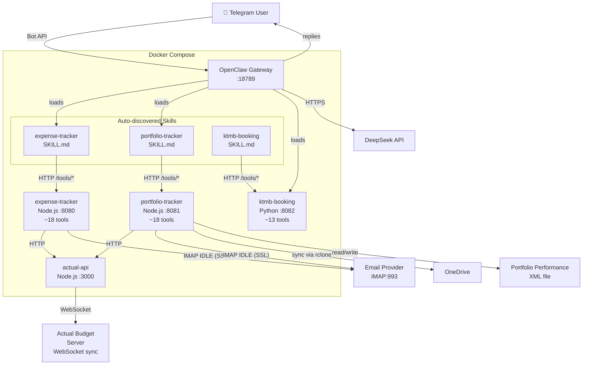

# OpenClaw

LLM-powered personal finance assistant — track expenses and portfolio from Telegram, auto-ingest bank alerts and IBKR statements from email, all synced into Actual Budget and Portfolio Performance.

## Architecture



### How it works

**Expense tracking:**
1. **You message the Telegram bot** → "Track S$12.80 at Toast Box from DBS Yuu"
2. **Gateway routes to expense-tracker skill** → LLM calls `fetch_accounts`, `check_duplicate`, `insert_transaction`
3. **Node.js tools execute** → calls actual-api → WebSocket sync to Actual Budget
4. **Agent replies on Telegram** → "✅ Done! S$12.80 at Toast Box under DBS Yuu (Food)"
5. **Bonus:** IMAP IDLE listener auto-ingests bank alert emails forwarded to a burner inbox

**Portfolio tracking:**
1. **You message** → `/ibkr` or forward a Flex Query, `/sync` to pull OneDrive updates, `/status` for snapshot
2. **Gateway routes to portfolio-tracker skill** → LLM calls `parse_ibkr_flex_query`, `pp-sync-all`, `update_pp_balance`
3. **Java CLI parses PP XML** → Node.js orchestrates pull→update→push via OneDrive
4. **Agent replies** → "📊 Synced: SGD Emergency $12,345 | MYR Emergency RM 5,678 | Warchest $89,012"

### Repository Structure

```
darren-openclaw/
├── gateway/                         # OpenClaw Gateway
│   ├── openclaw.json                # Gateway config (channels, model, skills)
│   ├── docker-compose.yml           # All 5 containers
│   ├── actual-api/                  # Node.js Actual Budget API proxy
│   ├── workspace/                   # Agent state (sessions, skills, persona)
│   │   ├── AGENTS.md                # Agent personality and behavioral rules
│   │   └── skills/
│   │       ├── expense-tracker/     # SKILL.md
│   │       └── portfolio-tracker/   # SKILL.md
│   └── .speckit/                    # Spec-Kit artifacts
├── modules/
│   ├── expense-tracker/             # Node.js tool backend for expenses
│   │   ├── src/                     # agent, client, imap, statement, extractors
│   │   ├── tests/                   # 25 test files, ~280 tests
│   │   ├── config/                  # Static config (non-secret)
│   │   ├── docker/Dockerfile
│   │   └── .env.example
│   ├── portfolio-tracker/           # Node.js tool backend for portfolio
│   │   ├── src/                     # agent, client, extractors, pp_client, google
│   │   ├── pp-cli/                  # Java CLI for Portfolio Performance XML
│   │   ├── tests/                   # 27 test files, ~185 tests
│   │   ├── docker/Dockerfile
│   │   └── .env.example
│   ├── ktmb-booking/                 # Python tool backend for KTMB train booking
│   │   ├── src/                     # API server, seat watcher worker
│   │   ├── tests/
│   │   ├── docker/Dockerfile
│   │   └── .env.example
│   └── onedrive-sync/               # rclone config for OneDrive sync
├── scripts/
│   └── deploy.sh                    # Validates env vars, starts containers
├── design.md                        # Full architecture document
└── agents.md                        # Agent instructions for development
```

---

## Setup

### Prerequisites

- **Docker** and **Docker Compose** installed
- A **Telegram account** (to create a bot and chat with the agent)
- API keys for: **DeepSeek**, **Actual Budget**, **an IMAP email provider**

### Step 1: Clone and configure environment

```bash
git clone https://github.com/YOUR_USERNAME/darren-openclaw.git
cd darren-openclaw

# Copy and fill in environment variables for both modules
cp modules/expense-tracker/.env.example modules/expense-tracker/.env
cp modules/portfolio-tracker/.env.example modules/portfolio-tracker/.env
cp gateway/.env.example gateway/.env
```

Edit each `.env` with your credentials. See `.env.example` files for all required variables.

### Step 2: Create a Telegram bot

1. Open Telegram, message [@BotFather](https://t.me/BotFather)
2. Send `/newbot`, give it a name (e.g. "My Finance Assistant")
3. Copy the bot token — looks like `123456:ABC-DEF1234gh...`
4. Message [@userinfobot](https://t.me/userinfobot) to get your Telegram user ID
5. Edit `gateway/.env` with your `TELEGRAM_BOT_TOKEN` and `TELEGRAM_CHAT_ID`

### Step 3: Deploy

```bash
./modules/deploy.sh
```

The script validates all required environment variables across all modules, then starts the containers. Verify:

```bash
docker compose -f gateway/docker-compose.yml ps
# All 5 containers should be "Up"
```

### Step 4: Chat with your agent

Open Telegram, find your bot, and send:

```
What accounts do I have?
```

The agent responds with your Actual Budget accounts. Try tracking an expense:

```
Track S$12.80 at Toast Box from DBS Yuu
```

Portfolio commands:

```
/ibkr           — forward an IBKR Flex Query to import trades
/sync           — pull latest PP from OneDrive, update balances, push back
/status         — snapshot of portfolio, cash, allocation
```

### Step 5: Set up email auto-ingestion (optional)

Forward your bank/payment alert emails to a burner inbox. The expense-tracker monitors it via IMAP IDLE and auto-creates transactions — no chat needed. The portfolio-tracker can also ingest IBKR statements from the same inbox.

---

## Full Architecture

See [design.md](design.md) for the complete architecture document with Mermaid diagrams, data flow, security design, and cost model.
