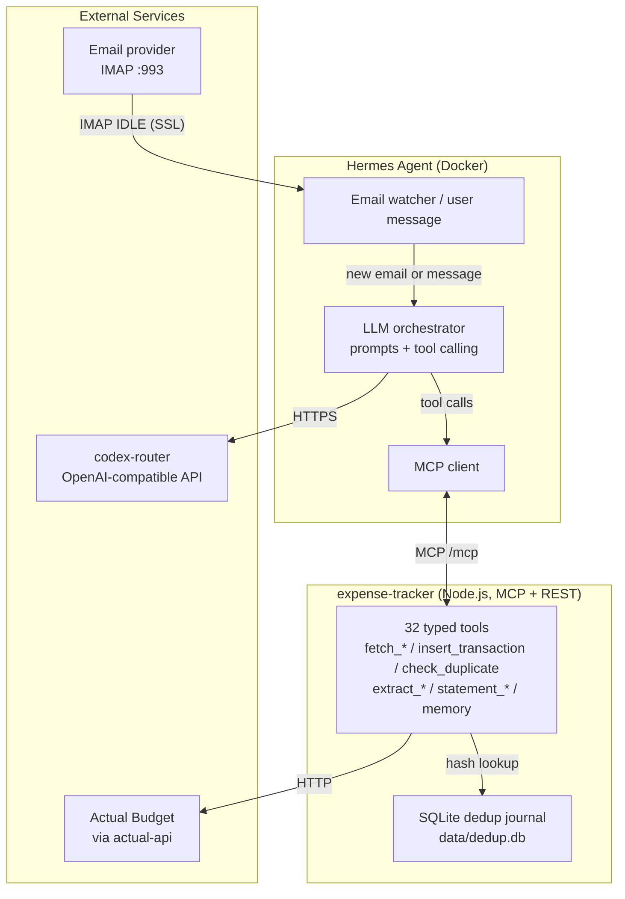
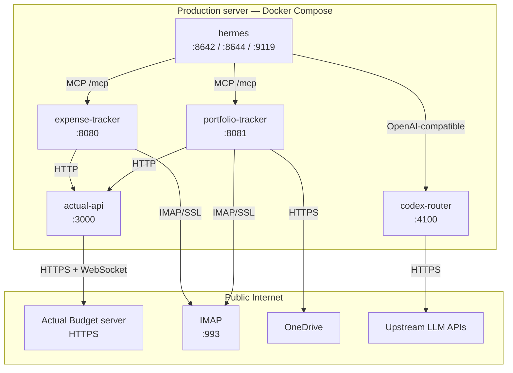
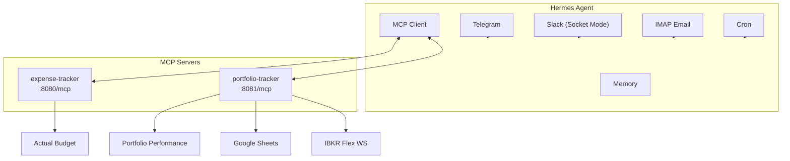
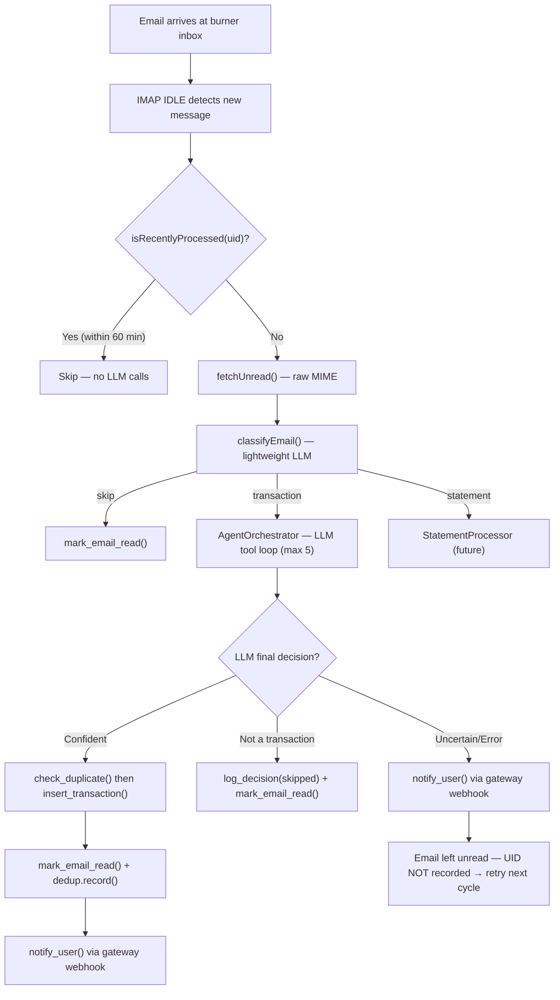
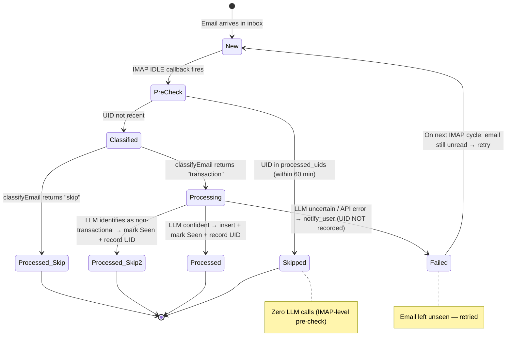
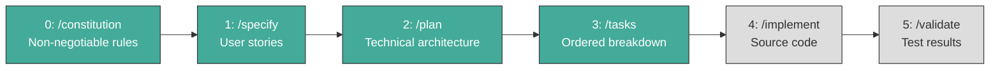

# Friday — Architecture Design Document

**Version:** 4.0.0
**Last Updated:** 2026-09-12
**Status:** Hermes migration complete. All modules MCP-enabled.

> ⚠ **This is a high-level overview.** Implementation details, tool tables, env vars, and algorithms belong in `specs/`. Link to specs for full detail. Do not bloat this file.

---

## Table of Contents

1. [Project Overview](#1-project-overview)
2. [Repository Structure](#2-repository-structure)
3. [System Architecture](#3-system-architecture)
4. [Hosting Topology](#4-hosting-topology)
5. [Module: expense-tracker](#5-module-expense-tracker)
5.A [Module: statement-reconciliation](#5a-module-statement-reconciliation-new)
5.B [Module: portfolio-tracker](#5b-module-portfolio-tracker)
6. [Module: Hermes Agent](#6-module-hermes-agent)
7. [Data Flow](#7-data-flow)
8. [Security Design](#8-security-design)
9. [Observability](#9-observability)
10. [Cost Model](#10-cost-model)
11. [Development Workflow](#11-development-workflow-spec-kit)
12. [Risk Register](#12-risk-register)
13. [Roadmap](#13-roadmap)

---
7. [Data Flow](#7-data-flow)
8. [Security Design](#8-security-design)
9. [Observability](#9-observability)
10. [Cost Model](#10-cost-model)
11. [Development Workflow (Spec-Kit)](#11-development-workflow-spec-kit)
12. [Risk Register](#12-risk-register)
13. [Roadmap](#13-roadmap)

---

## 1. Project Overview

**Friday** is an umbrella project hosting modular, LLM-powered automation agents. Each module is an independent agent with its own spec, plan, tasks, and implementation. Modules share no code but follow consistent architectural principles: LLM-driven intelligence, deterministic tool execution, and internal-network communication. Hermes Agent is the runtime; modules are MCP tool servers it calls.

### Current Modules

| Module | Purpose | Status |
|---|---|---|
| **hermes** | Agent runtime: Telegram + Slack channels, memory, cron, skills, MCP client | Implemented & Deployed |
| **expense-tracker** | Automated expense tracking via email → Actual Budget (Node.js MCP + REST tool server) | Implemented |
| **portfolio-tracker** | Investment portfolio sync: IBKR Flex queries, PDF trade confirmations, AB → PP balance sync, taxonomy → Google Sheets (Node.js + Java CLI) | Implemented |
| **actual-api** | Actual Budget REST/WebSocket proxy (`@actual-app/api`) | Implemented |
| **codex-router** | LLM router exposing one OpenAI-compatible endpoint over multiple upstream models | Implemented (separate repo, checked out at deploy) |
| **image-gen** | Image generation skill | Implemented |
| **statement-reconciliation** | PDF credit card statement reconciliation + outlier detection | Specified, Planned, Tasked — Implementation Pending |

---

## 2. Repository Structure

```
darren-openclaw/                          # Umbrella repository root (product name: Friday)
├── README.md                             # Project overview
├── design.md                             # ← This file (architecture document)
├── DEPLOY.md                             # Production deployment guide
├── SETUP.md                              # Production host setup + permissions model
├── AGENTS.md                             # Repository agent rules
├── modules/
│   ├── docker-compose.yml                # expense-tracker, portfolio-tracker, actual-api, codex-router, hermes
│   ├── deploy.sh                         # Component-aware deploy: build + compose up
│   ├── build.sh                          # Component-aware image build (no downtime)
│   ├── hermes/                           # Agent runtime
│   │   ├── config.yaml                   # Providers, model, mcp_servers, platforms
│   │   ├── Dockerfile
│   │   ├── 50-seed-defaults              # Seeds skills/profiles/cron into the container
│   │   ├── SOUL.md.template              # Agent persona template
│   │   ├── SLACK.md                      # Slack app setup + manifest instructions
│   │   ├── skills/                       # expense-tracker, image-gen, spec-auditor, hermes-troubleshooting
│   │   ├── profiles/                     # architect, code-reviewer, project-manager, spec-auditor
│   │   ├── opencode/                     # OpenCode CLI config for dev-loop workers
│   │   ├── scripts/                      # Skill reconciler, Slack manifest generator
│   │   └── tests/                        # Shell-based contract tests
│   ├── expense-tracker/                  # Node.js ESM MCP + REST tool server
│   │   ├── src/                          # orchestrator, classify, tools, imap, memory, statement/, extractors
│   │   ├── tests/                        # vitest suites
│   │   ├── docs/                         # Module-level design + test plans
│   │   ├── docker/Dockerfile
│   │   └── .env.example
│   ├── portfolio-tracker/                # Node.js ESM + Java CLI tool server
│   │   ├── src/                          # orchestrator, tools, ibkr_flex, ibkr_parser, pdf_extractor, onedrive
│   │   ├── pp-cli/                       # Java CLI for PP XML read/write (Maven project)
│   │   ├── tests/                        # vitest suites
│   │   ├── docker/Dockerfile
│   │   └── .env.example
│   ├── actual-api/                       # Official Actual Budget API proxy (Node.js)
│   ├── image-gen/                        # Image generation MCP service
│   ├── signal-cli/                       # Optional Signal channel deployment
│   ├── perchance-gen/                    # Perchance image generation script
│   ├── onedrive-sync/                    # Legacy rclone helper (superseded by portfolio-tracker OAuth tools)
│   └── tests/                            # Repo-level Python checks (compose, logs, deploy workflow)
├── specs/                                # Spec-Kit artifacts, one numbered directory per feature
├── docs/                                 # Point-in-time plans and drift verification notes
├── scripts/                              # Runner setup + utility scripts
├── .github/                              # CI/CD workflows + Spec-Kit agent prompts
└── .specify/                             # Spec-Kit tooling configuration
```

---

## 3. System Architecture

### 3.1 High-Level Architecture (Mermaid)



### 3.2 Component Relationship Diagram


### 3.3 Architectural Pattern

Hermes Agent uses the **LLM Agent Pattern**: each module exposes typed tools over MCP, and Hermes' LLM decides which to call. All intelligence — parsing, classification, matching, routing — is delegated to the LLM via OpenAI-compatible function calling, routed through `codex-router`.

**Key Principle:** No business rules are hardcoded. Category mapping, account matching, and currency detection are performed by the LLM using live data fetched from Actual Budget's API at runtime.

---

## 4. Hosting Topology

| Component | Host | Network Access | Specs |
|---|---|---|---|
| **Actual Budget** | Existing server | Public HTTPS for web UI; API through `actual-api` (auth required) | Existing production instance |
| **Hermes Agent** | Production server (Docker) | Telegram + Slack channels, memory, cron, skills, MCP client | ~3 GB limit (`mem_limit: 3g`) |
| **expense-tracker** | Production server (Docker) | MCP + REST tool server, IMAP IDLE | ~512 MB (`mem_limit: 512m`) |
| **portfolio-tracker** | Production server (Docker) | MCP + REST tool server, IMAP ingress (Trades folder), PP XML read/write, OneDrive | ~512 MB (`mem_limit: 512m`) |
| **actual-api** | Production server (Docker) | Official `@actual-app/api` (Node.js), WebSocket sync | — |
| **codex-router** | Production server (Docker) | OpenAI-compatible LLM endpoint on :4100 | ~1.5 GB (`mem_limit: 1536m`) |
| **Email Burner** | Any IMAP provider | Public IMAP | Dedicated inbox |
| **DeepSeek API** | DeepSeek Cloud | Public HTTPS, reached through `codex-router` | Pay-per-token |

All container resource limits are declared in `modules/docker-compose.yml`; read that file for the authoritative values.

### Production Server Setup

The production server runs host-level services alongside Docker. `chrome-daemon.service` is a Chromium + Xvfb CDP helper kept in the repository as a template for Perchance-based image generation (`modules/perchance-gen/`); it is **not** installed by `modules/deploy.sh`. Verify what is actually enabled on the host before relying on it:

| Service | Port | Purpose |
|---------|------|---------|
| `chrome-daemon` | CDP :9222 | Chromium (headed, Xvfb :99) for Perchance browser automation (template: `chrome-daemon.service`) |

### Internal Networking

Containers talk to each other by Compose service name (`expense-tracker`, `portfolio-tracker`, `actual-api`, `codex-router`) on the default Compose network. `hermes` additionally joins the external `hermes_shared` network. Hermes reaches Actual Budget only through `actual-api`; the tracker modules reach Portfolio Performance through their bundled Java CLI and OneDrive, not over the network.

### Network Diagram



---

## 5. Module: expense-tracker

### 5.1 Purpose

An LLM-powered agent that handles receipt emails, extracts structured transactions, and inserts them into Actual Budget. The tool registry exposes 32 tools; 23 of them are registered on the MCP server for Hermes, and the rest are reachable over REST `/tools/*`. The LLM orchestrator, IMAP handling, and memory are now owned by Hermes — expense-tracker is a tool server.

### 5.2 Technology Stack

| Layer | Choice |
|---|---|
| Runtime | Node.js 22 |
| LLM Client | openai SDK (DeepSeek) |
| HTTP | Express |
| MCP | @modelcontextprotocol/sdk (Streamable HTTP) |
| Embeddings | @xenova/transformers (WASM, all-MiniLM-L6-v2) |
| Dedup | better-sqlite3 (dedup.db + statement.db) |
| PDF | child_process pdftotext |
| Logging | pino |

### 5.3 Architecture

Expense-tracker exposes an MCP server at `:8080/mcp`. Hermes handles email ingestion, LLM orchestration, and memory. The module provides deterministic tools: Actual Budget CRUD, dedup checks, PDF extraction, and HTML parsing. Alert emails (receipts) and statement emails (monthly PDFs) are dispatched by Hermes to the appropriate pipeline. Full details in [spec 002](./specs/002-expense-tracking/spec.md).

### 5.4 Key Design Decisions

| Decision | Rationale |
|---|---|
| Node.js over Python | Fast Docker builds (no PyTorch), unified stack |
| WASM embeddings over ONNX | ~50MB model, no native deps, baked into image |
| SQLite dedup journal | Prevents duplicate inserts; shared schema with Python era |
| MCP over REST-only | Hermes integration; typed tool schemas |

### 5.5 Implementation Status

- ✅ 23 tools registered on the MCP server (32 tools in the registry; the remainder are REST-only)
- ✅ Dedup journal (dedup.db + statement.db)
- ✅ PDF extraction (pdftotext)
- ✅ WASM embeddings baked into Docker image
- ✅ Pre-classification: statement vs transaction routing

---

## 5.A Module: statement-reconciliation

### 5A.1 Purpose

A parallel pipeline for processing monthly bank/credit card statements (PDF/HTML). Unlike receipt emails which insert new transactions, statements reconcile against existing entries: matching line items are marked cleared, unmatched are inserted as outliers. Uses `deepseek-flash` for higher accuracy on multi-line extraction.

### 5A.2 Architecture

An email is pre-classified by Hermes as "statement" vs "transaction" before dispatch. Statements go to the StatementProcessor (separate orchestrator, `deepseek-flash`, max 20 iterations). The pipeline: extract content → LLM extracts line items → fuzzy match against unreconciled transactions → mark matched as cleared, insert outliers → notify user with summary. Full details in [spec 004](./specs/004-statement-reconciliation/spec.md).

### 5A.3 Key Design Decisions

| Decision | Rationale |
|---|---|
| Separate orchestrator from alert pipeline | Isolates regression risk; different LLM model + iteration count |
| Statement journal (statement.db) | Prevents double-processing by account + period |
| Fuzzy matching over exact matching | Handles posting delays (±2d) and amount rounding (±20c) |

### 5A.4 Implementation Status

- ✅ Statement classification (pre-classify LLM call)
- ✅ StatementProcessor with 5 tools (fetch_unreconciled, reconcile, record, fetch_history, check_duplicate)
- ✅ Fuzzy matching algorithm (amount + date + merchant overlap)
- ✅ actual-api endpoints (/transactions/:id/clear, date range filters)

---

---

## 6. Module: Hermes Agent

### 6.1 Purpose

The central agent runtime replacing the former OpenClaw gateway. Hermes provides Telegram, email, memory, cron, and MCP client support. All modules connect via MCP — Hermes calls their tools, receives results, and relays to users.

### 6.2 Architecture



### 6.3 MCP Servers

| Module | MCP URL | Tools |
|---|---|---|
| expense-tracker | `http://expense-tracker:8080/mcp` | Actual Budget CRUD + dedup + extractors + memory + IMAP inbox |
| portfolio-tracker | `http://portfolio-tracker:8081/mcp` | Portfolio queries/imports, OneDrive IO, OneDrive auth |

`image-gen` ships as a skill plus a deployable component (`--component image-gen`, port 8083), but as of this revision it is **not** listed under `mcp_servers:` in `modules/hermes/config.yaml`.

### 6.4 Cron Jobs (Hermes-managed)

| Job | Schedule | Action |
|---|---|---|
| portfolio-daily-sync | `0 12 * * *` (daily noon, container time) | `portfolio-sync.sh` — REST `POST /tools/pp-sync-all` (no_agent, zero tokens) |
| github-auth-refresh | Every 50 min | Refresh GitHub App token |
| memory-backup | Every 360 min | Backup Hermes memories to private repo |

### 6.5 Implementation Status

- ✅ Hermes container running (`modules/hermes/Dockerfile`)
- ✅ expense-tracker and portfolio-tracker registered as MCP servers in `config.yaml`
- ✅ Telegram + Slack + email channels configured
- ✅ Cron jobs seeded via `50-seed-defaults`
- ✅ OpenClaw gateway fully removed

## 5.B Module: portfolio-tracker

### 5B.1 Purpose

A Node.js agent that manages investment portfolio data. It syncs IBKR trades via the Flex Web Service, handles PDF trade confirmations via IMAP, updates Portfolio Performance via Java CLI, syncs Actual Budget balances, and exports taxonomy to Google Sheets. Hermes Agent controls it via MCP (`portfolio_sync`, OneDrive IO).

### 5B.2 Technology Stack

| Layer | Choice |
|---|---|
| Runtime | Node.js 22 + Java 21 |
| LLM | DeepSeek Flash (PDF trade confirmation matching) |
| MCP | @modelcontextprotocol/sdk (Streamable HTTP) |
| IMAP | node-imap (PDF trade confirmations only) |
| OneDrive | Microsoft Graph API |
| PP CLI | Java JAR (pp-cli.jar) — native IBFlexStatementExtractor |
| Google Sheets | googleapis (service account) |
| Scheduling | Hermes cron `0 12 * * *` (daily noon, container time; see `modules/hermes/50-seed-defaults`) |

### 5B.3 Architecture

Portfolio-tracker exposes 12 MCP tools to Hermes: `portfolio_sync` (full pipeline), three OneDrive auth tools (`onedrive_auth_url`, `onedrive_auth_complete`, `onedrive_status`), two OneDrive IO tools (`onedrive_pull`, `onedrive_push`), four portfolio data tools (`insert_transaction`, `get_all`, `query_security`, `taxonomy`), and two memory tools (`search_memory`, `learn_fact` — for encrypted PDF passwords and broker mappings). The sync pipeline is deterministic — no LLM:

1. OneDrive pull → 2. IBKR flex fetch + Java CLI import → 3. AB balance sync (AB→PP) → 4. OneDrive push → 5. Taxonomy export → 6. SGD-converted portfolio status

IMAP IDLE monitors the "Trades" folder for PDF confirmations only. The LLM orchestrator matches securities and inserts trades. REST endpoints are preserved for backward compatibility. Full architecture details are in [spec 003](./specs/003-portfolio-tracker/spec.md).

### 5B.4 Key Design Decisions

| Decision | Rationale |
|---|---|
| MCP Streamable HTTP over SSE | Survives container restarts — Hermes auto-reconnects transparently |
| IBKR flex via REST, not IMAP | Deterministic; no email parsing needed. PP native IBFlexStatementExtractor handles import |
| Java CLI subprocess | Uses PP's own XML parser; mutex-locked to prevent file corruption |
| Hermes MCP for notifications | Hermes migration transfers channel ownership from gateway to Hermes |

### 5B.5 Implementation Status

- ✅ MCP server (`src/mcp-server.js`) — 12 tools registered
- ✅ IBKR Flex Web Service (`src/ibkr_flex.js`) — two-step protocol
- ✅ `_computeSyncAll()` pipeline — deterministic, non-fatal on flex failure
- ✅ Hermes config — `mcp_servers` lists portfolio-tracker
- ✅ Telegram commands — `/sync`, `/onedrive` routed through Hermes
- ✅ 22 REST `/tools/*` endpoints preserved for backward compatibility

---

### 6.8 WARP for Docker Builds

**Status:** ✅ Implemented (2026-06-10)

Docker builds on the production server suffer from bad ISP routing to PyPI
(127 kB/s) and GHCR. Cloudflare WARP runs as a system-level VPN, routing
all traffic through Cloudflare's backbone.

| Component | Role |
|-----------|------|
| \ | System VPN — routes all traffic through Cloudflare |
| \ | Toggles WARP on before The command docker could not be found in this WSL 2 distro.
We recommend to activate the WSL integration in Docker Desktop settings.

For details about using Docker Desktop with WSL 2, visit:

https://docs.docker.com/go/wsl2/, off after |

**Results:** pip 127 kB/s → 64 MB/s (500x). No proxy, no privoxy, no env vars.

---

## 7. Data Flow

### 7.1 Per-Email Processing Sequence (Mermaid Flowchart)



### 7.2 Email Lifecycle States



---

## 8. Security Design

### 8.1 Secret Management

All credentials are injected via environment variables:
- **DeepSeek API key** — `DEEPSEEK_API_KEY`
- **IMAP password** — `IMAP_PASSWORD` (IMAP app-specific password)
- **Actual Budget password** — `ACTUAL_BUDGET_PASSWORD`
- **SMTP password** — `NOTIFICATION_SMTP_*` / `NOTIFICATION_EMAIL`
- **Chat channel tokens** — `TELEGRAM_BOT_TOKEN`, `SLACK_BOT_TOKEN`, `SLACK_APP_TOKEN`
- **GitHub App credentials** — `GH_APP_ID`, `GH_APP_INSTALLATION_ID`, `GH_APP_PRIVATE_KEY`; agent PAT `FRIDAY_PAT`

Secrets are injected by the GitHub Actions deploy workflow (`.github/workflows/deploy.yml`) from repository secrets and GitHub Variables, and are never committed. `.env` is `.gitignore`d; a tracked `.env.example` documents required names without values.

API keys, bot tokens, and the GitHub App private key are supplied as environment variables by the deploy workflow at container start. There is no agent-side device pairing step: the retired OpenClaw gateway's approval flow does not exist in the Hermes runtime.

### 8.2 Network Isolation

| Path | Protocol | Exposure |
|---|---|---|
| actual-api → Actual Budget server | HTTPS + WebSocket (public) | Outbound only (with auth) |
| codex-router → upstream model APIs | HTTPS (public) | Outbound only |
| expense-tracker / portfolio-tracker → IMAP | IMAP/SSL (public) | Outbound only |
| portfolio-tracker → OneDrive | HTTPS (public) | Outbound only, OAuth refresh token |
| Hermes → tracker modules | HTTP (Docker network) | `expense-tracker:8080/mcp`, `portfolio-tracker:8081/mcp`; inter-container only |
| Hermes webhook ingress | HTTP | `:8644`, guarded by `HERMES_WEBHOOK_SECRET` |
| User → Actual Budget UI | HTTPS (public) | For manual budget management |
| Telegram / Slack → Hermes | HTTPS outbound | Slack uses Socket Mode, so no inbound port is opened |

### 8.3 Burner Email Isolation

The Email burner inbox is a dedicated, isolated account. Compromise of this inbox:
- Cannot access Actual Budget (API key is not in emails)
- Cannot access user's main email (separate accounts)
- Only exposes transaction alert emails (which are already sent to this address)

---

## 9. Observability

### 9.1 Logging

All logs are JSON-line format written to stdout and consumed via `docker compose logs`:

```json
{
  "timestamp": "2026-06-04T13:00:01.082Z",
  "level": "INFO",
  "logger": "src.agent.orchestrator",
  "correlation_id": "txn-abc123",
  "event": "transaction_inserted",
  "data": {
    "amount_cents": -1280,
    "currency": "SGD",
    "account": "DBS Yuu",
    "merchant": "Toast Box",
    "transaction_id": "a9e755b1-f94f-45b0-be77-fe83c0180042"
  }
}
```

### 9.2 Correlation ID

Every email's IMAP `message_id` is carried through the entire pipeline as `correlation_id`. It appears in:
- All log lines for that email
- The dedup journal (`msg_id` column)
- The Actual Budget transaction `notes` field

### 9.3 Crash Diagnostics

Three `process` handlers log the cause of any unexpected exit:

| Handler | Trigger | Log Event | Exit Code |
|---|---|---|---|
| `unhandledRejection` | Promise rejects with no `.catch()` | `fatal_unhandled_rejection` | 1 |
| `uncaughtException` | Synchronous throw outside try/catch | `fatal_uncaught_exception` | 1 |
| `beforeExit` | Event loop drained (no more work) | `process_before_exit` | 0 |

SIGTERM (Docker `compose stop`) uses Node default — exit code 143, no custom handler, distinguishable from event-loop drain.

### 9.4 Health Check

The expense-tracker container exposes an HTTP health check on port 8080 (returns 200 OK) for Docker health monitoring. No other endpoints are exposed.

---

## 10. Cost Model

| Resource | Monthly Cost |
|---|---|
| Server #1 (Actual Budget, existing) | $0.00 (free tier) |
| Ubuntu laptop (Docker, self-hosted) | $0.00 (existing hardware) |
| DeepSeek API (~100 emails/month, expense-tracker internal LLM) | ~$0.10 |
| DeepSeek API (Telegram chat — orchestrator `deepseek-flash`) | ~$0.05 |
| DeepSeek API (Telegram chat — thinker `deepseek-flash`, ~20% of messages) | ~$0.05 |
| Gemini API (embeddings + fallback, free tier) | $0.00 |
| Email burner inbox | $0.00 (free tier) |
| **Total incremental cost** | **~$0.20/month** |

Token economics per email (expense-tracker internal): ~2000 input tokens + ~200 output tokens = ~$0.001 per email.

Token economics per Telegram message: 
- 80% simple (orchestrator `deepseek-flash`): ~500 tokens = ~$0.0001
- 20% complex (thinker `deepseek-flash`): ~2000 tokens = ~$0.001
- Weighted average per message: ~$0.0003

---
  <!-- trufflehog:ignore -->

## 11. Development Workflow (Spec-Kit)

Friday follows **Spec-Kit**, a spec-driven development methodology. Every feature progresses through 5 phases:



| Phase | Command | Output | Description |
|---|---|---|---|
| 0 | `/speckit.constitution` | `constitution.md` | Non-negotiable architecture rules |
| 1 | `/speckit.specify` | `spec.md` | User stories with acceptance criteria |
| 2 | `/speckit.plan` | `plan.md` | Technical architecture, tool schemas, data models |
| 3 | `/speckit.tasks` | `tasks.md` | Ordered implementation tasks with estimates |
| 4 | `/speckit.implement` | Source files | Task-by-task implementation |
| 5 | `/speckit.validate` | Test results | Verification against acceptance criteria |

### Artifact Hierarchy

```
.speckit/
├── constitution.md          # Project-level (governs all modules)
├── agent.md                 # Agent harness (workflow state machine)
└── features/
    └── <feature-name>/
        ├── spec.md          # What to build
        ├── plan.md          # How to build it
        └── tasks.md         # Step-by-step breakdown
```

---

## 12. Risk Register

| Risk | Likelihood | Impact | Mitigation |
|---|---|---|---|
| DeepSeek API downtime | Low | Processing stalls | 3 retries with exponential backoff; on failure, leave email unread + notify user |
| IMAP IDLE connection drops | Medium | Missed emails | Auto-reconnect with catch-up fetch of unread emails |
| Actual Budget API schema change | Low | Insertions fail | Version-locked; check Actual Budget release notes |
| LLM hallucinates transaction data | Medium | Bad data in Actual Budget | Guardrails in system prompt; `check_duplicate` catches repeats; `notify_user` on uncertainty |
| Email Provider blocks automated IMAP access | Low | No email ingestion | Use IMAP app-specific password; fallback to different burner email provider |
| 256MB RAM insufficient for Tesseract OCR | Medium | PDF processing fails | PDF/OCR is optional; fallback to plain text attachment extraction |
| Docker host failure | Low | Processing stalls | Restart Docker Compose; dedup journal prevents duplicates on recovery |

---

## 13. Roadmap


| Phase | Milestone | Status |
|---|---|---|
| **Current** | expense-tracker (alert pipeline): Spec, Plan, Tasks complete | ✅ |
| **Current** | statement-reconciliation: Spec, Plan, Tasks complete | ✅ |
| **Current** | OpenClaw gateway → Hermes Agent migration (Telegram, Slack, email, cron, MCP client) | ✅ |
| **Current** | expense-tracker + portfolio-tracker registered as MCP servers | ✅ |
| **Next** | statement-reconciliation: `/implement` — Phase 0 (Foundation) | ⬜ |
| **Future** | image-gen: register as an MCP server in `modules/hermes/config.yaml` | ⬜ |

### 13.1 Technical Debt

Cross-cutting debt is tracked in `specs/030-spec-drift/` (audit + code notes) and in the open GitHub issues labelled `spec-drift`.