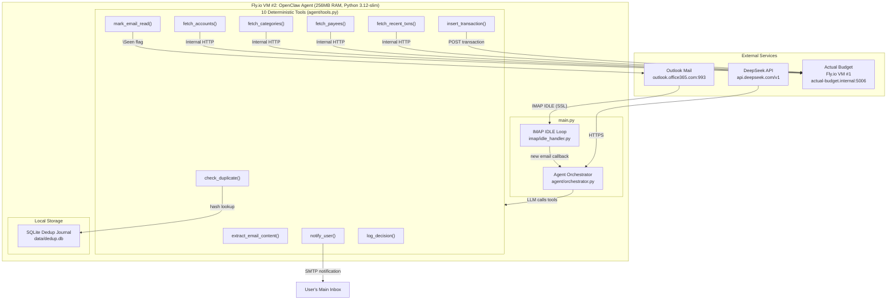
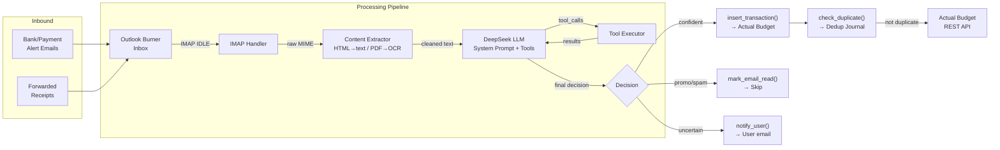
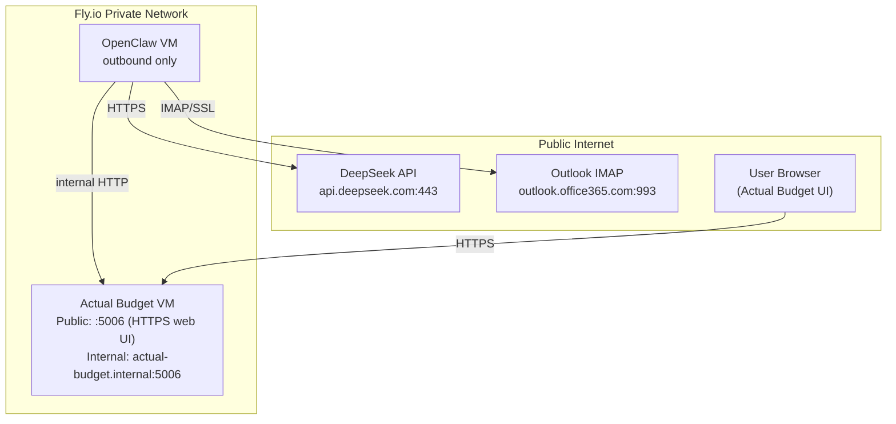
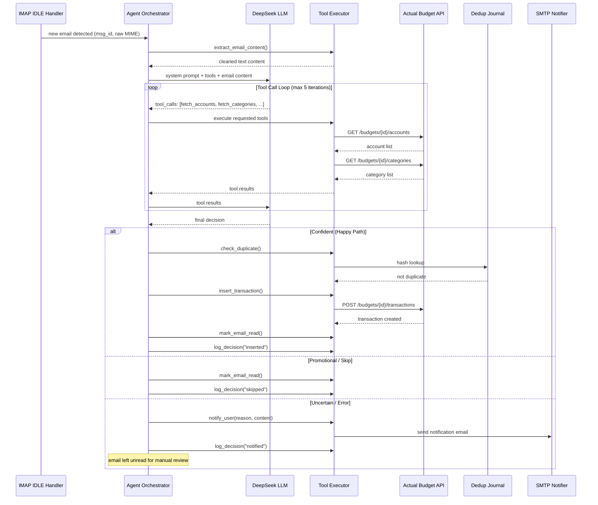
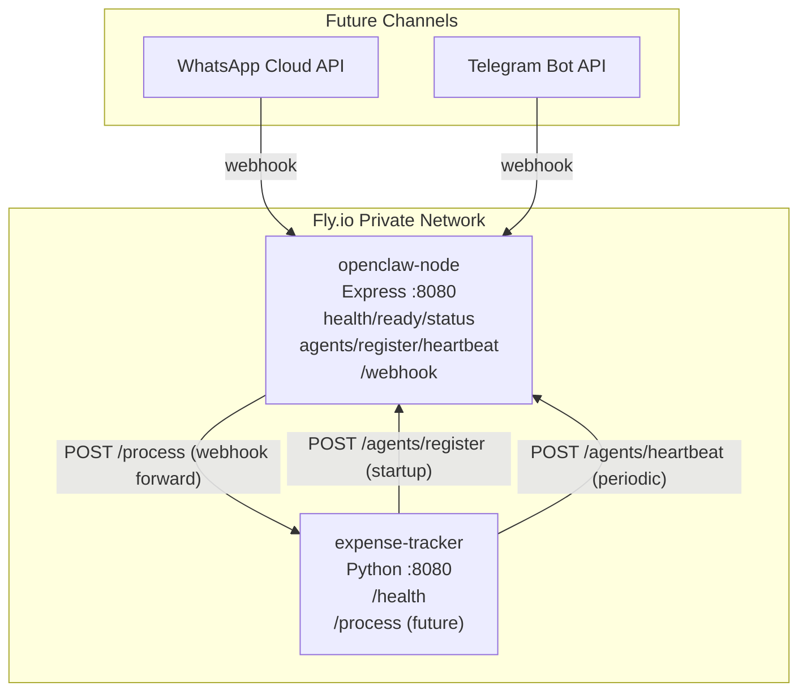
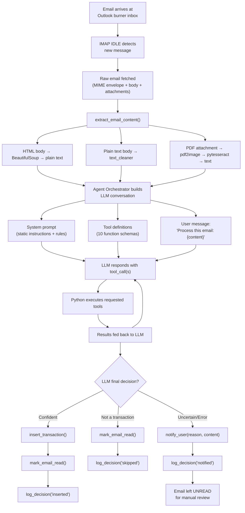
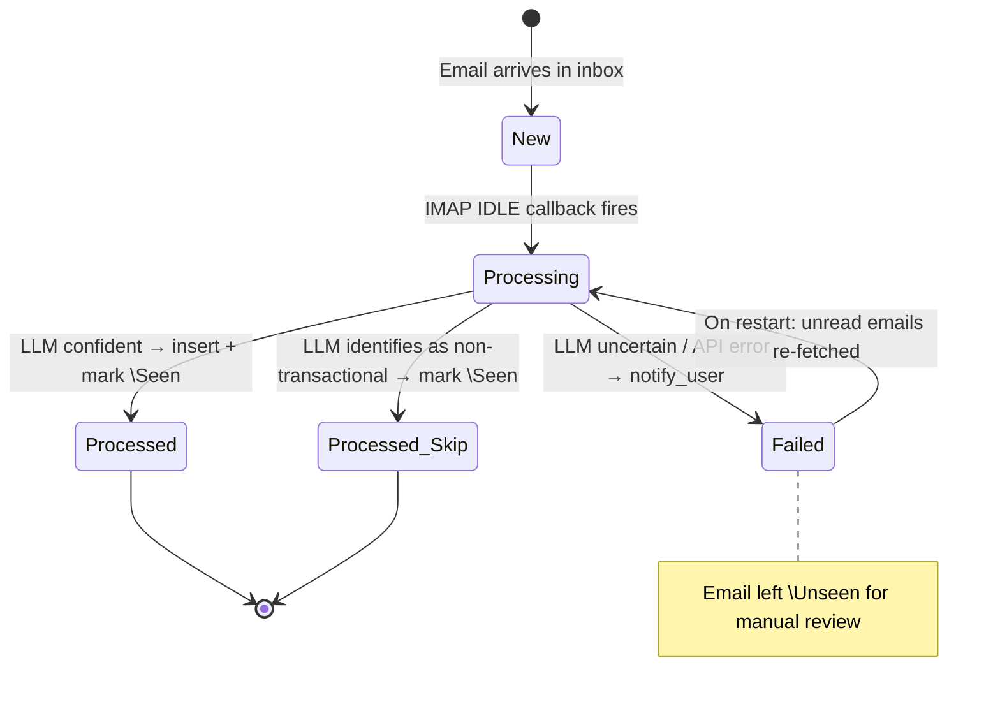
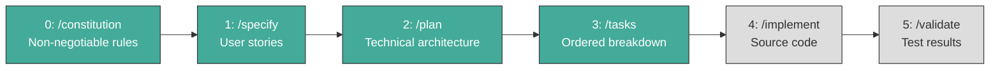

# OpenClaw — Architecture Design Document

**Project:** darren-openclaw
**Version:** 1.0.0
**Last Updated:** 2026-06-04
**Status:** Specified & Planned — Implementation Pending

---

## Table of Contents

1. [Project Overview](#1-project-overview)
2. [Repository Structure](#2-repository-structure)
3. [System Architecture](#3-system-architecture)
4. [Hosting Topology](#4-hosting-topology)
5. [Module: expense-tracker](#5-module-expense-tracker)
6. [Module: openclaw-node](#6-module-openclaw-node)
7. [Data Flow](#7-data-flow)
8. [Security Design](#8-security-design)
9. [Observability](#9-observability)
10. [Cost Model](#10-cost-model)
11. [Development Workflow (Spec-Kit)](#11-development-workflow-spec-kit)
12. [Risk Register](#12-risk-register)
13. [Roadmap](#13-roadmap)

---

## 1. Project Overview

**OpenClaw** is an umbrella project hosting modular, LLM-powered automation agents. Each module is an independent agent with its own spec, plan, tasks, and implementation. Modules share no code but follow consistent architectural principles: LLM-driven intelligence, deterministic tool execution, and internal-network communication.

### Current Modules

| Module | Purpose | Status |
|---|---|---|
| **expense-tracker** | Automated expense tracking via email → Actual Budget | Specified, Planned, Tasked — Implementation Pending |
| **openclaw-node** | (TBD) Node.js-based agent module | Scaffold only |

---

## 2. Repository Structure

```
darren-openclaw/                          # Umbrella repository root
├── design.md                             # ← This file (architecture audit)
├── modules/
│   └── expense-tracker/                  # Python 3.12 module
│       ├── .speckit/                     # Spec-Kit artifacts
│       │   ├── constitution.md           # Non-negotiable architecture rules
│       │   ├── agent.md                  # Agent harness (workflow state, context dump)
│       │   └── features/
│       │       └── expense-tracking/
│       │           ├── spec.md           # User stories & acceptance criteria
│       │           ├── plan.md           # Technical architecture & tool schemas
│       │           └── tasks.md          # Ordered implementation breakdown (16 tasks, ~12h)
│       ├── config/                       # Static configuration (non-secret)
│       │   ├── .gitkeep
│       │   ├── actual_config.json        # API URL for Actual Budget
│       │   └── email_config.json         # IMAP host/port for Outlook
│       ├── src/                          # Python source (stubs only — not yet implemented)
│       │   ├── __init__.py
│       │   ├── agent/                    # LLM orchestration
│       │   ├── client/                   # Actual Budget REST client
│       │   ├── extractors/               # Email content extractors (HTML, PDF, text)
│       │   ├── imap/                     # IMAP IDLE handler
│       │   ├── notifier/                 # SMTP notification sender
│       │   └── utils/                    # Dedup journal, structured logging
│       ├── tests/                        # Test suite (stubs only)
│       ├── docker/                       # Dockerfile + fly.toml
│       └── db.sqlite                     # Dedup journal (runtime artifact)
└── openclaw-node/                        # Node.js module (scaffold only)
    └── .speckit/                         # Spec-Kit scaffold
        ├── .gitkeep
        └── features/                     # Feature specs (empty)
```

---

## 3. System Architecture

### 3.1 High-Level Architecture (Mermaid)



### 3.2 Component Relationship Diagram



### 3.3 Architectural Pattern

OpenClaw uses the **LLM Agent Pattern**: the Python host is a thin runtime that provides deterministic tools. All intelligence — parsing, classification, matching, routing — is delegated to the DeepSeek LLM via OpenAI-compatible function calling.

**Key Principle:** No business rules are hardcoded in Python. Category mapping, account matching, and currency detection are performed by the LLM using live data fetched from Actual Budget's API at runtime.

---

## 4. Hosting Topology

| Component | Host | Network Access | Specs |
|---|---|---|---|
| **Actual Budget** | Fly.io VM #1 (existing) | Public HTTPS for web UI; internal HTTP for OpenClaw API | Existing production instance |
| **OpenClaw Agent** | Fly.io VM #2 (free tier) | Outbound: HTTPS → DeepSeek, IMAP → Zoho; Internal → Actual Budget + openclaw-node | 256MB RAM, shared CPU |
| **openclaw-node** | Fly.io VM #3 (free tier) | Internal HTTP only — health/status/agents/webhook | 256MB RAM, shared CPU |
| **Zoho Mail Burner** | Zoho (zoho.com) | Public IMAP (imap.zoho.com:993) | Free tier, dedicated inbox |
| **DeepSeek API** | DeepSeek Cloud | Public HTTPS (api.deepseek.com/v1) | Pay-per-token |

### Internal Networking

OpenClaw communicates with Actual Budget exclusively over Fly.io's internal private network (`http://actual-budget.internal:5006`). Actual Budget's API port is **not** exposed to the public internet — only the web UI port (5006) is publicly accessible with HTTPS enforcement. This means automation traffic never traverses the public internet.

### Network Diagram



---

## 5. Module: expense-tracker

### 5.1 Purpose

An LLM-powered agent that monitors a dedicated Outlook burner inbox via IMAP IDLE. When a receipt or transaction alert email arrives, the agent extracts structured transaction data and inserts it into the user's Actual Budget instance.

### 5.2 Technology Stack

| Layer | Choice | Rationale |
|---|---|---|
| Runtime | Python 3.12-slim | Lightweight (~80MB), async I/O, mature IMAP/HTTP libraries |
| LLM | DeepSeek `deepseek-chat` | $0.14/1M input, $0.28/1M output; strong at structured extraction |
| LLM Client | `openai` SDK | DeepSeek is OpenAI-API-compatible |
| IMAP | `aioimaplib` | Async IMAP IDLE support, lightweight |
| HTTP | `aiohttp` | Async HTTP for Actual Budget REST API |
| HTML Parsing | `beautifulsoup4` + `lxml` | Extract plain text from HTML email bodies |
| PDF OCR | `pytesseract` + `pdf2image` | Optional; Tesseract binary in Docker image |
| Dedup | `sqlite3` (stdlib) | Zero-dependency single-file journal |
| Logging | `logging` + `json` (stdlib) | JSON-line structured logs to stdout |
| Container | Docker + Fly.io | `Dockerfile` + `fly.toml` |

### 5.3 User Stories (from spec.md)

| ID | Story | Core Behavior |
|---|---|---|
| US-1 | Real-Time Email Monitoring | IMAP IDLE connection detects new emails within 5 seconds; auto-reconnect with catch-up |
| US-2 | Intelligent Email Parsing via LLM | DeepSeek extracts amount, currency, merchant, date from any format; no per-bank parser code |
| US-3 | Dual-Currency Budget Routing | SGD → `Darren-SGD-29ed82a`; MYR → MYR budget; unknown currencies trigger notification |
| US-4 | Live Account Matching | LLM calls `fetch_accounts` before matching; no hardcoded account UUIDs |
| US-5 | Live Category Assignment | LLM calls `fetch_categories`; category based on merchant context; `null` if uncertain |
| US-6 | Duplicate Prevention | SHA-256 hash check against SQLite journal before each insert |
| US-7 | Notification for Ambiguous Emails | Unknown currency, missing amount, unmatched account → SMTP notification, email left unread |
| US-8 | Idempotent Processing | Emails marked `\Seen` only after successful insert; safe to restart at any time |

### 5.4 The 10 LLM Tools

The LLM is given 10 function definitions (OpenAI-compatible JSON schema). It chooses which tools to call and in what order:

| # | Tool | Type | Description |
|---|---|---|---|
| 1 | `extract_email_content` | Pre-processing | Extract & clean text from email (HTML → text, PDF → OCR) |
| 2 | `fetch_accounts` | Read | GET accounts from Actual Budget API |
| 3 | `fetch_categories` | Read | GET categories from Actual Budget API |
| 4 | `fetch_payees` | Read | GET payees from Actual Budget API |
| 5 | `fetch_recent_transactions` | Read | GET recent transactions for dedup context |
| 6 | `insert_transaction` | Write | POST transaction to Actual Budget |
| 7 | `check_duplicate` | Read | SHA-256 lookup in SQLite dedup journal |
| 8 | `mark_email_read` | Write | Set IMAP `\Seen` flag |
| 9 | `notify_user` | Write | Send SMTP notification to user's main inbox |
| 10 | `log_decision` | Write | Structured JSON log entry |

### 5.5 Agent Orchestration (Mermaid Sequence)



### 5.6 Dedup Journal

SHA-256 hash computed over `(date, amount_cents, account_id, merchant)` and stored in a local SQLite database. The journal is persisted on a Fly.io volume mount and survives restarts/redeploys.

```sql
CREATE TABLE dedup_journal (
    id INTEGER PRIMARY KEY AUTOINCREMENT,
    hash TEXT UNIQUE NOT NULL,
    msg_id TEXT NOT NULL,
    date TEXT NOT NULL,
    amount_cents INTEGER NOT NULL,
    account_id TEXT NOT NULL,
    merchant TEXT NOT NULL,
    created_at TEXT NOT NULL DEFAULT (datetime('now'))
);
```

### 5.7 Environment Variables

| Variable | Required | Description |
|---|---|---|
| `DEEPSEEK_API_KEY` | ✅ | DeepSeek API key |
| `ACTUAL_BUDGET_API_KEY` | ✅ | Actual Budget API auth token |
| `ACTUAL_BUDGET_URL` | ✅ | `http://actual-budget.internal:5006` |
| `IMAP_HOST` | ✅ | `outlook.office365.com` |
| `IMAP_PORT` | ❌ | Default: `993` |
| `IMAP_USERNAME` | ✅ | Burner email address (Outlook/Microsoft 365 account) |
| `IMAP_PASSWORD` | ✅ | App-specific password (generated via Microsoft Account Security → App passwords) |
| `NOTIFICATION_SMTP_HOST` | ✅ | SMTP server for notifications |
| `NOTIFICATION_SMTP_PORT` | ❌ | Default: `587` |
| `NOTIFICATION_EMAIL` | ✅ | User's main email for notifications |
| `NOTIFICATION_EMAIL_PASSWORD` | ✅ | SMTP password |
| `DEDUP_DB_PATH` | ❌ | Default: `data/dedup.db` |
| `LOG_LEVEL` | ❌ | Default: `INFO` |

### 5.8 Outlook vs Zoho — Migration Notes

| Aspect | Zoho (Old) | Outlook (New) |
|---|---|---|
| IMAP Host | `imap.zoho.com` | `outlook.office365.com` |
| Port | 993 (SSL) | 993 (SSL) — unchanged |
| IDLE Support | ✅ Yes | ✅ Yes — unchanged |
| Auth Method | App-specific password | App-specific password (same concept) |
| Free Tier | Zoho Mail free | Microsoft 365 free / Outlook.com free |
| IMAP Library | `aioimaplib` | `aioimaplib` — unchanged |
| SMTP for Notifications | Separate | Separate (unchanged) |
| Architectural Impact | None | **None — hostname-only change** |

**Impact Assessment:** The switch from Zoho to Outlook requires **no architectural changes**. The IMAP protocol, port (993), SSL/TLS, IDLE support, and app-password authentication model are identical. Only `IMAP_HOST` and `IMAP_PASSWORD` (to an Outlook app password) change. All source code, tool schemas, Docker configuration, and Fly.io setup remain unchanged.

### 5.9 Implementation Status

| Phase | Artifacts | Status |
|---|---|---|
| 0: Constitution | `constitution.md` | ✅ Complete |
| 1: Specify | `spec.md` (8 user stories, 9 edge cases) | ✅ Complete |
| 2: Plan | `plan.md` (architecture, 10 tool schemas, system prompt, DB schema) | ✅ Complete |
| 3: Tasks | `tasks.md` (16 tasks across 4 phases, ~12h estimated) | ✅ Complete |
| 4: Implement | Source code (stubs exist, logic not yet written) | ⬜ Pending |
| 5: Validate | Test suite, Docker build verification | ⬜ Pending |

---

## 6. Module: openclaw-node (Companion Service)

### 6.1 Purpose

A **Node.js 22 companion service** running on Express that provides health monitoring, agent registration/heartbeat tracking, and a generic webhook ingress for future channel expansion (WhatsApp, Telegram). The expense-tracker registers itself as an agent on startup and sends periodic heartbeats.

### 6.2 Endpoints

| Method | Endpoint | Description |
|---|---|---|
| GET | `/health` | Liveness probe — always returns 200 |
| GET | `/ready` | Readiness probe — 503 during startup/shutdown |
| GET | `/status` | Service metadata + registered agents |
| POST | `/agents/register` | Register a new agent (201) or re-register (200) |
| POST | `/agents/{name}/heartbeat` | Update agent heartbeat timestamp |
| GET/POST | `/webhook` | Future channel ingress — forwards to expense-tracker |

### 6.3 Inter-Service Communication



### 6.4 WhatsApp Expansion (Future)

The `/webhook` endpoint is designed as a **generic passthrough** — it validates the payload format and forwards to the expense-tracker's `/process` endpoint. No channel-specific logic lives in the companion service.

**Flow:** WhatsApp → webhook → openclaw-node validates → forwards to expense-tracker → LLM agent orchestrator → Actual Budget

The expense-tracker's `POST /process` endpoint (not yet implemented) accepts:
```json
{
  "source": "whatsapp",
  "from": "+65xxxxxxxx",
  "text": "Track $12.80 at Toast Box from DBS Yuu",
  "correlation_id": "uuid",
  "timestamp": "2026-06-05T01:18:00+08:00"
}
```

### 6.5 Status

| Artifact | Status |
|---|---|
| `.speckit/` scaffold | ✅ Created |
| Constitution (TDD mandated) | ✅ Complete |
| Spec (8 user stories, v2.0.0) | ✅ Complete |
| Plan (Mermaid diagrams, env vars) | ✅ Complete |
| Tasks (9 tasks, ~2.5h) | ✅ Complete |
| Implementation | ⬜ Pending |

---

## 7. Data Flow

### 7.1 Per-Email Processing Sequence (Mermaid Flowchart)



### 7.2 Email Lifecycle States



---

## 8. Security Design

### 8.1 Secret Management

All credentials are injected via environment variables:
- **DeepSeek API key** — `DEEPSEEK_API_KEY`
- **IMAP password** — `IMAP_PASSWORD` (Outlook app-specific password)
- **Actual Budget API key** — `ACTUAL_BUDGET_API_KEY`
- **SMTP password** — `NOTIFICATION_EMAIL_PASSWORD`

Secrets are set via `fly secrets set` in production and `.env` file locally. `.env` is `.gitignore`d.

### 8.2 Network Isolation

| Path | Protocol | Exposure |
|---|---|---|
| OpenClaw → Actual Budget API | HTTP (internal) | Fly.io private network only |
| OpenClaw → DeepSeek | HTTPS (public) | Outbound only |
| OpenClaw → Outlook IMAP | IMAP/SSL (public) | Outbound only |
| User → Actual Budget UI | HTTPS (public) | For manual budget management |
| Automation → Actual Budget API | — | **Not exposed publicly** |

### 8.3 Burner Email Isolation

The Outlook burner inbox is a dedicated, isolated account. Compromise of this inbox:
- Cannot access Actual Budget (API key is not in emails)
- Cannot access user's main email (separate accounts)
- Only exposes transaction alert emails (which are already sent to this address)

---

## 9. Observability

### 9.1 Logging

All logs are JSON-line format written to stdout and consumed via `fly logs`:

```json
{
  "timestamp": "2026-06-04T13:00:01.082Z",
  "level": "INFO",
  "logger": "src.agent.orchestrator",
  "correlation_id": "<abc123@mail.example.com>",
  "event": "transaction_inserted",
  "data": {
    "amount_cents": -1280,
    "currency": "SGD",
    "account": "DBS Yuu",
    "merchant": "Toast Box",
    "transaction_id": "a9e755b1-f94f-45b0-be77-fe83c0180042"
  }
}
```

### 9.2 Correlation ID

Every email's IMAP `message_id` is carried through the entire pipeline as `correlation_id`. It appears in:
- All log lines for that email
- The dedup journal (`msg_id` column)
- The Actual Budget transaction `notes` field

### 9.3 Health Check

OpenClaw exposes an HTTP health check on port 8080 (returns 200 OK) for Fly.io's health monitoring. No other endpoints are exposed.

---

## 10. Cost Model

| Resource | Monthly Cost |
|---|---|
| Fly.io VM #1 (Actual Budget, existing) | $0.00 (free tier) |
| Fly.io VM #2 (OpenClaw, 256MB) | $0.00 (free tier) |
| DeepSeek API (~100 emails/month) | ~$0.10 |
| Outlook/Microsoft 365 burner inbox | $0.00 (free tier) |
| **Total incremental cost** | **~$0.10/month** |

Token economics per email: ~2000 input tokens (system prompt + email content + tool results) + ~200 output tokens = ~$0.001 per email.

---

## 11. Development Workflow (Spec-Kit)

OpenClaw follows **Spec-Kit**, a spec-driven development methodology. Every feature progresses through 5 phases:



| Phase | Command | Output | Description |
|---|---|---|---|
| 0 | `/speckit.constitution` | `constitution.md` | Non-negotiable architecture rules |
| 1 | `/speckit.specify` | `spec.md` | User stories with acceptance criteria |
| 2 | `/speckit.plan` | `plan.md` | Technical architecture, tool schemas, data models |
| 3 | `/speckit.tasks` | `tasks.md` | Ordered implementation tasks with estimates |
| 4 | `/speckit.implement` | Source files | Task-by-task implementation |
| 5 | `/speckit.validate` | Test results | Verification against acceptance criteria |

### Artifact Hierarchy

```
.speckit/
├── constitution.md          # Project-level (governs all modules)
├── agent.md                 # Agent harness (workflow state machine)
└── features/
    └── <feature-name>/
        ├── spec.md          # What to build
        ├── plan.md          # How to build it
        └── tasks.md         # Step-by-step breakdown
```

---

## 12. Risk Register

| Risk | Likelihood | Impact | Mitigation |
|---|---|---|---|
| DeepSeek API downtime | Low | Processing stalls | 3 retries with exponential backoff; on failure, leave email unread + notify user |
| IMAP IDLE connection drops | Medium | Missed emails | Auto-reconnect with catch-up fetch of unread emails |
| Actual Budget API schema change | Low | Insertions fail | Version-locked; check Actual Budget release notes |
| LLM hallucinates transaction data | Medium | Bad data in Actual Budget | Guardrails in system prompt; `check_duplicate` catches repeats; `notify_user` on uncertainty |
| Outlook blocks automated IMAP access | Low | No email ingestion | Use app-specific password via Microsoft Account Security; OAuth2 fallback available |
| 256MB RAM insufficient for Tesseract OCR | Medium | PDF processing fails | PDF/OCR is optional; fallback to plain text attachment extraction |
| Fly.io free tier changes/removal | Low | Hosting cost | Migration to another provider (Docker-based, portable) |

---

## 13. Roadmap


| Phase | Milestone | Status |
|---|---|---|
| **Current** | expense-tracker: Spec, Plan, Tasks complete | ✅ |
| **Next** | expense-tracker: `/implement` — Phase 0 (Foundation) | ⬜ |
| | expense-tracker: `/implement` — Phase 1 (Deterministic Tools) | ⬜ |
| | expense-tracker: `/implement` — Phase 2 (Agent Intelligence) | ⬜ |
| | expense-tracker: `/implement` — Phase 3 (Integration & Deploy) | ⬜ |
| | expense-tracker: `/validate` — Test suite + Docker build | ⬜ |
| **Future** | openclaw-node: `/speckit.constitution` | ⬜ |
| | openclaw-node: Feature specification & implementation | ⬜ |