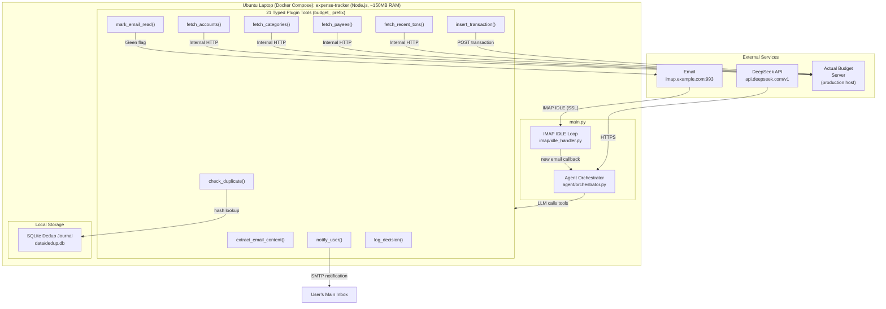
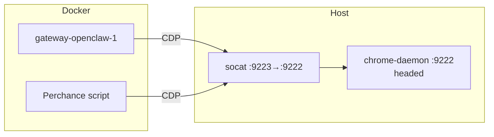
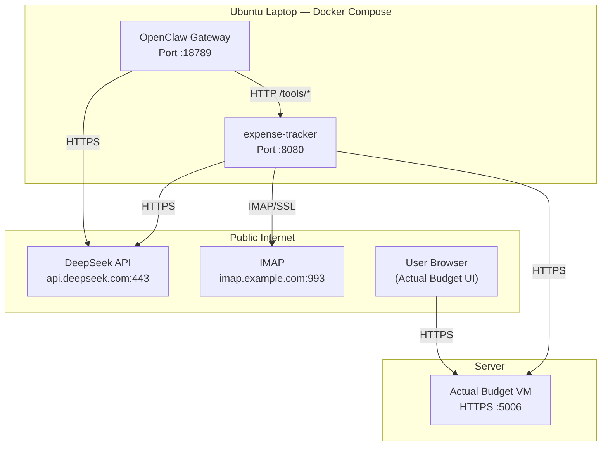
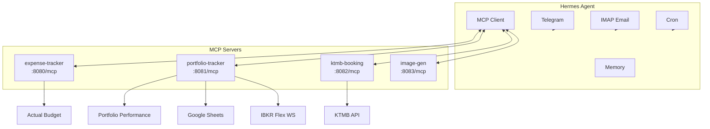
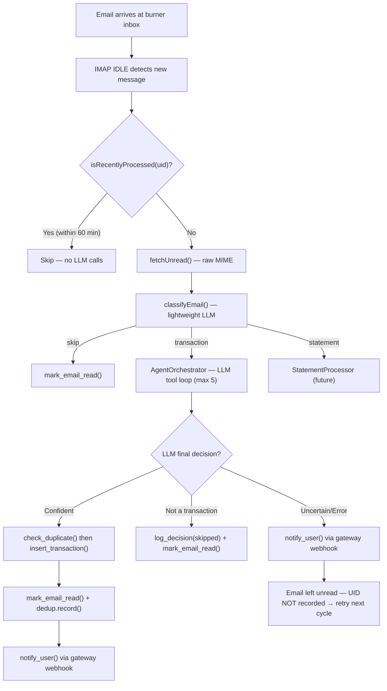
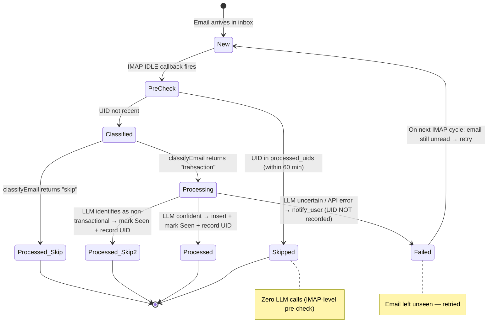
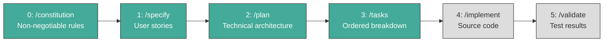
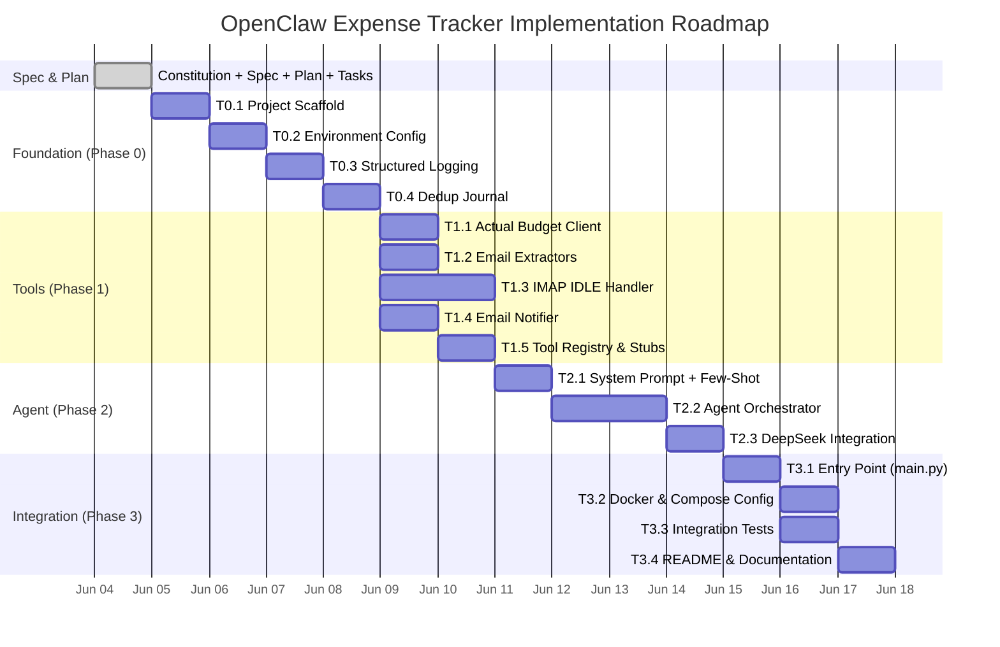

# darren-openclaw — Architecture Design Document

**Version:** 3.0.0
**Last Updated:** 2026-06-20
**Status:** Hermes migration complete. All modules MCP-enabled.

> ⚠ **This is a high-level overview.** Implementation details, tool tables, env vars, and algorithms belong in `specs/`. Link to specs for full detail. Do not bloat this file.

---

## Table of Contents

1. [Project Overview](#1-project-overview)
2. [Repository Structure](#2-repository-structure)
3. [System Architecture](#3-system-architecture)
4. [Hosting Topology](#4-hosting-topology)
5. [Module: expense-tracker](#5-module-expense-tracker)
5.A [Module: statement-reconciliation](#5a-module-statement-reconciliation-new)
5.B [Module: portfolio-tracker](#5b-module-portfolio-tracker)
6. [Module: Hermes Agent](#6-module-hermes-agent)
7. [Data Flow](#7-data-flow)
8. [Security Design](#8-security-design)
9. [Observability](#9-observability)
10. [Cost Model](#10-cost-model)
11. [Development Workflow](#11-development-workflow-spec-kit)
12. [Risk Register](#12-risk-register)
13. [Roadmap](#13-roadmap)

---
7. [Data Flow](#7-data-flow)
8. [Security Design](#8-security-design)
9. [Observability](#9-observability)
10. [Cost Model](#10-cost-model)
11. [Development Workflow (Spec-Kit)](#11-development-workflow-spec-kit)
12. [Risk Register](#12-risk-register)
13. [Roadmap](#13-roadmap)

---

## 1. Project Overview

**OpenClaw** is an umbrella project hosting modular, LLM-powered automation agents. Each module is an independent agent with its own spec, plan, tasks, and implementation. Modules share no code but follow consistent architectural principles: LLM-driven intelligence, deterministic tool execution, and internal-network communication.

### Current Modules

| Module | Purpose | Status |
|---|---|---|
| **expense-tracker** | Automated expense tracking via email → Actual Budget (Node.js tool backend) | Implemented |
| **portfolio-tracker** | Investment portfolio sync: IBKR flex queries, PDF trade confirmations, AB → PP balance sync, taxonomy → Google Sheets. Notifications via Gateway webhook (Node.js + Java CLI) | Implemented |
| **gateway** | OpenClaw Gateway deployment with expense-tracker + portfolio-tracker + ktmb-booking skills, Telegram channel, CDP browser relay, memory persistence | Implemented & Deployed |
| **statement-reconciliation** | PDF credit card statement reconciliation + outlier detection | Specified, Planned, Tasked — Implementation Pending |
| **ktmb-booking** | KTMB Shuttle Tebrau train booking + seat watcher (Python, Docker container) | Implemented |

---

## 2. Repository Structure

```
darren-openclaw/                          # Umbrella repository root
├── design.md                             # ← This file (architecture audit)
├── modules/
│   ├── expense-tracker/                  # Node.js module (expense tracking agent)
│   │   ├── .speckit/                     # Spec-Kit artifacts
│       │   ├── constitution.md           # Non-negotiable architecture rules
│       │   ├── agent.md                  # Agent harness (workflow state, context dump)
│       │   └── features/
│       │       └── expense-tracking/
│       │           ├── spec.md           # User stories & acceptance criteria
│       │           ├── plan.md           # Technical architecture & tool schemas
│       │           └── tasks.md          # Ordered implementation breakdown (16 tasks, ~12h)
│       ├── config/                       # Static configuration (non-secret)
│       │   ├── .gitkeep
│       │   └── email_config.json         # IMAP host/port for Email Provider
│       ├── src/                          # Python source (stubs only — not yet implemented)
│       │   ├── __init__.py
│       │   ├── agent/                    # LLM orchestration
│       │   ├── client/                   # Actual Budget REST client
│       │   ├── extractors/               # Email content extractors (HTML, PDF, text)
│       │   ├── imap/                     # IMAP IDLE handler
│       │   ├── notifier/                 # SMTP notification sender
│       │   └── utils/                    # Dedup journal, structured logging
│       ├── tests/                        # Test suite (stubs only)
│       ├── docker/                       # Dockerfile for expense-tracker container
│       └── db.sqlite                     # Dedup journal (runtime artifact)
│   └── portfolio-tracker/                # Node.js + Java 21 module
│       ├── .speckit/                     # Spec-Kit artifacts (constitution, spec, plan, tasks, agent)
│       ├── pp-cli/                       # Java CLI for PP XML read/write (Maven project)
│       │   ├── pom.xml                   # Depends on name.abuchen.portfolio:0.84.1
│       │   └── src/main/java/.../cli/
│       │       ├── Main.java             # CLI dispatcher (accounts, securities, insert, balance, taxonomy, portfolio)
│       │       └── PpClient.java         # PP model I/O via ClientFactory.load()/save()
│       ├── src/
│       │   ├── agent/                    # LLM orchestration (prompts.py, tools.py, orchestrator.py)
│       │   ├── channels/                 # Telegram bot handler + IMAP email handler
│       │   ├── extractors/               # PDF OCR (tesseract), IBKR flex query XML parser, email extractor
│       │   ├── pp_client/                # Async subprocess bridge to Java CLI
│       │   ├── google/                   # Google Sheets API client (taxonomy export)
│       │   ├── client/                   # Actual Budget REST client (budget queries)
│       │   └── utils/                    # Dedup journal, memory store, structured logging
│       ├── tests/                        # 111 Python tests across 13 test files
│       ├── docker/Dockerfile             # Python 3.12 + JRE 17 + Tesseract + curl
│       └── README.md
└── gateway/                              # OpenClaw Gateway config + skills
    ├── openclaw.json                     # Gateway configuration (JSON5)
    ├── docker-compose.yml                # Gateway + expense-tracker + actual-api + portfolio-tracker
    ├── Dockerfile                        # Custom image extending openclaw:latest-browser
    ├── docker-entrypoint.sh              # Template → workspace file generation + Xvfb/DBus startup
    ├── .env                              # Secrets (TELEGRAM_BOT_TOKEN, GEMINI_API_KEY, etc.)
    ├── AGENTS.md.template                # Agent instructions template (env-var substituted)
    ├── SOUL.md.template                  # Agent persona template (voice, visual appearance)
    ├── USER.md.template                  # User profile template (currency, budgets, rules)
    ├── IDENTITY.md.template              # Agent identity template (name, vibe, emoji)
    ├── MEMORY.md.template                # Memory seed template (plugin-managed, section headers only)
    ├── workspace/                        # Agent workspace (persisted on openclaw_home volume)
    │   └── skills/                       # Skills loaded by the gateway
    │       ├── expense-tracker/          # Expense tracker skill
    │       │   ├── SKILL.md              # LLM instructions for expense tracking
    │       │   └── SKILL.js              # Tool wrappers (HTTP → Python tools)
    │       ├── portfolio-tracker/        # Portfolio tracker skill
    │       ├── image-generation/         # Image generation skill (Perchance + Pollinations)
    │       └── pdf/                      # PDF decryption + extraction skill
    ├── actual-api/                       # Official Actual Budget API (Node.js)
    │   ├── server.js                     # Express.js wrapper around @actual-app/api
    │   ├── package.json                  # @actual-app/api@^26.6.0
    │   └── Dockerfile                    # Node.js container
    ├── notify-webhook.py                 # Portfolio-tracker notification webhook → Telegram
    └── .speckit/                         # Spec-Kit artifacts (gateway + skill)
```

---

## 3. System Architecture

### 3.1 High-Level Architecture (Mermaid)



### 3.2 Component Relationship Diagram


### 3.3 Architectural Pattern

OpenClaw uses the **LLM Agent Pattern**: expense-tracker tools are exposed as typed plugin tools (`budget_*` prefix) via the OpenClaw plugin system. All intelligence — parsing, classification, matching, routing — is delegated to the DeepSeek LLM via OpenAI-compatible function calling.

**Key Principle:** No business rules are hardcoded. Category mapping, account matching, and currency detection are performed by the LLM using live data fetched from Actual Budget's API at runtime.

---

## 4. Hosting Topology

| Component | Host | Network Access | Specs |
|---|---|---|---|
| **Actual Budget** | Server #1 (existing) | Public HTTPS for web UI; API via HTTPS (with auth) | Existing production instance |
| **OpenClaw Gateway** | Ubuntu laptop (Docker) | Agent orchestration, channels, skills, tool calling | ~400MB RAM |
| **Expense-tracker** | Ubuntu laptop (Docker) | 21 typed plugin tools (budget_ prefix), IMAP IDLE | ~150MB RAM |
| **Portfolio-tracker** | Ubuntu server (Docker) | Node.js agent + Java CLI subprocess; IMAP ingress (Trades folder); PP XML read/write; notifications via Gateway webhook | ~256MB RAM |
| **actual-api** | Ubuntu laptop (Docker) | Official `@actual-app/api` (Node.js), WebSocket sync | ~100MB RAM |
| **ktmb-booking** | Ubuntu laptop (Docker) | Python aiohttp API server + seat watcher worker; SQLite job store | ~150MB RAM |
| **Email Burner** | Any IMAP provider | Public IMAP (imap.example.com:993) | Free tier, dedicated inbox |
| **DeepSeek API** | DeepSeek Cloud | Public HTTPS (api.deepseek.com/v1) | Pay-per-token |
| **Windows Companion** | Windows laptop | Windows Hub app connects via `ws://192.168.68.51:18789` + token. Canvas, camera, screen, voice, TTS/STT via node mode | Any modern Windows 10/11 PC |
| **Chrome Daemon** | Production server | Chromium (headed, Xvfb :99) CDP :9222, socat-forwarded :9223 for Docker | ~300 MB RAM |

### Production Server Setup

The production server (`<SERVER_IP>`) runs several host-level services alongside Docker:

| Service | Port | Purpose |
|---------|------|---------|
| `chrome-daemon` | CDP :9222 | Chromium (headed, Xvfb :99) for browser automation (openclaw + Perchance) |
| `cdp-forward` | :9223 → :9222 | socat relay making loopback CDP accessible from Docker bridge |
| `x11vnc` | VNC :5900 | Debug accessibility for the virtual display (optional) |
| `cloudflare-warp` | system VPN | Accelerates Docker builds via Cloudflare backbone |

**Chrome daemon flags** (`chrome-daemon.service`):

```
--disable-dev-shm-usage
--remote-debugging-port=9222
--disable-gpu
--disable-software-rasterizer
--renderer-process-limit=1
```

See `./chrome-daemon.service` — a template included in the repo for new server setup.
The `modules/deploy.sh` creates and enables these services automatically on first run.

### Browser CDP Relay Architecture

Chrome runs **on the host**, not inside Docker. Containers connect via `host.docker.internal:9223`
(socat relay). `openclaw.json` uses `${CDP_URL}` — resolved dynamically by
`docker-entrypoint.sh` at container boot via `extra_hosts`.



### Internal Networking

The expense-tracker container accesses Actual Budget's API via HTTPS over the public internet. Actual Budget's web UI port (5006) is publicly accessible with HTTPS enforcement and API authentication.

### Network Diagram



---

## 5. Module: expense-tracker

### 5.1 Purpose

An LLM-powered agent that handles receipt emails, extracts structured transactions, and inserts them into Actual Budget. Exposes 22 tools via MCP to Hermes (and 26 REST `/tools/*` endpoints). The LLM orchestrator, IMAP handling, and memory are now owned by Hermes — expense-tracker is a tool server.

### 5.2 Technology Stack

| Layer | Choice |
|---|---|
| Runtime | Node.js 22 |
| LLM Client | openai SDK (DeepSeek) |
| HTTP | Express |
| MCP | @modelcontextprotocol/sdk (Streamable HTTP) |
| Embeddings | @xenova/transformers (WASM, all-MiniLM-L6-v2) |
| Dedup | better-sqlite3 (dedup.db + statement.db) |
| PDF | child_process pdftotext |
| Logging | pino |

### 5.3 Architecture

Expense-tracker exposes an MCP server at `:8080/mcp`. Hermes handles email ingestion, LLM orchestration, and memory. The module provides deterministic tools: Actual Budget CRUD, dedup checks, PDF extraction, and HTML parsing. Alert emails (receipts) and statement emails (monthly PDFs) are dispatched by Hermes to the appropriate pipeline. Full details in [spec 002](./specs/002-expense-tracking/spec.md).

### 5.4 Key Design Decisions

| Decision | Rationale |
|---|---|
| Node.js over Python | Fast Docker builds (no PyTorch), unified stack |
| WASM embeddings over ONNX | ~50MB model, no native deps, baked into image |
| SQLite dedup journal | Prevents duplicate inserts; shared schema with Python era |
| MCP over REST-only | Hermes integration; typed tool schemas |

### 5.5 Implementation Status

- ✅ 22 tools registered as MCP server (26 REST `/tools/*` endpoints)
- ✅ Dedup journal (dedup.db + statement.db)
- ✅ PDF extraction (pdftotext)
- ✅ WASM embeddings baked into Docker image
- ✅ Pre-classification: statement vs transaction routing

---

## 5.A Module: statement-reconciliation

### 5A.1 Purpose

A parallel pipeline for processing monthly bank/credit card statements (PDF/HTML). Unlike receipt emails which insert new transactions, statements reconcile against existing entries: matching line items are marked cleared, unmatched are inserted as outliers. Uses DeepSeek v4-pro for higher accuracy on multi-line extraction.

### 5A.2 Architecture

An email is pre-classified by Hermes as "statement" vs "transaction" before dispatch. Statements go to the StatementProcessor (separate orchestrator, v4-pro, max 20 iterations). The pipeline: extract content → LLM extracts line items → fuzzy match against unreconciled transactions → mark matched as cleared, insert outliers → notify user with summary. Full details in [spec 004](./specs/004-statement-reconciliation/spec.md).

### 5A.3 Key Design Decisions

| Decision | Rationale |
|---|---|
| Separate orchestrator from alert pipeline | Isolates regression risk; different LLM model + iteration count |
| Statement journal (statement.db) | Prevents double-processing by account + period |
| Fuzzy matching over exact matching | Handles posting delays (±2d) and amount rounding (±20c) |

### 5A.4 Implementation Status

- ✅ Statement classification (pre-classify LLM call)
- ✅ StatementProcessor with 5 tools (fetch_unreconciled, reconcile, record, fetch_history, check_duplicate)
- ✅ Fuzzy matching algorithm (amount + date + merchant overlap)
- ✅ actual-api endpoints (/transactions/:id/clear, date range filters)

---

---

## 6. Module: Hermes Agent

### 6.1 Purpose

The central agent runtime replacing the former OpenClaw gateway. Hermes provides Telegram, email, memory, cron, and MCP client support. All modules connect via MCP — Hermes calls their tools, receives results, and relays to users.

### 6.2 Architecture



### 6.3 MCP Servers

| Module | MCP URL | Tools |
|---|---|---|
| expense-tracker | `http://expense-tracker:8080/mcp` | 22 MCP tools — Actual Budget CRUD + dedup + extractors + memory + IMAP inbox |
| portfolio-tracker | `http://portfolio-tracker:8081/mcp` | `portfolio_sync`, OneDrive IO, OneDrive auth |
| ktmb-booking | `http://ktmb-booking:8082/mcp` | Train booking, schedule lookup |
| image-gen | `http://image-gen:8083/mcp` | Image generation |

### 6.4 Cron Jobs (Hermes-managed)

| Job | Schedule | Action |
|---|---|---|
| portfolio-daily-sync | `0 12 * * *` (daily noon, container time) | `portfolio-sync.sh` — REST `POST /tools/pp-sync-all` (no_agent, zero tokens) |
| github-auth-refresh | Every 50 min | Refresh GitHub App token |
| memory-backup | Every 360 min | Backup Hermes memories to private repo |

### 6.5 Implementation Status

- ✅ Hermes container running (`modules/hermes/Dockerfile`)
- ✅ All 4 modules registered as MCP servers in `config.yaml`
- ✅ Telegram + email channels configured
- ✅ Cron jobs seeded via `50-seed-defaults`
- ✅ OpenClaw gateway fully removed

## 5.B Module: portfolio-tracker

### 5B.1 Purpose

A Node.js agent that manages investment portfolio data. It syncs IBKR trades via the Flex Web Service, handles PDF trade confirmations via IMAP, updates Portfolio Performance via Java CLI, syncs Actual Budget balances, and exports taxonomy to Google Sheets. Hermes Agent controls it via MCP (`portfolio_sync`, OneDrive IO).

### 5B.2 Technology Stack

| Layer | Choice |
|---|---|
| Runtime | Node.js 22 + Java 21 |
| LLM | DeepSeek v4 (PDF trade confirmation matching) |
| MCP | @modelcontextprotocol/sdk (Streamable HTTP) |
| IMAP | node-imap (PDF trade confirmations only) |
| OneDrive | Microsoft Graph API |
| PP CLI | Java JAR (pp-cli.jar) — native IBFlexStatementExtractor |
| Google Sheets | googleapis (service account) |
| Scheduling | Hermes cron `0 12 * * *` (daily noon, container time; see `modules/hermes/50-seed-defaults`) |

### 5B.3 Architecture

Portfolio-tracker exposes 12 MCP tools to Hermes: `portfolio_sync` (full pipeline), three OneDrive auth tools (`onedrive_auth_url`, `onedrive_auth_complete`, `onedrive_status`), two OneDrive IO tools (`onedrive_pull`, `onedrive_push`), four portfolio data tools (`insert_transaction`, `get_all`, `query_security`, `taxonomy`), and two memory tools (`search_memory`, `learn_fact` — for encrypted PDF passwords and broker mappings). The sync pipeline is deterministic — no LLM:

1. OneDrive pull → 2. IBKR flex fetch + Java CLI import → 3. AB balance sync (AB→PP) → 4. OneDrive push → 5. Taxonomy export → 6. SGD-converted portfolio status

IMAP IDLE monitors the "Trades" folder for PDF confirmations only. The LLM orchestrator matches securities and inserts trades. REST endpoints are preserved for backward compatibility. Full architecture details are in [spec 003](./specs/003-portfolio-tracker/spec.md).

### 5B.4 Key Design Decisions

| Decision | Rationale |
|---|---|
| MCP Streamable HTTP over SSE | Survives container restarts — Hermes auto-reconnects transparently |
| IBKR flex via REST, not IMAP | Deterministic; no email parsing needed. PP native IBFlexStatementExtractor handles import |
| Java CLI subprocess | Uses PP's own XML parser; mutex-locked to prevent file corruption |
| Hermes MCP for notifications | Hermes migration transfers channel ownership from gateway to Hermes |

### 5B.5 Implementation Status

- ✅ MCP server (`src/mcp-server.js`) — 12 tools registered
- ✅ IBKR Flex Web Service (`src/ibkr_flex.js`) — two-step protocol
- ✅ `_computeSyncAll()` pipeline — deterministic, non-fatal on flex failure
- ✅ Hermes config — `mcp_servers` lists portfolio-tracker
- ✅ Telegram commands — `/sync`, `/onedrive` routed through Hermes
- ✅ 22 REST `/tools/*` endpoints preserved for backward compatibility

---

### 6.8 WARP for Docker Builds

**Status:** ✅ Implemented (2026-06-10)

Docker builds on the production server suffer from bad ISP routing to PyPI
(127 kB/s) and GHCR. Cloudflare WARP runs as a system-level VPN, routing
all traffic through Cloudflare's backbone.

| Component | Role |
|-----------|------|
| \ | System VPN — routes all traffic through Cloudflare |
| \ | Toggles WARP on before The command docker could not be found in this WSL 2 distro.
We recommend to activate the WSL integration in Docker Desktop settings.

For details about using Docker Desktop with WSL 2, visit:

https://docs.docker.com/go/wsl2/, off after |

**Results:** pip 127 kB/s → 64 MB/s (500x). No proxy, no privoxy, no env vars.

---

## 7. Data Flow

### 7.1 Per-Email Processing Sequence (Mermaid Flowchart)



### 7.2 Email Lifecycle States



---

## 8. Security Design

### 8.1 Secret Management

All credentials are injected via environment variables:
- **DeepSeek API key** — `DEEPSEEK_API_KEY`
- **IMAP password** — `IMAP_PASSWORD` (IMAP app-specific password)
- **Actual Budget password** — `ACTUAL_BUDGET_PASSWORD`
- **SMTP password** — `NOTIFICATION_EMAIL_PASSWORD`
- **Gateway auth token** — `OPENCLAW_GATEWAY_TOKEN` (authenticates operators, nodes, and internal CLI)

Secrets are set via `.env` file (mounted as read-only volume in Docker Compose). `.env` is `.gitignore`d. Both `openclaw.json` and `docker-compose.yml` reference `${OPENCLAW_GATEWAY_TOKEN}` via env-var substitution — no hardcoded tokens.

At container startup, `docker-entrypoint.sh` seeds `/app/.openclaw/exec-approvals.json` (the allowlist for `exec:` commands). Device pairing is handled separately: on first connect, the Windows Companion sends a pairing request. Run `docker exec openclaw openclaw devices approve <requestId>` on the server to approve it. Once approved, the pairing persists in `/app/.openclaw/devices/paired.json` (managed by the OpenClaw runtime). This is a one-time step.

### 8.2 Network Isolation

| Path | Protocol | Exposure |
|---|---|---|
| expense-tracker → Actual Budget API | HTTPS (public) | Outbound only (with auth) |
| expense-tracker → DeepSeek | HTTPS (public) | Outbound only |
| expense-tracker → IMAP | IMAP/SSL (public) | Outbound only |
| User → Actual Budget UI | HTTPS (public) | For manual budget management |
| Windows Companion → Gateway | WebSocket (LAN) | `0.0.0.0:18789` authenticated via `gateway.auth.token` |
| Internal services → Gateway | HTTP (Docker network) | Inter-container only; webhooks use `hooks.token` |

### 8.3 Burner Email Isolation

The Email burner inbox is a dedicated, isolated account. Compromise of this inbox:
- Cannot access Actual Budget (API key is not in emails)
- Cannot access user's main email (separate accounts)
- Only exposes transaction alert emails (which are already sent to this address)

---

## 9. Observability

### 9.1 Logging

All logs are JSON-line format written to stdout and consumed via `docker compose logs`:

```json
{
  "timestamp": "2026-06-04T13:00:01.082Z",
  "level": "INFO",
  "logger": "src.agent.orchestrator",
  "correlation_id": "txn-abc123",
  "event": "transaction_inserted",
  "data": {
    "amount_cents": -1280,
    "currency": "SGD",
    "account": "DBS Yuu",
    "merchant": "Toast Box",
    "transaction_id": "a9e755b1-f94f-45b0-be77-fe83c0180042"
  }
}
```

### 9.2 Correlation ID

Every email's IMAP `message_id` is carried through the entire pipeline as `correlation_id`. It appears in:
- All log lines for that email
- The dedup journal (`msg_id` column)
- The Actual Budget transaction `notes` field

### 9.3 Crash Diagnostics

Three `process` handlers log the cause of any unexpected exit:

| Handler | Trigger | Log Event | Exit Code |
|---|---|---|---|
| `unhandledRejection` | Promise rejects with no `.catch()` | `fatal_unhandled_rejection` | 1 |
| `uncaughtException` | Synchronous throw outside try/catch | `fatal_uncaught_exception` | 1 |
| `beforeExit` | Event loop drained (no more work) | `process_before_exit` | 0 |

SIGTERM (Docker `compose stop`) uses Node default — exit code 143, no custom handler, distinguishable from event-loop drain.

### 9.4 Health Check

The expense-tracker container exposes an HTTP health check on port 8080 (returns 200 OK) for Docker health monitoring. No other endpoints are exposed.

---

## 10. Cost Model

| Resource | Monthly Cost |
|---|---|
| Server #1 (Actual Budget, existing) | $0.00 (free tier) |
| Ubuntu laptop (Docker, self-hosted) | $0.00 (existing hardware) |
| DeepSeek API (~100 emails/month, expense-tracker internal LLM) | ~$0.10 |
| DeepSeek API (Telegram chat — orchestrator v4-flash) | ~$0.05 |
| DeepSeek API (Telegram chat — thinker v4-pro, ~20% of messages) | ~$0.05 |
| Gemini API (embeddings + fallback, free tier) | $0.00 |
| Email burner inbox | $0.00 (free tier) |
| **Total incremental cost** | **~$0.20/month** |

Token economics per email (expense-tracker internal): ~2000 input tokens + ~200 output tokens = ~$0.001 per email.

Token economics per Telegram message: 
- 80% simple (orchestrator v4-flash): ~500 tokens = ~$0.0001
- 20% complex (thinker v4-pro): ~2000 tokens = ~$0.001
- Weighted average per message: ~$0.0003

---
  <!-- trufflehog:ignore -->

## 11. Development Workflow (Spec-Kit)

OpenClaw follows **Spec-Kit**, a spec-driven development methodology. Every feature progresses through 5 phases:



| Phase | Command | Output | Description |
|---|---|---|---|
| 0 | `/speckit.constitution` | `constitution.md` | Non-negotiable architecture rules |
| 1 | `/speckit.specify` | `spec.md` | User stories with acceptance criteria |
| 2 | `/speckit.plan` | `plan.md` | Technical architecture, tool schemas, data models |
| 3 | `/speckit.tasks` | `tasks.md` | Ordered implementation tasks with estimates |
| 4 | `/speckit.implement` | Source files | Task-by-task implementation |
| 5 | `/speckit.validate` | Test results | Verification against acceptance criteria |

### Artifact Hierarchy

```
.speckit/
├── constitution.md          # Project-level (governs all modules)
├── agent.md                 # Agent harness (workflow state machine)
└── features/
    └── <feature-name>/
        ├── spec.md          # What to build
        ├── plan.md          # How to build it
        └── tasks.md         # Step-by-step breakdown
```

---

## 12. Risk Register

| Risk | Likelihood | Impact | Mitigation |
|---|---|---|---|
| DeepSeek API downtime | Low | Processing stalls | 3 retries with exponential backoff; on failure, leave email unread + notify user |
| IMAP IDLE connection drops | Medium | Missed emails | Auto-reconnect with catch-up fetch of unread emails |
| Actual Budget API schema change | Low | Insertions fail | Version-locked; check Actual Budget release notes |
| LLM hallucinates transaction data | Medium | Bad data in Actual Budget | Guardrails in system prompt; `check_duplicate` catches repeats; `notify_user` on uncertainty |
| Email Provider blocks automated IMAP access | Low | No email ingestion | Use IMAP app-specific password; fallback to different burner email provider |
| 256MB RAM insufficient for Tesseract OCR | Medium | PDF processing fails | PDF/OCR is optional; fallback to plain text attachment extraction |
| Docker host failure | Low | Processing stalls | Restart Docker Compose; dedup journal prevents duplicates on recovery |

---

## 13. Roadmap



| Phase | Milestone | Status |
|---|---|---|
| **Current** | expense-tracker (alert pipeline): Spec, Plan, Tasks complete | ✅ |
| **Current** | statement-reconciliation: Spec, Plan, Tasks complete | ✅ |
| **Current** | Gateway model tiering (orchestrator + thinker): Deployed | ✅ |
| **Next** | expense-tracker: `/implement` — Phase 0 (Foundation) | ⬜ |
| | statement-reconciliation: `/implement` — Phase 0 (Foundation) | ⬜ |
| | expense-tracker: `/validate` — Test suite + Docker build | ⬜ |
| | statement-reconciliation: `/validate` — Full regression suite | ⬜ |
| **Future** | gateway: Feature specification & implementation | ⬜ |

### 13.1 Technical Debt

See [tech-debt.md](../tech-debt.md) for cross-cutting architectural items.