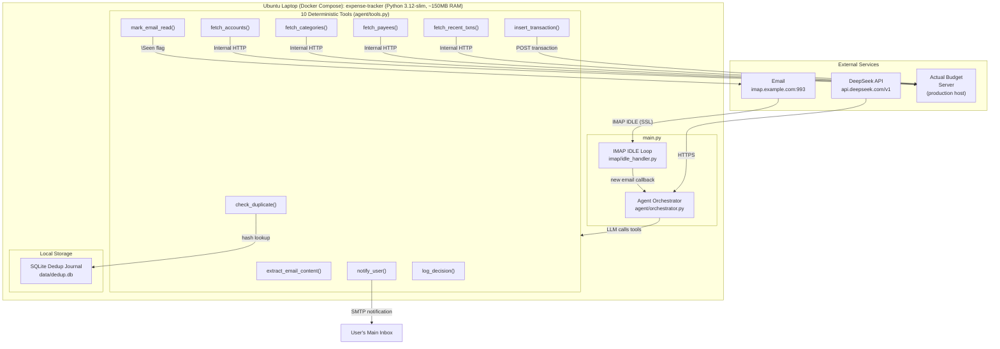
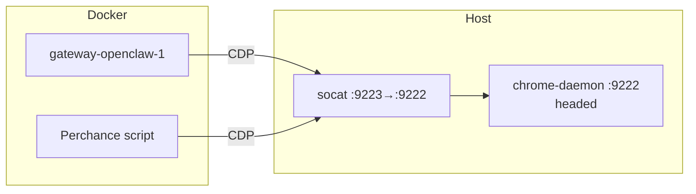
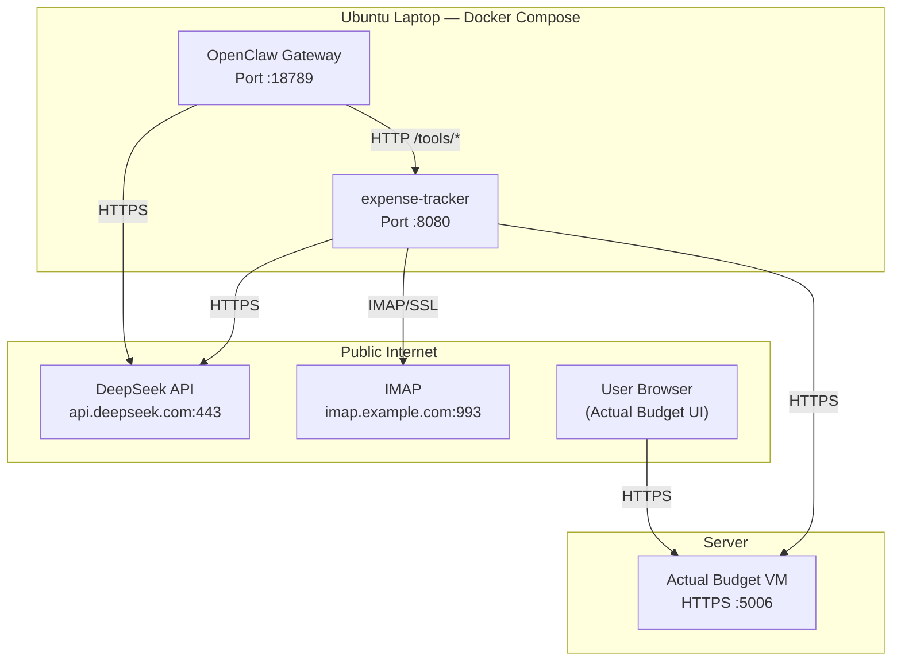
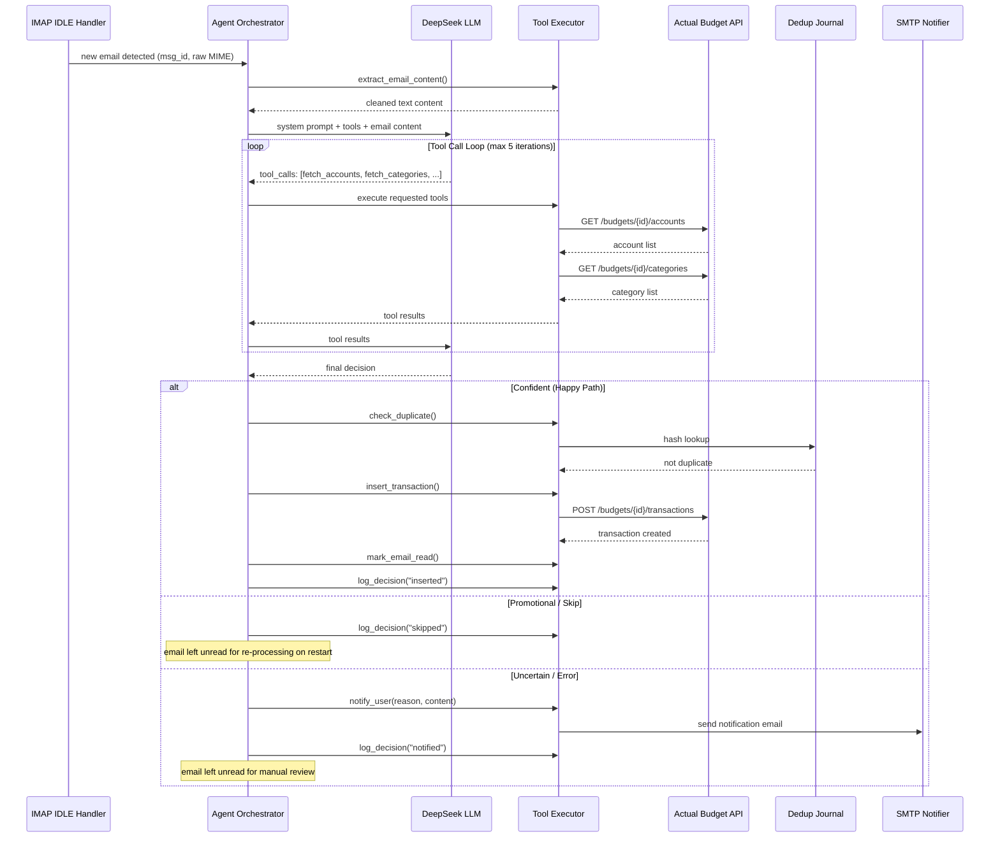
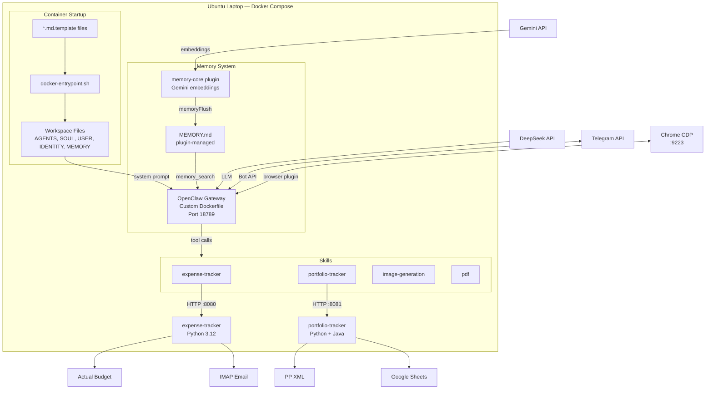
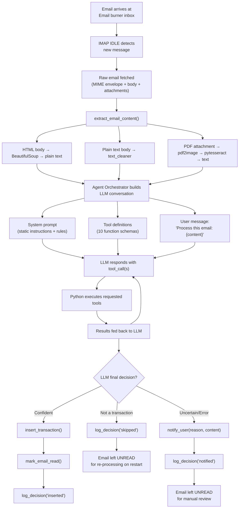
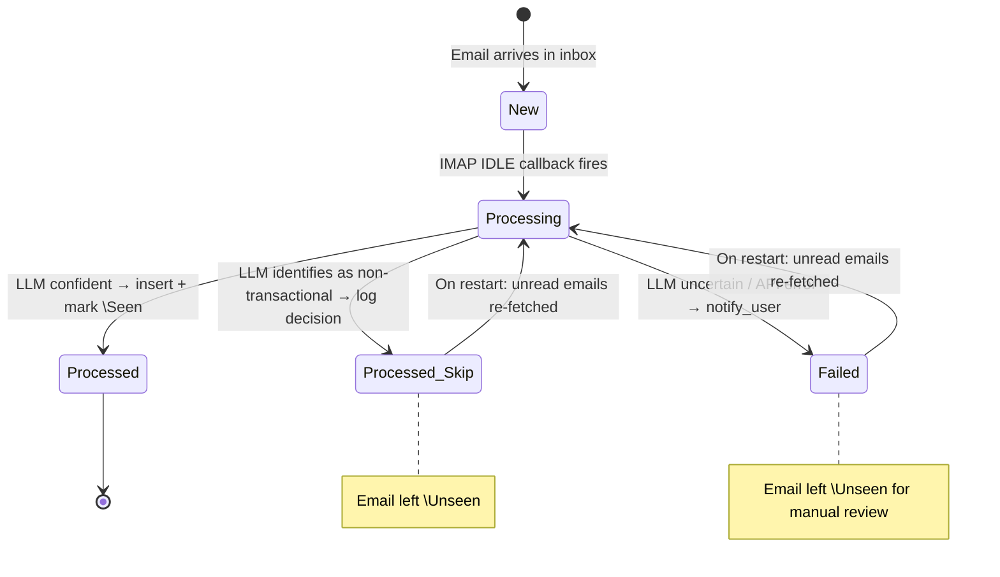
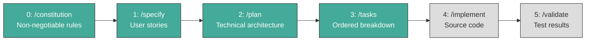
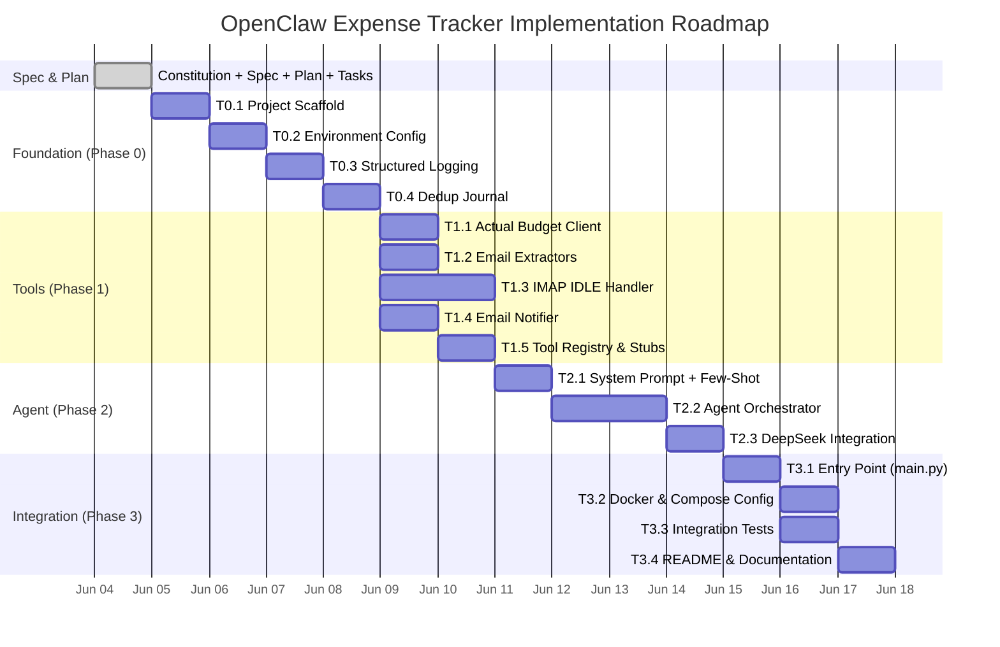

# OpenClaw — Architecture Design Document

**Project:** darren-openclaw
**Version:** 2.1.0
**Last Updated:** 2026-06-12
**Status:** Gateway implemented & deployed. Workspace memory files specified. Statement Reconciliation specified.

---

## Table of Contents

1. [Project Overview](#1-project-overview)
2. [Repository Structure](#2-repository-structure)
3. [System Architecture](#3-system-architecture)
4. [Hosting Topology](#4-hosting-topology)
5. [Module: expense-tracker](#5-module-expense-tracker)
6. [Module: gateway](#6-module-gateway)
   - [6.8 Workspace File Templates](#68-workspace-file-templates)
7. [Data Flow](#7-data-flow)
8. [Security Design](#8-security-design)
9. [Observability](#9-observability)
10. [Cost Model](#10-cost-model)
11. [Development Workflow (Spec-Kit)](#11-development-workflow-spec-kit)
12. [Risk Register](#12-risk-register)
13. [Roadmap](#13-roadmap)

---

## 1. Project Overview

**OpenClaw** is an umbrella project hosting modular, LLM-powered automation agents. Each module is an independent agent with its own spec, plan, tasks, and implementation. Modules share no code but follow consistent architectural principles: LLM-driven intelligence, deterministic tool execution, and internal-network communication.

### Current Modules

| Module | Purpose | Status |
|---|---|---|
| **expense-tracker** | Automated expense tracking via email → Actual Budget (Python tool backend) | Implemented |
| **portfolio-tracker** | Investment portfolio sync: IBKR flex queries, PDF trade confirmations, AB → PP balance sync, taxonomy → Google Sheets. Notifications via Gateway webhook (Python + Java CLI) | Implemented |
| **gateway** | OpenClaw Gateway deployment with expense-tracker + portfolio-tracker skills, Telegram channel, CDP browser relay, memory persistence | Implemented & Deployed |
| **statement-reconciliation** | PDF credit card statement reconciliation + outlier detection | Specified, Planned, Tasked — Implementation Pending |

---

## 2. Repository Structure

```
darren-openclaw/                          # Umbrella repository root
├── design.md                             # ← This file (architecture audit)
├── modules/
│   ├── expense-tracker/                  # Python 3.12 module (expense tracking agent)
│   │   ├── .speckit/                     # Spec-Kit artifacts
│       │   ├── constitution.md           # Non-negotiable architecture rules
│       │   ├── agent.md                  # Agent harness (workflow state, context dump)
│       │   └── features/
│       │       └── expense-tracking/
│       │           ├── spec.md           # User stories & acceptance criteria
│       │           ├── plan.md           # Technical architecture & tool schemas
│       │           └── tasks.md          # Ordered implementation breakdown (16 tasks, ~12h)
│       ├── config/                       # Static configuration (non-secret)
│       │   ├── .gitkeep
│       │   └── email_config.json         # IMAP host/port for Email Provider
│       ├── src/                          # Python source (stubs only — not yet implemented)
│       │   ├── __init__.py
│       │   ├── agent/                    # LLM orchestration
│       │   ├── client/                   # Actual Budget REST client
│       │   ├── extractors/               # Email content extractors (HTML, PDF, text)
│       │   ├── imap/                     # IMAP IDLE handler
│       │   ├── notifier/                 # SMTP notification sender
│       │   └── utils/                    # Dedup journal, structured logging
│       ├── tests/                        # Test suite (stubs only)
│       ├── docker/                       # Dockerfile for expense-tracker container
│       └── db.sqlite                     # Dedup journal (runtime artifact)
│   └── portfolio-tracker/                # Python 3.12 + Java 17 module
│       ├── .speckit/                     # Spec-Kit artifacts (constitution, spec, plan, tasks, agent)
│       ├── pp-cli/                       # Java CLI for PP XML read/write (Maven project)
│       │   ├── pom.xml                   # Depends on name.abuchen.portfolio:0.84.1
│       │   └── src/main/java/.../cli/
│       │       ├── Main.java             # CLI dispatcher (accounts, securities, insert, balance, taxonomy, portfolio)
│       │       └── PpClient.java         # PP model I/O via ClientFactory.load()/save()
│       ├── src/
│       │   ├── agent/                    # LLM orchestration (prompts.py, tools.py, orchestrator.py)
│       │   ├── channels/                 # Telegram bot handler + IMAP email handler
│       │   ├── extractors/               # PDF OCR (tesseract), IBKR flex query XML parser, email extractor
│       │   ├── pp_client/                # Async subprocess bridge to Java CLI
│       │   ├── google/                   # Google Sheets API client (taxonomy export)
│       │   ├── client/                   # Actual Budget REST client (budget queries)
│       │   └── utils/                    # Dedup journal, memory store, structured logging
│       ├── tests/                        # 111 Python tests across 13 test files
│       ├── docker/Dockerfile             # Python 3.12 + JRE 17 + Tesseract + curl
│       └── README.md
└── gateway/                              # OpenClaw Gateway config + skills
    ├── openclaw.json                     # Gateway configuration (JSON5)
    ├── docker-compose.yml                # Gateway + expense-tracker + actual-api + portfolio-tracker
    ├── Dockerfile                        # Custom image extending openclaw:latest-browser
    ├── docker-entrypoint.sh              # Template → workspace file generation + Xvfb/DBus startup
    ├── .env                              # Secrets (TELEGRAM_BOT_TOKEN, GEMINI_API_KEY, etc.)
    ├── AGENTS.md.template                # Agent instructions template (env-var substituted)
    ├── SOUL.md.template                  # Agent persona template (voice, visual appearance)
    ├── USER.md.template                  # User profile template (currency, budgets, rules)
    ├── IDENTITY.md.template              # Agent identity template (name, vibe, emoji)
    ├── MEMORY.md.template                # Memory seed template (plugin-managed, section headers only)
    ├── workspace/                        # Agent workspace (persisted on openclaw_home volume)
    │   └── skills/                       # Skills loaded by the gateway
    │       ├── expense-tracker/          # Expense tracker skill
    │       │   ├── SKILL.md              # LLM instructions for expense tracking
    │       │   └── SKILL.js              # Tool wrappers (HTTP → Python tools)
    │       ├── portfolio-tracker/        # Portfolio tracker skill
    │       ├── image-generation/         # Image generation skill (Perchance + Pollinations)
    │       └── pdf/                      # PDF decryption + extraction skill
    ├── actual-api/                       # Official Actual Budget API (Node.js)
    │   ├── server.js                     # Express.js wrapper around @actual-app/api
    │   ├── package.json                  # @actual-app/api@^26.6.0
    │   └── Dockerfile                    # Node.js container
    ├── notify-webhook.py                 # Portfolio-tracker notification webhook → Telegram
    └── .speckit/                         # Spec-Kit artifacts (gateway + skill)
```

---

## 3. System Architecture

### 3.1 High-Level Architecture (Mermaid)



### 3.2 Component Relationship Diagram


### 3.3 Architectural Pattern

OpenClaw uses the **LLM Agent Pattern**: the Python host is a thin runtime that provides deterministic tools. All intelligence — parsing, classification, matching, routing — is delegated to the DeepSeek LLM via OpenAI-compatible function calling.

**Key Principle:** No business rules are hardcoded in Python. Category mapping, account matching, and currency detection are performed by the LLM using live data fetched from Actual Budget's API at runtime.

---

## 4. Hosting Topology

| Component | Host | Network Access | Specs |
|---|---|---|---|
| **Actual Budget** | Server #1 (existing) | Public HTTPS for web UI; API via HTTPS (with auth) | Existing production instance |
| **OpenClaw Gateway** | Ubuntu laptop (Docker) | Agent orchestration, channels, skills, tool calling | ~400MB RAM |
| **Expense-tracker** | Ubuntu laptop (Docker) | 10 deterministic Python tools, IMAP IDLE | ~150MB RAM |
| **Portfolio-tracker** | Ubuntu server (Docker) | Python agent + Java CLI subprocess; IMAP ingress (Trades folder); PP XML read/write; notifications via Gateway webhook | ~256MB RAM |
| **actual-api** | Ubuntu laptop (Docker) | Official `@actual-app/api` (Node.js), WebSocket sync | ~100MB RAM |
| **Email Burner** | Any IMAP provider | Public IMAP (imap.example.com:993) | Free tier, dedicated inbox |
| **DeepSeek API** | DeepSeek Cloud | Public HTTPS (api.deepseek.com/v1) | Pay-per-token |
| **Windows Node** (future) | Windows laptop | Canvas, camera, screen, voice — connects via WebSocket | Any modern Windows PC |
| **Chrome Daemon** | Production server | Chromium (headed, Xvfb :99) CDP :9222, socat-forwarded :9223 for Docker | ~300 MB RAM |

### Production Server Setup

The production server (`<SERVER_IP>`) runs several host-level services alongside Docker:

| Service | Port | Purpose |
|---------|------|---------|
| `chrome-daemon` | CDP :9222 | Chromium (headed, Xvfb :99) for browser automation (openclaw + Perchance) |
| `cdp-forward` | :9223 → :9222 | socat relay making loopback CDP accessible from Docker bridge |
| `x11vnc` | VNC :5900 | Debug accessibility for the virtual display (optional) |
| `cloudflare-warp` | system VPN | Accelerates Docker builds via Cloudflare backbone |

**Chrome daemon flags** (`chrome-daemon.service`):

```
--disable-dev-shm-usage
--remote-debugging-port=9222
--disable-gpu
--disable-software-rasterizer
--renderer-process-limit=1
```

See `./chrome-daemon.service` — a template included in the repo for new server setup.
The `scripts/deploy.sh` creates and enables these services automatically on first run.

### Browser CDP Relay Architecture

Chrome runs **on the host**, not inside Docker. Containers connect via `host.docker.internal:9223`
(socat relay). `openclaw.json` uses `${CDP_URL}` — resolved dynamically by
`docker-entrypoint.sh` at container boot via `extra_hosts`.



### Internal Networking

The expense-tracker container accesses Actual Budget's API via HTTPS over the public internet. Actual Budget's web UI port (5006) is publicly accessible with HTTPS enforcement and API authentication.

### Network Diagram



---

## 5. Module: expense-tracker

### 5.1 Purpose

An LLM-powered agent that monitors a dedicated Email burner inbox via IMAP IDLE. When a receipt or transaction alert email arrives, the agent extracts structured transaction data and inserts it into the user's Actual Budget instance.

### 5.2 Technology Stack

| Layer | Choice | Rationale |
|---|---|---|
| Runtime | Python 3.12-slim | Lightweight (~80MB), async I/O, mature IMAP/HTTP libraries |
| LLM | DeepSeek `deepseek-chat` | $0.14/1M input, $0.28/1M output; strong at structured extraction |
| LLM Client | `openai` SDK | DeepSeek is OpenAI-API-compatible |
| IMAP | `aioimaplib` | Async IMAP IDLE support, lightweight |
| HTTP | `aiohttp` | Async HTTP for Actual Budget REST API |
| HTML Parsing | `beautifulsoup4` + `lxml` | Extract plain text from HTML email bodies |
| PDF OCR | `pytesseract` + `pdf2image` | Optional; Tesseract binary in Docker image |
| Dedup | `sqlite3` (stdlib) | Zero-dependency single-file journal |
| Logging | `logging` + `json` (stdlib) | JSON-line structured logs to stdout |
| Container | Docker Compose | `Dockerfile` + `docker-compose.yml` |

### 5.3 User Stories (from spec.md)

| ID | Story | Core Behavior |
|---|---|---|
| US-1 | Real-Time Email Monitoring | IMAP IDLE connection detects new emails within 5 seconds; auto-reconnect with catch-up |
| US-2 | Intelligent Email Parsing via LLM | DeepSeek extracts amount, currency, merchant, date from any format; no per-bank parser code |
| US-3 | Dual-Currency Budget Routing | SGD → `Test-SGD-Budget`; MYR → MYR budget; unknown currencies trigger notification |
| US-4 | Live Account Matching | LLM calls `fetch_accounts` before matching; no hardcoded account UUIDs |
| US-5 | Live Category Assignment | LLM calls `fetch_categories`; category based on merchant context; `null` if uncertain |
| US-6 | Duplicate Prevention | SHA-256 hash check against SQLite journal before each insert |
| US-7 | Notification for Ambiguous Emails | Unknown currency, missing amount, unmatched account → SMTP notification, email left unread |
| US-8 | Idempotent Processing | Emails marked `\Seen` only after successful insert; safe to restart at any time |

### 5.4 The 10 LLM Tools

The LLM is given 10 function definitions (OpenAI-compatible JSON schema). It chooses which tools to call and in what order:

| # | Tool | Type | Description |
|---|---|---|---|
| 1 | `extract_email_content` | Pre-processing | Extract & clean text from email (HTML → text, PDF → OCR) |
| 2 | `fetch_accounts` | Read | GET accounts from Actual Budget API |
| 3 | `fetch_categories` | Read | GET categories from Actual Budget API |
| 4 | `fetch_payees` | Read | GET payees from Actual Budget API |
| 5 | `fetch_recent_transactions` | Read | GET recent transactions for dedup context |
| 6 | `insert_transaction` | Write | POST transaction to Actual Budget |
| 7 | `check_duplicate` | Read | SHA-256 lookup in SQLite dedup journal |
| 8 | `mark_email_read` | Write | Set IMAP `\Seen` flag |
| 9 | `notify_user` | Write | Send SMTP notification to user's main inbox |
| 10 | `log_decision` | Write | Structured JSON log entry |

### 5.5 Agent Orchestration (Mermaid Sequence)



### 5.6 Dedup Journal

SHA-256 hash computed over `(date, amount_cents, account_id, merchant)` and stored in a local SQLite database. The journal is persisted on a Docker volume mount and survives container restarts.

```sql
CREATE TABLE dedup_journal (
    id INTEGER PRIMARY KEY AUTOINCREMENT,
    hash TEXT UNIQUE NOT NULL,
    msg_id TEXT NOT NULL,
    date TEXT NOT NULL,
    amount_cents INTEGER NOT NULL,
    account_id TEXT NOT NULL,
    merchant TEXT NOT NULL,
    created_at TEXT NOT NULL DEFAULT (datetime('now'))
);
```

### 5.7 Environment Variables

| Variable | Required | Description |
|---|---|---|
| `DEEPSEEK_API_KEY` | ✅ | DeepSeek API key |
| `ACTUAL_BUDGET_URL` | ✅ | Actual Budget server URL |
| `ACTUAL_BUDGET_PASSWORD` | ✅ | Actual Budget server password |
| `ACTUAL_BUDGET_FILE` | ✅ | Budget file ID or name |
| `ACTUAL_BUDGET_ENCRYPTION_PASSWORD` | ❌ | Optional encryption password |
| `IMAP_HOST` | ✅ | `imap.example.com` |
| `IMAP_PORT` | ❌ | Default: `993` |
| `IMAP_USERNAME` | ✅ | Burner email address (Email account) |
| `IMAP_PASSWORD` | ✅ | IMAP app-specific password |
| `NOTIFICATION_SMTP_HOST` | ✅ | SMTP server for notifications (`smtp.example.com`) |
| `NOTIFICATION_SMTP_PORT` | ❌ | Default: `587` |
| `NOTIFICATION_EMAIL` | ✅ | User's main email for notifications |
| `NOTIFICATION_EMAIL_PASSWORD` | ✅ | SMTP password (defaults to IMAP_PASSWORD if not set) |
| `DEDUP_DB_PATH` | ❌ | Default: `data/dedup.db` |
| `LOG_LEVEL` | ❌ | Default: `INFO` |

### 5.8 Email Configuration

| Aspect | Setting |
|---|---|
| IMAP Host | `imap.example.com` |
| IMAP Port | 993 (SSL) |
| IDLE Support | ✅ Yes |
| Auth Method | App-specific password |
| Free Tier | Email free |
| IMAP Library | `aioimaplib` |
| SMTP Host (Notifications) | `smtp.example.com` |
| SMTP Port | 587 (STARTTLS) |
| Architectural Impact | **Hostname-only configuration change** from any other IMAP provider |

### 5.9 Implementation Status

| Phase | Artifacts | Status |
|---|---|---|
| 0: Constitution | `constitution.md` | ✅ Complete |
| 1: Specify | `spec.md` (8 user stories, 9 edge cases) | ✅ Complete |
| 2: Plan | `plan.md` (architecture, 10 tool schemas, system prompt, DB schema) | ✅ Complete |
| 3: Tasks | `tasks.md` (16 tasks across 4 phases, ~12h estimated) | ✅ Complete |
| 4: Implement | Source code (stubs exist, logic not yet written) | ⬜ Pending |
| 5: Validate | Test suite, Docker build verification | ⬜ Pending |

---

## 5.A Module: statement-reconciliation (NEW)

### 5A.1 Purpose

A **parallel pipeline** that processes monthly credit card and bank **statements** (PDF or HTML tabular emails). Unlike the alert pipeline, which treats each email as a potential new transaction, the statement pipeline treats the statement as the **bank's authoritative final record** for a billing cycle:

| | Alert Pipeline | Statement Pipeline |
|---|---|---|
| **Authority** | Hint (may miss txns) | Bank's official record |
| **"Match found"** | Duplicate → skip silently | **Reconciliation** → mark cleared |
| **"No match"** | Insert new txn (cleared=false) | **Insert as outlier** (cleared=false, noted) |
| **Result** | 1 txn inserted or skipped | X cleared + Y outliers inserted |
| **Email disposition** | Read on insert; unread on skip/fail | **Always marked read** |
| **LLM Model** | deepseek-v4-flash | deepseek-v4-pro |
| **Database** | dedup.db (dedup journal) | statement.db (statement journal) |

### 5A.2 Architecture: Pre-Classification + Dispatch

Every email goes through a **lightweight pre-classification LLM call** before dispatch to determine which pipeline to use:

```
Email arrives → extract content (text/HTML/PDF OCR)
    │
    ▼
Pre-classification LLM call (deepseek-v4-flash, no tools):
  "Classify: 'statement' or 'transaction'"
    │
    ├── "transaction" → AgentOrchestrator.process_email()
    │                    (EXISTING alert pipeline — UC-1/2/3, UNCHANGED)
    │
    └── "statement"  → StatementProcessor.process_statement()
                         (NEW — deepseek-v4-pro, max 20 iterations)
```

This handles all formats: single-receipt PDFs route to the alert pipeline, tabular HTML statements route to the statement pipeline. Ambiguous input defaults to "transaction" (safe).

### 5A.3 Statement Processing Flow

```
Statement email dispatched to StatementProcessor (v4-pro)
    │
    ▼
1. Extract content (PDF OCR or HTML text via extractors/__init__.py — now wired)
    │
    ▼
2. LLM Turn 1: extracts statement period, account, currency, ALL line items
      tool_calls: [fetch_accounts, fetch_categories, fetch_statement_history]
        → Check: has this (account, period) been processed?
        → If YES → notify "Already processed" → mark_read → STOP
    │
    ▼
3. LLM Turn 2: fetch_unreconciled_transactions(account_id, period_start, period_end)
        → GET /transactions?account_id=X&cleared=false&since_date=Y&until_date=Z
    │
    ▼
4. LLM Turns 3-N: For EACH statement line item:
      fuzzy_match(stmt_date, stmt_amount, stmt_desc, uncleared_txns)
        → Returns top 3 scored candidates (amount ±20c, date ±2d, merchant overlap)
        → MATCH (score ≥ 50):
            reconcile_transaction(ab_txn_id, "Statement [period]")
              → POST /transactions/:id/clear → cleared: true
              → Notes: "... | Statement [period]"
        → NO MATCH:
            insert_transaction(account_id, date, amount, payee,
                               notes="OUTLIER | Statement [period]")
              → POST /transactions → created with cleared: false (default)
    │
    ▼
5. Final turn:
      tool_calls: [record_statement(...), notify_user(...), mark_email_read()]
        → Telegram: "✅ X reconciled and cleared ⚠️ Y outliers inserted but not cleared: [details]"
        → IMAP \Seen flag

On ANY failure:
      → notify_user("Failed: [error]") → mark_email_read() → log error
```

### 5A.4 New Tools (4 new, 15 total with existing 11)

| # | Tool | Pipeline | Purpose |
|---|---|---|---|
| 12 | `fetch_unreconciled_transactions` | Statement | GET uncleared AB txns for account in date range |
| 13 | `reconcile_transaction` | Statement | PATCH AB transaction → `cleared: true` |
| 14 | `record_statement` | Statement | Log statement processing in statement journal |
| 15 | `fetch_statement_history` | Statement | Check if (account, period) was already processed |

Existing 11 alert tools are **shared** between both pipelines (unchanged).

### 5A.5 Fuzzy Matching Algorithm

| Signal | Weight | Condition |
|---|---|---|
| Amount exact | 80 | Same cents |
| Amount within ±20c | 50 | Tolerance for rounding |
| Date exact | 30 | Same calendar day |
| Date within ±2d | 15 | Posting delay |
| Merchant overlap > 0.5 | 20 | Jaccard token similarity |

Threshold: 50. Returns top 3 candidates sorted by score.

### 5A.6 actual-api Changes (gateway/actual-api/server.js)

| Change | Endpoint | Purpose |
|---|---|---|
| NEW | `POST /transactions/:id/clear` | Mark transaction as cleared |
| ENHANCED | `GET /transactions?cleared=false` | Filter uncleared transactions |
| ENHANCED | `GET /transactions?since_date=X&until_date=Y` | Date range filtering |

### 5A.7 User Stories (6 stories)

| ID | Story |
|---|---|
| US-1 | LLM pre-classification ("statement" vs "transaction") |
| US-2 | PDF ingestion via OCR (wire pdf_extractor.py) |
| US-3 | Multi-transaction extraction from statement text |
| US-4 | Reconciliation (match→clear) + outlier insertion (no-match→insert uncleared) |
| US-5 | Statement period tracking (prevent double-processing) |
| US-6 | Notification with reconciliation summary; always mark read |

### 5A.8 Regression Isolation

| Component | Alert Pipeline | Statement Pipeline | Shared? |
|---|---|---|---|
| Orchestrator | `agent/orchestrator.py` (MAX=5) | `statement/orchestrator.py` (MAX=20) | No |
| LLM Model | deepseek-v4-flash | deepseek-v4-pro | No |
| System Prompt | `agent/prompts.py` | `statement/prompts.py` | No |
| Tool Registry | `agent/tools.py` (15 tools) | Same instance | Yes |
| Journal | `dedup.db` | `statement.db` | No |
| actual-api | `server.js` (original + new) | Same server | Yes |
| Pre-classification | N/A | Flash LLM call in main.py | Yes (main.py) |

---

## 6. Module: gateway

### 6.1 Purpose

An **OpenClaw Gateway deployment** running the official `openclaw` Node.js gateway on Ubuntu/Docker, loaded with a custom **expense-tracker skill**. The gateway provides channels (WhatsApp/Telegram/WebChat), agent orchestration, session management, and tool calling. WE provide the skills and deterministic tools.

The gateway can be joined by **OpenClaw nodes** — separate machines (Windows/macOS/iOS/Android) that connect via WebSocket and expose device capabilities (camera, screen capture, canvas, voice).

### 6.2 Architecture



### 6.3 We Do NOT Build HTTP Endpoints

The OpenClaw Gateway provides all infrastructure:
- Channel handlers (WhatsApp, Telegram, WebChat, 26+ others)
- Agent orchestration (LLM loop, tool calling, session management)
- DM pairing and security
- Webhook verification
- Graceful shutdown and health checks

We configure `openclaw.json` — we do not build a custom server.

### 6.4 We Build Skills + Tools

| File | Language | Purpose |
|---|---|---|
| `SKILL.md` (per skill) | Markdown | LLM instructions: expense-tracking, portfolio-sync, image-generation, PDF extraction |
| `SKILL.js` (per skill) | Node.js | Async functions → HTTP calls to Python tool APIs |
| `tools_api.py` (per module) | Python | HTTP endpoints for deterministic tools |
| `openclaw.json` | JSON5 | Gateway config (models, providers, channels, agents, memory, compaction, browser) |
| `docker-compose.yml` | YAML | Four containers: gateway + expense-tracker + portfolio-tracker + actual-api |
| `*.md.template` | Markdown | Workspace file templates (AGENTS, SOUL, USER, IDENTITY, MEMORY) |

### 6.5 WhatsApp/Telegram — Zero Code Required

OpenClaw natively supports 26+ channels. To enable WhatsApp:
```json
// openclaw.json
{
  "channels": {
    "whatsapp": { "enabled": true }
  }
}
```

The gateway handles Meta webhook verification, message parsing, and DM pairing. No custom code needed.

### 6.6 Windows Node Expansion (Future)

A Windows laptop can connect as an OpenClaw node:
```bash
openclaw node connect --gateway <ubuntu-ip>:18789
```

The node exposes device capabilities (`nodes.camera`, `nodes.screen`, `nodes.canvas`, `nodes.voice`) to the gateway agent. No code changes in darren-openclaw.

### 6.7 Status

| Artifact | Status |
|---|---|
| Gateway container + Dockerfile | Implemented |
| openclaw.json (models, providers, channels, agents, memory, compaction) | Deployed |
| Workspace template files (AGENTS.md, SOUL.md, USER.md, IDENTITY.md) | Deployed |
| MEMORY.md template (plugin-managed seed) | Specified |
| USER.md template rewrite (compact user profile) | Specified |
| docker-entrypoint.sh (template generation + Xvfb) | Deployed |
| Skills (expense-tracker, portfolio-tracker, image-gen, pdf) | Deployed |
| Telegram channel + DM allowlist | Deployed |
| Browser CDP relay (chrome-daemon.service) | Deployed |
| Memory search (Gemini embeddings) | Deployed |
| Session compaction + memoryFlush | Deployed |

### 6.8 Workspace File Templates

Files live on the `openclaw_home` named Docker volume (`/app/.openclaw`), persisting across container restarts and image rebuilds.

#### Template Pipeline

At startup, `docker-entrypoint.sh` reads each `*.md.template`, substitutes `$ENV_VAR` placeholders (longest keys first), and writes to `/app/.openclaw/workspace/<NAME>.md`:

```
AGENTS.md.template    →  AGENTS.md     (tool routing, rules, memory policy)
SOUL.md.template      →  SOUL.md       (voice, tone, visual appearance)
USER.md.template      →  USER.md       (currency, budgets, payees, accounts)
IDENTITY.md.template  →  IDENTITY.md   (name, vibe, emoji)
MEMORY.md.template    →  MEMORY.md     (section headers only — plugin-managed)
```

#### File Roles

| File | Manager | Read/Write |
|---|---|---|
| `MEMORY.md` | memory-core plugin | Plugin writes (memoryFlush), agent reads (memory_search) |
| `USER.md` | Human (template) | Agent reads at session start — never re-asks currency/budget/rules |
| `SOUL.md` | Human (template) | Agent reads for persona, image-gen reads for appearance/outfit |
| `AGENTS.md` | Human (template) | Agent reads for routing, rules, deployment, memory policy |
| `IDENTITY.md` | Human (template) | Agent reads for name/vibe |

#### Design: Compact Files

Long-winded files give the LLM more surface to confabulate. Every line must earn its place:
- **MEMORY.md**: Section headers only (`## Facts`, `## Preferences`, `## Decisions`). No example content that could be mistaken for real memories.
- **USER.md**: Terse key-value. No narrative prose. Only facts the agent would otherwise re-ask.

#### Memory Flow

1. Agent learns a durable fact during conversation (e.g., "UOB 4605 = Ladies card")
2. Session approaches `reserveTokens: 40000` → compaction triggered
3. `memoryFlush` runs silent model turn → extracts key facts → appends to MEMORY.md
4. Compaction summarizes old context; facts now safe in MEMORY.md
5. Next session: `memory_search` retrieves facts from MEMORY.md via Gemini embeddings

---

## 5.B Module: portfolio-tracker

### 5B.1 Purpose

An LLM-powered agent that manages investment portfolio data in Portfolio Performance. It ingests IBKR flex query XML files (via Telegram or IMAP email), parses trade/transaction data, matches securities by ISIN/ticker, inserts transactions into PP via Java CLI, and syncs account balances from Actual Budget. It also exports taxonomy data to Google Sheets.

### 5B.2 Technology Stack

| Layer | Choice | Rationale |
|---|---|---|
| Runtime | Python 3.12 + Java 17 | Python for async I/O and LLM orchestration; Java for PP CLI (XML read/write) |
| LLM | DeepSeek v4-flash / v4-pro | Flash for fast processing; Pro for complex balance sync |
| LLM Client | openai SDK | DeepSeek is OpenAI-API-compatible |
| IMAP | aioimaplib | Async IMAP IDLE for email ingestion |
| Telegram | OpenClaw Gateway | Gateway handles Telegram channel; portfolio-tracker sends notifications via gateway webhook |
| OneDrive | Microsoft Graph API | Source of truth for PP file |
| PP CLI | Java JAR (pp-cli.jar) | Deterministic XML read/write for Portfolio Performance |
| Google Sheets | google-api-python-client | Service account auth for taxonomy export |
| Scheduler | apscheduler (AsyncIOScheduler) | Daily pp-sync-all cron at 3 AM SGT |

### 5B.3 Notification Architecture

The portfolio-tracker does **not** implement its own Telegram sender. All user notifications flow through the **OpenClaw Gateway webhook**:

    notify_user(message)
      -> POST http://openclaw:18800/api/notify
      -> gateway notify-webhook.py
      -> Telegram Bot API
      -> User

The gateway runs a minimal Python sidecar (notify-webhook.py on port 18800) that receives JSON and forwards to the Telegram Bot API using the gateway bot token. This avoids duplicating Telegram credentials across modules and ensures all notifications go through a single, consistent channel.

**Design rationale:** Per the constitution, the gateway owns all channel communication. Modules call back to the gateway for notifications rather than reaching around it to call Telegram directly.

### 5B.4 IMAP Folder Configuration

The IMAP handler monitors a **configurable folder** (default: Trades) via the IMAP_FOLDER env var. IBKR auto-forwards flex query emails to this folder via email rules. If the configured folder does not exist, the handler falls back to INBOX.

### 5B.5 OneDrive Pull/Push Workflow

The IBKR import workflow respects OneDrive as the source of truth. The correct sequence is:

1. pp-pull — Download latest from OneDrive
2. Parse IBKR XML
3. Match securities (ISIN -> ticker -> name)
4. User confirmation
5. Insert trades (insert_pp_transaction x N)
6. pp-push — Upload modified file to OneDrive
7. pp-sync-all — Pull -> sync AB balances -> push -> taxonomy -> Sheets
8. notify_user — Gateway webhook notification

pp-sync-all internally does its own pp-pull -> update -> pp-push -> taxonomy export cycle. Pushing before calling pp-sync-all is critical — otherwise pp-sync-all initial pull would overwrite the newly inserted trades.

### 5B.6 Tools

| # | Tool | Type | Description |
|---|---|---|---|
| 1 | parse_ibkr_flex_query | Parse | Parse IBKR flex query XML into structured transactions |
| 2 | extract_email_content | Parse | Extract text from email (PDF attachment support) |
| 3 | fetch_pp_accounts | Read | List PP accounts via Java CLI |
| 4 | fetch_pp_securities | Read | List PP securities with ISIN/ticker/currency |
| 5 | fetch_pp_portfolio | Read | Full portfolio structure |
| 6 | insert_pp_transaction | Write | Insert trade/dividend/deposit into PP |
| 7 | update_pp_balance | Write | Update account balance |
| 8 | pp-pull | Write | Download latest PP file from OneDrive |
| 9 | pp-push | Write | Upload PP file to OneDrive |
| 10 | pp-sync-all | Sync | Full balance sync: pull -> AB budgets -> update -> push -> taxonomy -> Sheets |
| 11 | query_pp_taxonomies | Read | Holdings aggregated by taxonomy |
| 12 | update_google_sheet | Write | Write taxonomy data to Google Sheets |
| 13 | notify_user | Write | Send notification via gateway webhook (not direct Telegram) |
| 14 | check_duplicate | Read | SHA-256 lookup in SQLite dedup journal |
| 15 | learn_mapping | Write | Persist security/account associations |
| 16 | log_decision | Write | Audit trail entry |
| 17 | ask_user_confirmation | Interactive | Pause for user approval before inserting |
| 18 | get_pp_status | Read | Portfolio performance summary |
| 19 | query_pp_security | Read | Query security by ticker/ISIN/name |

### 5B.7 Key Design Decisions

| Decision | Rationale |
|---|---|
| Webhook for notifications, not direct Telegram | Gateway owns channel layer; avoids duplicating credentials |
| TCPConnector(force_close=True) for webhook calls | Bypasses system Privoxy proxy which cannot resolve Docker hostnames |
| IMAP folder configurable, not hardcoded | IBKR emails routed to Trades folder via email rules |
| pp-push before pp-sync-all | Prevents pp-sync-all initial pull from overwriting un-pushed inserts |
| Java CLI subprocess (not JNI/PyJNIus) | Simpler deployment; serialized via asyncio lock to prevent file corruption |
| Dedup journal (SQLite) | Prevents duplicate IBKR trade inserts on re-processing |
|---|---|
| `.speckit/` scaffold | ✅ Created |
| Constitution (v3.0.0, OpenClaw-native) | ✅ Complete |
| Spec (4 user stories) | ✅ Complete |
| Plan (Mermaid + Docker Compose + SKILL.js) | ✅ Complete |
| Tasks (8 tasks, ~3.5h) | ✅ Complete |
| SKILL.md + SKILL.js + openclaw.json | ✅ Written |
| docker-compose.yml | ✅ Written |
| Implementation (tools_api.py) | ⬜ Pending |

### 6.8 WARP for Docker Builds

**Status:** ✅ Implemented (2026-06-10)

Docker builds on the production server suffer from bad ISP routing to PyPI
(127 kB/s) and GHCR. Cloudflare WARP runs as a system-level VPN, routing
all traffic through Cloudflare's backbone.

| Component | Role |
|-----------|------|
| \ | System VPN — routes all traffic through Cloudflare |
| \ | Toggles WARP on before The command docker could not be found in this WSL 2 distro.
We recommend to activate the WSL integration in Docker Desktop settings.

For details about using Docker Desktop with WSL 2, visit:

https://docs.docker.com/go/wsl2/, off after |

**Results:** pip 127 kB/s → 64 MB/s (500x). No proxy, no privoxy, no env vars.

---

## 7. Data Flow

### 7.1 Per-Email Processing Sequence (Mermaid Flowchart)



### 7.2 Email Lifecycle States



---

## 8. Security Design

### 8.1 Secret Management

All credentials are injected via environment variables:
- **DeepSeek API key** — `DEEPSEEK_API_KEY`
- **IMAP password** — `IMAP_PASSWORD` (IMAP app-specific password)
- **Actual Budget password** — `ACTUAL_BUDGET_PASSWORD`
- **SMTP password** — `NOTIFICATION_EMAIL_PASSWORD`

Secrets are set via `.env` file (mounted as read-only volume in Docker Compose). `.env` is `.gitignore`d.

### 8.2 Network Isolation

| Path | Protocol | Exposure |
|---|---|---|
| expense-tracker → Actual Budget API | HTTPS (public) | Outbound only (with auth) |
| expense-tracker → DeepSeek | HTTPS (public) | Outbound only |
| expense-tracker → IMAP | IMAP/SSL (public) | Outbound only |
| User → Actual Budget UI | HTTPS (public) | For manual budget management |

### 8.3 Burner Email Isolation

The Email burner inbox is a dedicated, isolated account. Compromise of this inbox:
- Cannot access Actual Budget (API key is not in emails)
- Cannot access user's main email (separate accounts)
- Only exposes transaction alert emails (which are already sent to this address)

---

## 9. Observability

### 9.1 Logging

All logs are JSON-line format written to stdout and consumed via `docker compose logs`:

```json
{
  "timestamp": "2026-06-04T13:00:01.082Z",
  "level": "INFO",
  "logger": "src.agent.orchestrator",
  "correlation_id": "<abc123@mail.example.com>",
  "event": "transaction_inserted",
  "data": {
    "amount_cents": -1280,
    "currency": "SGD",
    "account": "DBS Yuu",
    "merchant": "Toast Box",
    "transaction_id": "a9e755b1-f94f-45b0-be77-fe83c0180042"
  }
}
```

### 9.2 Correlation ID

Every email's IMAP `message_id` is carried through the entire pipeline as `correlation_id`. It appears in:
- All log lines for that email
- The dedup journal (`msg_id` column)
- The Actual Budget transaction `notes` field

### 9.3 Health Check

The expense-tracker container exposes an HTTP health check on port 8080 (returns 200 OK) for Docker health monitoring. No other endpoints are exposed.

---

## 10. Cost Model

| Resource | Monthly Cost |
|---|---|
| Server #1 (Actual Budget, existing) | $0.00 (free tier) |
| Ubuntu laptop (Docker, self-hosted) | $0.00 (existing hardware) |
| DeepSeek API (~100 emails/month) | ~$0.10 |
| Email burner inbox | $0.00 (free tier) |
| **Total incremental cost** | **~$0.10/month** |

Token economics per email: ~2000 input tokens (system prompt + email content + tool results) + ~200 output tokens = ~$0.001 per email.

---
  <!-- trufflehog:ignore -->

## 11. Development Workflow (Spec-Kit)

OpenClaw follows **Spec-Kit**, a spec-driven development methodology. Every feature progresses through 5 phases:



| Phase | Command | Output | Description |
|---|---|---|---|
| 0 | `/speckit.constitution` | `constitution.md` | Non-negotiable architecture rules |
| 1 | `/speckit.specify` | `spec.md` | User stories with acceptance criteria |
| 2 | `/speckit.plan` | `plan.md` | Technical architecture, tool schemas, data models |
| 3 | `/speckit.tasks` | `tasks.md` | Ordered implementation tasks with estimates |
| 4 | `/speckit.implement` | Source files | Task-by-task implementation |
| 5 | `/speckit.validate` | Test results | Verification against acceptance criteria |

### Artifact Hierarchy

```
.speckit/
├── constitution.md          # Project-level (governs all modules)
├── agent.md                 # Agent harness (workflow state machine)
└── features/
    └── <feature-name>/
        ├── spec.md          # What to build
        ├── plan.md          # How to build it
        └── tasks.md         # Step-by-step breakdown
```

---

## 12. Risk Register

| Risk | Likelihood | Impact | Mitigation |
|---|---|---|---|
| DeepSeek API downtime | Low | Processing stalls | 3 retries with exponential backoff; on failure, leave email unread + notify user |
| IMAP IDLE connection drops | Medium | Missed emails | Auto-reconnect with catch-up fetch of unread emails |
| Actual Budget API schema change | Low | Insertions fail | Version-locked; check Actual Budget release notes |
| LLM hallucinates transaction data | Medium | Bad data in Actual Budget | Guardrails in system prompt; `check_duplicate` catches repeats; `notify_user` on uncertainty |
| Email Provider blocks automated IMAP access | Low | No email ingestion | Use IMAP app-specific password; fallback to different burner email provider |
| 256MB RAM insufficient for Tesseract OCR | Medium | PDF processing fails | PDF/OCR is optional; fallback to plain text attachment extraction |
| Docker host failure | Low | Processing stalls | Restart Docker Compose; dedup journal prevents duplicates on recovery |

---

## 13. Roadmap



| Phase | Milestone | Status |
|---|---|---|---|
| **Current** | expense-tracker (alert pipeline): Spec, Plan, Tasks complete | ✅ |
| **Current** | statement-reconciliation: Spec, Plan, Tasks complete | ✅ |
| **Next** | expense-tracker: `/implement` — Phase 0 (Foundation) | ⬜ |
| | statement-reconciliation: `/implement` — Phase 0 (Foundation) | ⬜ |
| | expense-tracker: `/validate` — Test suite + Docker build | ⬜ |
| | statement-reconciliation: `/validate` — Full regression suite | ⬜ |
| **Future** | gateway: Feature specification & implementation | ⬜ |

### 13.1 Technical Debt

See [tech-debt.md](../tech-debt.md) for cross-cutting architectural items.