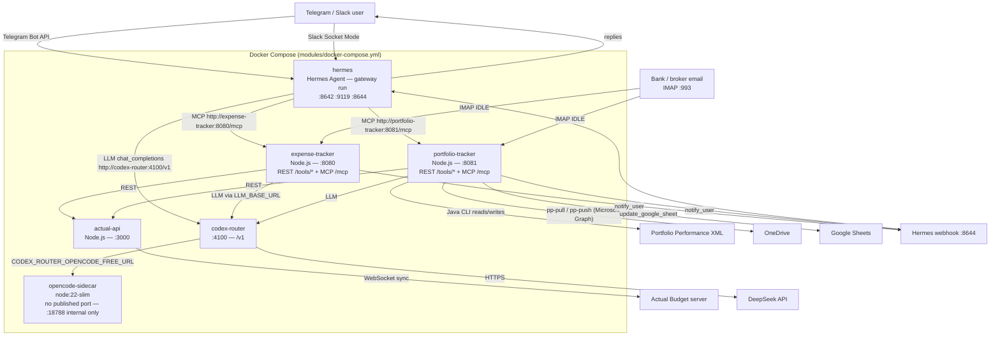

# Architecture and data flow

`codex-router` is **not** part of this repository. It is a separate repository (`darrencjh8/codex-router`) that CI checks out into `modules/codex-router` at deploy time, and `modules/docker-compose.yml` builds it from that path. The directory does not exist in a plain clone of this repo until the deploy workflow populates it.

`opencode-sidecar` is the sixth compose service: a `node:22-slim` container that runs `opencode serve` on port `18788` to back the keyless `opencode-free/` lane. It publishes no port, has no healthcheck, and is reached only by `codex-router` over the compose network through `CODEX_ROUTER_OPENCODE_FREE_URL` (default `http://opencode-sidecar:18788`). It is not listed in the health-check table in [operations.md](operations.md) because it has no `/health` endpoint.

## How it works

### Expense tracking

1. **Email arrives.** `modules/expense-tracker/src/imap.js` holds an IMAP IDLE connection to the configured mailbox. Every new message enters the dispatcher in `modules/expense-tracker/src/classify.js`.
2. **Classification.** `classifyEmail` labels the message `statement`, `transaction`, or `skip`. Statements are routed to the reconciliation pipeline in `modules/expense-tracker/src/statement/`; everything else non-skipped goes to the agent orchestrator.
3. **Three-phase pipeline.** `modules/expense-tracker/src/orchestrator.js` does all phases internally, so Hermes only routes email — it does not run the expense logic itself. Per the `expense-tracker` skill: Phase 1 is a low-reasoning LLM call with the `fetch_context` tool to read live accounts, categories, and payees; Phase 2 is code-driven resolution of blanks through memory and `resolve_merchant`; Phase 3 executes the booking.
4. **Card suffix facts.** A fact such as `Card ending 3255 belongs to Epsilon Nova Card` maps the number in an alert to an account and overrides an LLM pick. Facts are managed with `search_facts`, `learn_fact`, `update_fact`, and `cleanup_facts`.
5. **Actual Budget.** Transactions are written through `actual-api` (`ACTUAL_BUDGET_URL=http://actual-api:3000`), which syncs to the Actual Budget server.
6. **Notifications.** `notify_user` posts to the Hermes webhook (`NOTIFY_URL`), which the `webhook` platform in `modules/hermes/config.yaml` relays to the home Telegram channel.
7. **From chat.** Hermes calls the expense-tracker MCP tools directly — for example `insert_transaction`, `resolve_merchant`, `update_transaction`, and `fetch_context`. Read-only lookups like `fetch_accounts` and `check_duplicate` are **not** on the MCP surface; they are REST-only, so they are reached over HTTP rather than as tools. See [glossary.md](glossary.md#tool-surfaces-rest-vs-mcp) for both lists.

### Portfolio tracking

1. **Inbound events** arrive as IBKR Flex query XML or PDF trade confirmations, sent to the bot or received over IMAP (`modules/portfolio-tracker/src/email_handler.js`, `src/imap.js`).
2. **Extraction.** `parse_ibkr_flex_query` parses Flex XML; `extract_pdf_text` and `extract_email_content` handle PDFs and message bodies.
3. **Context and matching.** Tools read live Portfolio Performance context (`fetch_pp_accounts`, `fetch_pp_securities`, `fetch_pp_portfolio`) and Actual Budget, then match securities by ISIN/ticker and accounts by broker and currency. Multi-trade imports ask for confirmation via `ask_user_confirmation`.
4. **Writes go through the Java CLI.** `insert_pp_transaction` and `update_pp_balance` are executed by `modules/portfolio-tracker/pp-cli/` (built from `pp-cli/pom.xml` against the Portfolio Performance model JAR), so edits use Portfolio Performance's own model classes.
5. **OneDrive.** `pp-pull` and `pp-push` sync the Portfolio XML through the Microsoft Graph API (`modules/portfolio-tracker/src/onedrive.js`). There is no rclone or `onedrive-sync` container in the runtime stack.
6. **Google Sheets.** `query_pp_taxonomies` reads taxonomy data and `update_google_sheet` exports it using the configured service account and `GOOGLE_SHEET_ID`.
7. **Scheduled sync.** The Hermes container seeds a `portfolio-daily-sync` cron job (`modules/hermes/50-seed-defaults`, schedule `0 12 * * *`) that runs `modules/hermes/scripts/portfolio-sync.sh` as a zero-token call to `POST http://portfolio-tracker:8081/tools/pp-sync-all`.
8. **From chat.** `modules/hermes/config.yaml` defines the `portfolio-sync` and `portfolio-status` quick commands, which curl `pp-sync-all` and `pp-status` directly.

Both trackers expose a **Streamable HTTP MCP server at `/mcp`** in addition to the REST `/tools/*` endpoints. Hermes registers them under `mcp_servers` in `modules/hermes/config.yaml`.
