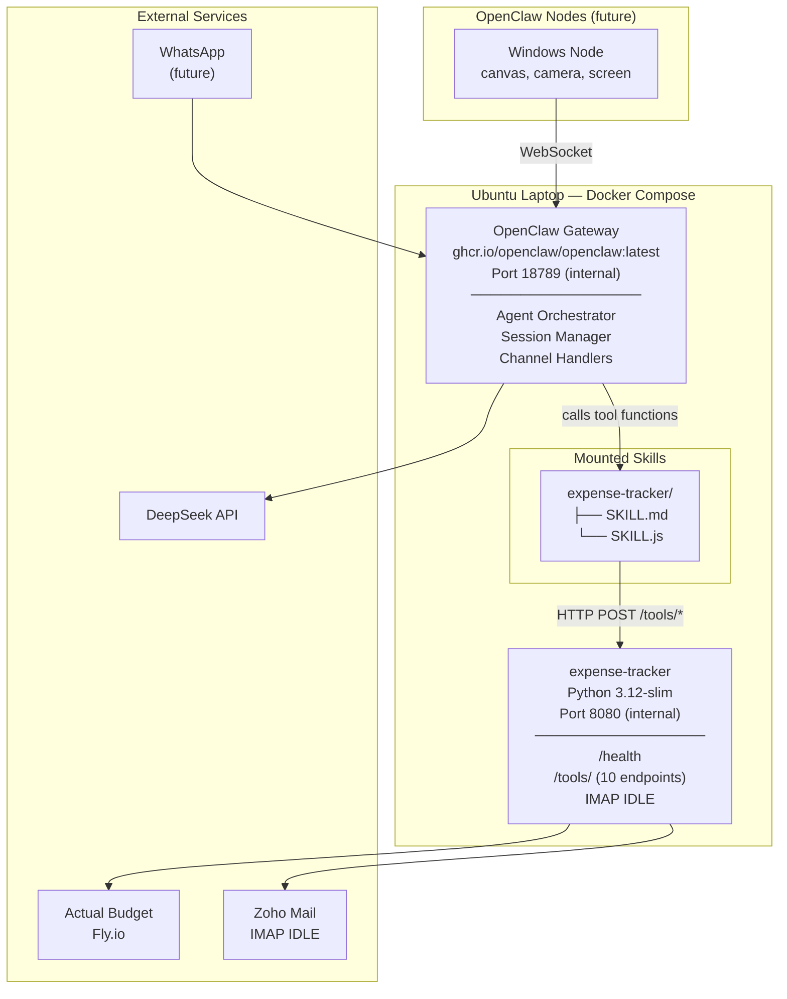

# Technical Plan: Expense Tracker OpenClaw Skill

**Feature:** expense-tracker-skill  
**Plan Version:** 3.0.0  
**Status:** Planned  
**Constitution Hash:** v3.0.0  

---

## 1. Architecture



## 2. Docker Compose

```yaml
# docker-compose.yml
services:
  openclaw:
    image: ghcr.io/openclaw/openclaw:latest
    ports:
      - "18789:18789"
    volumes:
      - ./openclaw.json:/app/openclaw.json:ro
      - ./workspace:/app/workspace
      - openclaw_data:/app/data
    environment:
      - OPENCLAW_CONFIG_PATH=/app/openclaw.json
      - OPENCLAW_HOME=/app
    restart: unless-stopped

  expense-tracker:
    build:
      context: ../modules/expense-tracker
      dockerfile: docker/Dockerfile
    ports:
      - "127.0.0.1:8080:8080"   # Only accessible from host
    volumes:
      - ../modules/expense-tracker/data:/app/data
      - ../modules/expense-tracker/.env:/app/.env:ro
    restart: unless-stopped

volumes:
  openclaw_data:
```

## 3. SKILL.js — Deterministic Tool Wrappers

```javascript
// skills/expense-tracker/SKILL.js
// Each tool is an async function called by the OpenClaw agent.
// They make HTTP calls to the expense-tracker container.

const BASE = process.env.TOOLS_API_URL || "http://expense-tracker:8080";

async function callTool(name, params = {}) {
  const res = await fetch(`${BASE}/tools/${name}`, {
    method: "POST",
    headers: { "Content-Type": "application/json" },
    body: JSON.stringify(params),
  });
  if (!res.ok) {
    const err = await res.json().catch(() => ({ error: res.statusText }));
    throw new Error(err.error || `Tool ${name} failed: ${res.status}`);
  }
  return res.json();
}

export async function fetch_accounts({ budget_id }) {
  return callTool("fetch-accounts", { budget_id });
}
export async function fetch_categories({ budget_id }) {
  return callTool("fetch-categories", { budget_id });
}
export async function fetch_payees({ budget_id }) {
  return callTool("fetch-payees", { budget_id });
}
export async function fetch_recent_transactions({ budget_id, account_id, days }) {
  return callTool("fetch-recent-transactions", { budget_id, account_id, days });
}
export async function insert_transaction({ budget_id, account_id, date, amount_cents, imported_description, category_id, notes }) {
  return callTool("insert-transaction", { budget_id, account_id, date, amount_cents, imported_description, category_id, notes });
}
export async function check_duplicate({ date, amount_cents, account_id, merchant }) {
  return callTool("check-duplicate", { date, amount_cents, account_id, merchant });
}
export async function mark_email_read() {
  return callTool("mark-email-read", {});
}
export async function notify_user({ subject, body }) {
  return callTool("notify-user", { subject, body });
}
export async function extract_email_content({ include_headers }) {
  return callTool("extract-email-content", { include_headers });
}
export async function log_decision({ action, reasoning, transaction_id }) {
  return callTool("log-decision", { action, reasoning, transaction_id });
}
```

## 4. openclaw.json — Gateway Config

```json
{
  "agents": {
    "defaults": {
      "workspace": "/app/workspace",
      "model": {
        "primary": "deepseek/deepseek-chat"
      }
    }
  },
  "gateway": {
    "port": 18789,
    "bind": "0.0.0.0"
  },
  "channels": {
    "whatsapp": {
      "enabled": false
    }
  }
}
```

## 5. tools_api.py — Python HTTP Endpoints

```python
# New file: modules/expense-tracker/src/tools_api.py
# Adds 10 POST /tools/<name> endpoints to the existing aiohttp app.

from aiohttp import web

def register_tools_api(app: web.Application, config):
    """Register all 10 tool endpoints on the given aiohttp app."""

    async def fetch_accounts(request):
        body = await request.json()
        from src.client.actual_client import ActualBudgetClient
        client = ActualBudgetClient(config)
        accounts = await client.get_accounts(body["budget_id"])
        return web.json_response(accounts)

    async def fetch_categories(request):
        body = await request.json()
        from src.client.actual_client import ActualBudgetClient
        client = ActualBudgetClient(config)
        categories = await client.get_categories(body["budget_id"])
        return web.json_response(categories)

    # ... (8 more endpoints following the same pattern)

    app.router.add_post("/tools/fetch-accounts", fetch_accounts)
    app.router.add_post("/tools/fetch-categories", fetch_categories)
    app.router.add_post("/tools/fetch-payees", fetch_payees)
    app.router.add_post("/tools/fetch-recent-transactions", fetch_recent_transactions)
    app.router.add_post("/tools/insert-transaction", insert_transaction)
    app.router.add_post("/tools/check-duplicate", check_duplicate)
    app.router.add_post("/tools/mark-email-read", mark_email_read)
    app.router.add_post("/tools/notify-user", notify_user)
    app.router.add_post("/tools/extract-email-content", extract_email_content)
    app.router.add_post("/tools/log-decision", log_decision)
```

## 6. Environment Variables (expense-tracker .env)

Same `.env` as before, plus:
```
TOOLS_API_PORT=8080
OPENCLAW_GATEWAY_URL=http://openclaw:18789