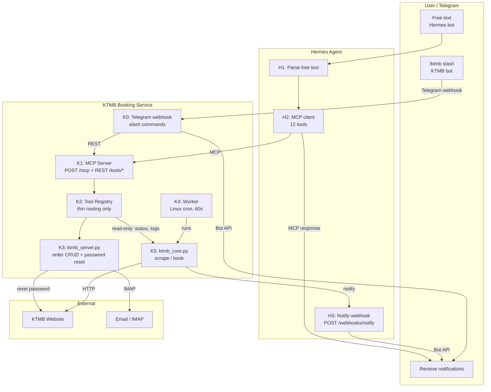

# Plan: KTMB MCP Conversion

**Spec**: 023-ktmb-mcp
**Spec Version**: 1.0.0
**Status**: Draft

## Summary

Replace the aiohttp REST server with a **FastMCP** server (Python `mcp` SDK). Exposes 12 MCP tools via **Streamable HTTP** transport (`POST /mcp`). Existing REST endpoints preserved as plain Starlette routes. The MCP server wraps the existing `ToolRegistry`, refactored with **zero** imports from `ktmb_core`. The worker is a Linux cron job (every 60s) that calls `ktmb_core.py` directly. Booking notifications route through the existing **generic Hermes webhook** (`/webhooks/notify`). `ktmb_server.py` handles order CRUD and password reset (including IMAP polling).

## Architecture Target



### Use Cases

See spec.md for detailed use case breakdown.

## Implementation Phases

| Phase | Description | Tasks | Effort |
|-------|-------------|-------|--------|
| 1 — Refactor | Extract `worker_lock.py`, clean tool registry imports, rename webhook to generic | T001-T004 | 45m |
| 2 — MCP Server | Create `src/mcp_server.py` (FastMCP), replace main.py, add `mcp` dep | T005-T007 | 1h 30m |
| 3 — Worker updates | Change notify URL to Hermes webhook, verify singleton lock | T008-T009 | 30m |
| 4 — Hermes Config | Add KTMB MCP server + 60s cron | T010-T012 | 20m |
| 5 — Validation | Rebuild, verify MCP discovery, E2E test booking flow | T013-T015 | 30m |

**Total**: ~3h 35m

## Key Decisions

1. **MCP transport**: Streamable HTTP via `POST /mcp` (single endpoint, firewall-friendly). Not SSE. Hermes auto-detects transport — no `transport` field needed in config.
2. **Worker: Linux cron, every 60s**: The worker is a Linux cron job started at boot, calling `ktmb_core.py` directly. No external trigger, pause, or resume. No MCP tool. No Hermes cron.
3. **Lock helpers extracted**: `acquire_lock`, `release_lock`, `is_worker_running`, `check_stop_file` extracted from `ktmb_core.py` to `src/worker_lock.py`. Used internally by `ktmb_core.py` and for read-only status queries.
4. **Tool registry isolation**: Registry has ZERO imports from `ktmb_core`. Lock helpers accessed via `src/worker_lock.py`. Logs queried via shared `src/utils/logging.py` circular buffer. No exceptions.
5. **Generic Hermes webhook for notifications**: Existing `POST /webhooks/notify` route on Hermes (shared with expense-tracker). `ktmb_core.py` posts `{message: "..."}` for both success and error. Hermes relays to Telegram. Replaces `http://openclaw:18789/api/notify`.
6. **aiohttp → FastMCP**: Full replacement. MCP server uses FastMCP (Python `mcp` SDK). REST endpoints served as Starlette routes. Single process, single port (8082).
7. **Python MCP SDK**: `mcp` PyPI package. MCP server wraps the existing `ToolRegistry.execute_tool()` — single source of truth between MCP and REST.
8. **ktmb_server.py**: Management console — order CRUD and password reset (including KTMB website interaction and IMAP polling). No connection to the worker.

## Files Changed

### New Files

- `modules/ktmb/src/worker_lock.py` — Lock helpers extracted from `ktmb_core.py`: `is_worker_running`, `acquire_lock`, `release_lock`, `check_stop_file`. Move-only — zero logic changes (~40 LOC)
- `modules/ktmb/src/mcp_server.py` — FastMCP server wrapping `ToolRegistry`. Replaces aiohttp main.py (~150 LOC). Must tolerate stale sessions after container restart (silently create new session instead of returning 400).

### Modified Files

- `modules/ktmb/src/agent/tools.py` — Remove all `ktmb_core` imports (zero exceptions). Import lock helpers from `src/worker_lock`. Query logs via `src/utils/logging`. Refactor `_handle_system_status` to use lock file checks.
- `modules/ktmb/src/main.py` — Replaced by `src/mcp_server.py` (FastMCP). REST routes reimplemented as Starlette HTTP endpoints (12 endpoints).
- `modules/ktmb/src/tools_api.py` — Removed (REST routes now live in `mcp_server.py` as Starlette routes)
- `modules/ktmb/ktmb_core.py` — Import lock helpers from `src/worker_lock.py`. Update `NOTIFY_URL` default to `http://hermes:8644/webhooks/notify`. Worker cron entry calls this directly.
- `modules/ktmb/ktmb_server.py` — Password reset: connect to KTMB website and IMAP directly. Order CRUD unchanged.
- `modules/ktmb/requirements.txt` — Replace `aiohttp` with `mcp`; add `uvicorn` (FastMCP dependency)
- `modules/hermes/config.yaml` — Add `ktmb-booking` MCP server; rename `expense` webhook route → `notify` (generic)
- `modules/docker-compose.yml` — Update `KTMB_NOTIFY_URL` → `http://hermes:8644/webhooks/notify`; add `KTMB_NOTIFY_TOKEN`; add `KTMB_POLL_INTERVAL=15`

## MCP Tool Schemas

### `ktmb_get_schedules`

```
name: ktmb_get_schedules
description: Get KTMB shuttle train schedules for one or both directions (jb-to-sg, sg-to-jb).
parameters:
  direction: {type: string, optional, description: "jb-to-sg or sg-to-jb. Omit for both."}
returns: Direction schedules with departure times and counts
```

### `ktmb_booking_window`

```
name: ktmb_booking_window
description: Get today's date, max booking date (5 months out), and days remaining.
parameters: {} (no required parameters)
returns: {today: string, max_booking_date: string, days_remaining: number}
```

### `ktmb_validate_booking`

```
name: ktmb_validate_booking
description: Validate a booking request before submitting. Checks date range, timeslot validity, direction.
parameters:
  date: {type: string, required, description: "YYYY-MM-DD"}
  direction: {type: string, required, description: "jb-to-sg or sg-to-jb"}
  time: {type: string, required, description: "HH:MM departure time"}
returns: {valid: boolean, errors: string[], direction: string, from: string, to: string}
```

### `ktmb_create_booking`

```
name: ktmb_create_booking
description: Create a KTMB booking order. Creates a "watching" job that the worker will auto-book when seats become available. Dedup: same date+direction+time+passport reuses existing job.
parameters:
  date: {type: string, required, description: "YYYY-MM-DD"}
  direction: {type: string, required, description: "jb-to-sg or sg-to-jb"}
  time: {type: string, required, description: "HH:MM departure time"}
  name: {type: string, required, description: "Passenger full name"}
  passport: {type: string, required, description: "Passport number"}
  expiry: {type: string, required, description: "Passport expiry YYYY-MM-DD"}
  contact: {type: string, required, description: "Contact number 7-15 digits"}
  gender: {type: string, required, description: "M or F"}
returns: {success: boolean, job_id: string, status: "watching", duplicate?: boolean}
```

### `ktmb_list_orders`

```
name: ktmb_list_orders
description: List all booking orders for a passport number.
parameters:
  passport: {type: string, required, description: "Passport number"}
returns: {success: boolean, orders: [{job_id, status, direction, date, time, passenger, retries, last_error}]}
```

### `ktmb_order_status`

```
name: ktmb_order_status
description: Get detailed status of a booking order including seat map, last poll time, retries, payment URL, and errors.
parameters:
  job_id: {type: string, required, description: "Order job ID"}
returns: {job_id, status, direction, date, time, passenger_name, retries, last_poll, seat_map, error, payment_url?, completed_at?}
```

### `ktmb_cancel_order`

```
name: ktmb_cancel_order
description: Cancel a watching booking order. Only orders in 'watching' status can be cancelled.
parameters:
  job_id: {type: string, required}
returns: {deleted: boolean}
```

### `ktmb_save_passenger`

```
name: ktmb_save_passenger
description: Save a passenger profile for reuse in future bookings. Persisted to JSON file.
parameters:
  name: {type: string, required}
  passport: {type: string, required}
  expiry: {type: string, required, description: "YYYY-MM-DD"}
  contact: {type: string, required}
  gender: {type: string, required, description: "M or F"}
returns: {success: boolean, profile: object}
```

### `ktmb_get_passenger`

```
name: ktmb_get_passenger
description: Retrieve the saved passenger profile, if one exists.
parameters: {}
returns: {found: boolean, profile?: object}
```

### `ktmb_system_status`

```
name: ktmb_system_status
description: Check worker health — whether it's running, its PID, and last notification cooldown state.
parameters: {}
returns: {worker_running: boolean, worker_pid?: number, last_notifications?: object}
```

### `ktmb_worker_logs`

```
name: ktmb_worker_logs
description: Retrieve recent worker log entries, optionally filtered by job_id.
parameters:
  lines: {type: number, optional, description: "Number of log lines (default 50)"}
  job_id: {type: string, optional, description: "Filter by booking job ID"}
returns: {success: boolean, logs: [{timestamp, level, logger, correlation_id, event}]}
```

### `ktmb_reset_password`

```
name: ktmb_reset_password
description: Reset KTMB account password. Handled by ktmb_server.py — triggers reset on KTMB website, polls IMAP for new password.
parameters: {}
returns: Password reset result with new password
```

## Worker Lock

Extracted from `ktmb_core.py` into `src/worker_lock.py`:

- **`acquire_lock()`** — Creates `/tmp/ktmb_worker.lock` with current PID. Checks existence first, then writes PID. Handles stale locks (dead PID, same-PID crashed thread).
- **`release_lock()`** — Removes `/tmp/ktmb_worker.lock`.
- **`is_worker_running()`** — Checks lock file existence + PID liveness. Returns `True` only if lock is held by a live process.
- **`check_stop_file()`** — Checks `/tmp/ktmb_worker.stop` existence.

Used internally by `ktmb_core.py` (via cron) and by the Tool Registry for read-only `system_status` queries.

## Hermes Webhook

The existing `expense` webhook route is renamed to `notify` (generic). Both expense-tracker and KTMB post to the same endpoint:

```yaml
# modules/hermes/config.yaml — renamed from expense → notify
platforms:
    webhook:
        routes:
            notify:
                secret: ${HERMES_WEBHOOK_SECRET}
                prompt: |
                    {SOUL_MD}

                    SYSTEM: Relay this notification. No questions, no follow-ups. One friendly line.

                    NOTIFICATION: {message}
                deliver: telegram
                deliver_extra:
                    chat_id: "${TELEGRAM_HOME_CHANNEL}"
```

Worker sends:
```json
POST http://hermes:8644/webhooks/notify
Authorization: Bearer ${HERMES_WEBHOOK_SECRET}
{"message": "✅ KTMB booking SUCCESS\nJob: abc12345\nDirection: jb-to-sg\nDate: 20 Jun 2026\nTime: 08:45\nPassenger: John Doe\nPayment: https://..."}
```

Or for errors:
```json
{"message": "❌ KTMB booking FAILED\nJob: abc12345\nDirection: jb-to-sg\nDate: 20 Jun 2026\nReason: login expired after max retries\nRetries: 5"}
```

## Linux Cron

The worker is a Linux cron job started at container boot:

```cron
# /etc/cron.d/ktmb-worker — runs every 60 seconds
* * * * * root cd /app && python ktmb_core.py >> /var/log/ktmb-cron.log 2>&1
```

- Calls `ktmb_core.py` directly — no MCP, no REST, no Hermes
- `ktmb_core.py` handles lock acquisition internally via `src/worker_lock.py`
- Notifies Hermes webhook on booking success/failure
- No external trigger, pause, or resume

## Rollback

1. Comment out `ktmb-booking` from Hermes `mcp_servers:` → restart Hermes
2. REST API + 12 `POST /tools/*` continue working (now Starlette routes)
3. Linux cron continues running independently
4. Restore `KTMB_NOTIFY_URL` to `http://openclaw:18789/api/notify` if needed
