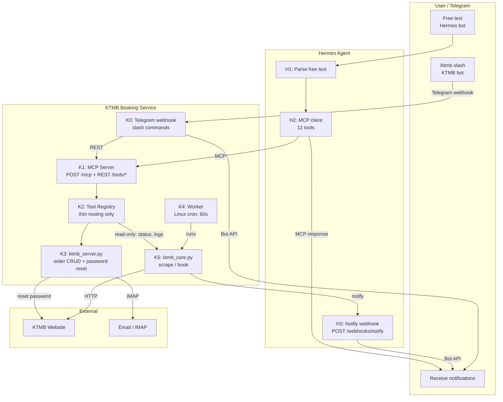

# Feature Specification: KTMB MCP Conversion

**Feature:** ktmb-mcp
**Spec Version:** 1.0.0
**Status:** Specified
**Created:** 2026-06-18

---

## Overview

Replace the aiohttp REST server with a **FastMCP** server (Python `mcp` SDK). Exposes 12 MCP tools via **Streamable HTTP** transport (`POST /mcp`). Existing REST endpoints are preserved as plain Starlette HTTP routes (FastMCP is built on Starlette). The MCP server wraps the existing Python `ToolRegistry`.

**Key design constraints:**
- Tool registry refactored: ZERO imports from `ktmb_core`. Lock helpers extracted to shared `src/worker_lock.py`. Logs and status queried via shared `src/utils/logging.py` circular buffer (not directly from `ktmb_core`). Read-only access to worker (status, logs).
- **ktmb_server.py**: Management console — order CRUD and password reset. No connection to the worker.
- **Worker**: NOT a daemon. A Linux cron job (every 60s) started at boot. Calls `ktmb_core.py` directly for scraping and booking. No external trigger.
- Notifications: reuse existing Hermes `/webhooks/notify` route (generic). Replaces `http://openclaw:18789/api/notify`.

---

## Use Cases

---

## User Stories

### US-1: Book KTMB Ticket via MCP (Priority: P1) 🎯 MVP

**As** a Telegram user,
**I want** to tell Hermes to book a KTMB shuttle train ticket,
**So that** the booking is created and monitored automatically without me watching the KTMB site.

**Acceptance Criteria:**
- MCP tools `ktmb_get_schedules`, `ktmb_booking_window`, `ktmb_validate_booking`, `ktmb_create_booking` all functional
- `ktmb_save_passenger` and `ktmb_get_passenger` support the booking flow
- Creates a "watching" job that the worker processes
- Returns `job_id` for tracking
- Dedup: same date+direction+time+passport reuses existing job
- Worker notification on success/error delivered via Hermes webhook → Telegram

### US-2: Check / Cancel Bookings via MCP (Priority: P1) 🎯 MVP

**As** a Telegram user,
**I want** to check my booking status or cancel a booking via Hermes,
**So that** I don't need to SSH into the server.

**Acceptance Criteria:**
- `ktmb_list_orders({passport})` returns all orders for a passport
- `ktmb_order_status({job_id})` returns detailed status including `status`, `last_poll`, `seat_map`, `retries`, `error`, `payment_url`
- `ktmb_cancel_order({job_id})` deletes a watching order (409 if not watching)

### US-3: System Management via MCP (Priority: P2)

**As** an admin,
**I want** to check worker health, pause/resume the worker, and view logs via Hermes,
**So that** I can manage the KTMB module without SSH.

**Acceptance Criteria:**
- `ktmb_system_status` reports `worker_running`, `worker_paused`, `worker_pid`
- `ktmb_system_pause` creates stop file; worker pauses on next cycle
- `ktmb_system_resume` removes stop file; worker resumes
- `ktmb_worker_logs` returns recent log entries, optionally filtered by `job_id`

### US-4: Password Reset via MCP (Priority: P2)

**As** an admin,
**I want** to trigger KTMB password reset via Hermes,
**So that** expired credentials are refreshed automatically.

**Acceptance Criteria:**
- `ktmb_reset_password()` triggers the full reset flow (email → IMAP extract)
- Only MCP tool that imports from `ktmb_core` — all others use `ktmb_server` or lock files

### US-5: Cron Worker via Hermes (Priority: P1) 🎯 MVP

**As** the system operator,
**I want** `ktmb_trigger_worker` triggered every 60 seconds via Hermes cron,
**So that** booking jobs are processed promptly with 3-4 seat checks per trigger.

**Acceptance Criteria:**
- Hermes cron fires every 60s, calls `ktmb_trigger_worker`
- Worker runs 3-4 poll cycles per trigger (`POLL_INTERVAL=15`, `MAX_RUNTIME=55`)
- Worker singleton lock: duplicate triggers are rejected (`acquire_lock` gate)
- On booking success/error, worker POSTs to Hermes `POST /webhooks/notify`

### US-6: Tool Registry Isolation (Priority: P1) 🎯 MVP

**As** the developer,
**I want** the tool registry to not import `ktmb_core` (except `reset_password`),
**So that** the registry remains a thin routing layer with no scraping/business logic.

**Acceptance Criteria:**
- Lock helpers (`is_worker_running`, `acquire_lock`, `release_lock`, `check_stop_file`) extracted to `src/worker_lock.py`
- `_handle_trigger_worker` imports `is_worker_running` from `ktmb_worker` (not `ktmb_core`)
- `_handle_system_status` uses lock file checks (directly from `worker_lock`)
- Only `_handle_reset_password` imports `reset_password` from `ktmb_core`
- All existing tool behavior is unchanged

### US-7: Hermes MCP Registration (Priority: P1) 🎯 MVP

**As** the system operator,
**I want** KTMB's MCP server registered in Hermes configuration,
**So that** Hermes discovers and can invoke all 15 KTMB tools.

**Acceptance Criteria:**
- `modules/hermes/config.yaml` lists `ktmb-booking` under `mcp_servers:` with `url: http://ktmb-booking:8082/mcp`
- Hermes auto-discovers all 15 KTMB MCP tools
- MCP connection survives KTMB restarts (Hermes auto-reconnects)
- Notifications delivered via existing generic `POST /webhooks/notify` → Telegram

### US-8: Backward Compatibility (Priority: P2)

**As** the system operator,
**I want** all existing functionality to remain intact alongside MCP.

**Acceptance Criteria:**
- All 12 REST `POST /tools/*` endpoints still work (served as Starlette routes)
- Worker is a Linux cron job — no external trigger, pause, or resume
- `ktmb_server.py` SQLite order CRUD unchanged
- Password reset still works via both REST and MCP
- Notification webhook is the only behavioral change (from OpenClaw → Hermes)

---

## MCP Tool Reference

### Booking Flow

| Tool | Params | Returns |
|------|--------|---------|
| `ktmb_get_schedules` | `{direction?}` | Schedules for one or both directions |
| `ktmb_booking_window` | `{}` | `{today, max_booking_date, days_remaining}` |
| `ktmb_validate_booking` | `{date, direction, time}` | `{valid, errors}` |
| `ktmb_create_booking` | `{date, direction, time, name, passport, expiry, contact, gender}` | `{success, job_id, status, duplicate?}` |
| `ktmb_save_passenger` | `{name, passport, expiry, contact, gender}` | `{success, profile}` |
| `ktmb_get_passenger` | `{}` | `{found, profile?}` |

### Order Management

| Tool | Params | Returns |
|------|--------|---------|
| `ktmb_list_orders` | `{passport}` | `{success, orders[]}` |
| `ktmb_order_status` | `{job_id}` | `{job_id, status, last_poll, seat_map, retries, error, payment_url?}` |
| `ktmb_cancel_order` | `{job_id}` | `{deleted}` |

### System

| Tool | Params | Returns |
|------|--------|---------|
| `ktmb_system_status` | `{}` | `{worker_running, worker_paused, worker_pid?}` |
| `ktmb_worker_logs` | `{lines?, job_id?}` | `{logs[]}` |

### Auth

| Tool | Params | Returns |
|------|--------|---------|
| `ktmb_reset_password` | `{}` | Password reset status |
|------|--------|---------|
| **Total** | **12 MCP tools** | |

---

## Edge Cases

| Scenario | Expected Behavior |
|---|---|
| Worker already running when cron fires | `is_worker_running()` → True → `trigger_worker` returns `{running: true}` — no-op |
| Worker lock file exists but PID is dead | `acquire_lock()` detects stale lock via `os.kill(pid, 0)`, removes it, re-acquires |
| Booking date expired | Worker sets status `error` with reason "date expired", notifies via webhook |
| KTMB site unreachable | Worker retries up to `MAX_RETRIES`, then sets `error`, notifies |
| Duplicate booking request | Dedup hash match → returns existing job_id with `duplicate: true` |
| Cancel non-watching order | Returns 409 — only `watching` orders can be cancelled |
| MCP connection drops | Hermes auto-reconnects; KTMB REST API still serves requests |
| Hermes webhook down | Worker retries with cooldown (`notify_with_cooldown`) — non-fatal, doesn't block bookings |
| Password reset while no IMAP configured | `ktmb_reset_password` returns error |

---

## Non-Goals (Phase 1)

- ❌ Removing the existing REST API
- ❌ Rewriting in Node.js
- ❌ Removing the gateway cron module (coexists, can be disabled later)
- ❌ Changing the worker polling/scraping logic
- ❌ Moving the SQLite DB to Hermes
- ❌ Adding seat selection or payment completion via MCP (payment link still manual)

---

## References

- Hermes MCP Guide: https://hermes-agent.nousresearch.com/docs/guides/use-mcp-with-hermes
- MCP Python SDK: https://github.com/modelcontextprotocol/python-sdk
- Spec 022: Portfolio Tracker MCP (pattern reference)
- Spec 021: Expense Tracker MCP (pattern reference)
- KTMB module: https://github.com/darrencjh8/openclaw-module-ktmb
