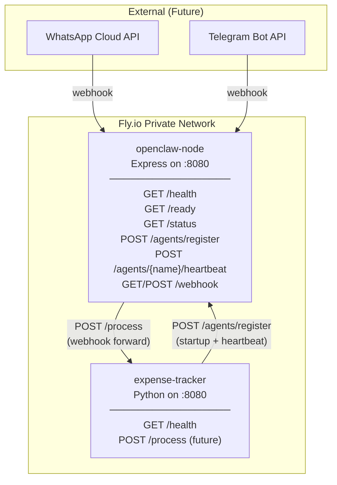

# Technical Plan: Companion Service

**Feature:** companion-service  
**Plan Version:** 2.0.0  
**Status:** Planned  
**Constitution Hash:** v1.0.0  

---

## 1. Technology Stack

| Layer | Choice | Rationale |
|---|---|---|
| Runtime | Node.js 22 LTS | Latest LTS, async/await, minimal memory |
| HTTP Framework | Express 4.x | Minimal, well-known, stable |
| HTTP Client | Node.js built-in `fetch` | No extra deps for webhook forwarding |
| UUID | `crypto.randomUUID()` | Built-in, no extra deps |
| Testing | Jest + supertest | Built-in assertion, HTTP testing |
| Container | Docker + Fly.io | `Dockerfile` + `fly.toml` |

## 2. Architecture Diagram



## 3. Endpoint Details

### 3.1 Health Check

```
GET /health
Response 200: {"status": "ok"}
Always returns 200 while process is alive (liveness probe).
```

### 3.2 Readiness Check

```
GET /ready
Response 200: {"status": "ready"}
Response 503: {"status": "not_ready"}  (during startup/shutdown)
```

### 3.3 Service Status

```
GET /status
Response 200: {
  "service": "openclaw-node",
  "version": "1.0.0",
  "uptime_seconds": 3600,
  "agents": {
    "expense-tracker": {"version": "1.0.0", "last_heartbeat": "2026-06-05T01:20:00Z"}
  }
}
```

### 3.4 Agent Registration

```
POST /agents/register
Body: {"name": "expense-tracker", "version": "1.0.0"}
Response 201: {"status": "registered", "name": "expense-tracker"}
Response 200: {"status": "already_registered", "name": "expense-tracker"}  (duplicate)
Response 400: {"error": "...", "code": "BAD_REQUEST"}  (invalid body)
```

### 3.5 Agent Heartbeat

```
POST /agents/{name}/heartbeat
Response 200: {"status": "ok"}
Response 404: {"error": "Agent 'unknown' not registered", "code": "NOT_FOUND"}
```

### 3.6 Webhook (Future)

```
GET /webhook?hub.mode=subscribe&hub.challenge=abc123
Response 200: "abc123"  (plain text challenge response)

POST /webhook
Body: {"channel": "whatsapp", "from": "+6512345678", "text": "Track $5 at Kopitiam", "timestamp": "..."}
Response 202: {"status": "accepted", "correlation_id": "uuid"}
Response 400: {"error": "...", "code": "BAD_REQUEST"}

Forwards to: POST http://expense-tracker.internal:8080/process
  Body: {"source": "whatsapp", "from": "+6512345678", "text": "...", "correlation_id": "uuid", "timestamp": "..."}
```

## 4. State Management

All agent state is stored in-memory (a `Map<string, AgentInfo>`). No persistence — resets on restart. Agents must re-register after each deployment.

```typescript
interface AgentInfo {
  name: string;
  version: string;
  registeredAt: Date;
  lastHeartbeat: Date;
}
```

## 5. Graceful Shutdown Sequence

```
1. SIGTERM received
2. Set isReady = false  (→ /ready returns 503)
3. Express server stops accepting new connections
4. Wait for existing connections to drain (max kill_timeout seconds)
5. process.exit(0)
```

## 6. Environment Variables

| Variable | Required | Default | Description |
|---|---|---|---|
| `PORT` | ❌ | `8080` | HTTP listen port |
| `SERVICE_NAME` | ❌ | `openclaw-node` | Service identifier |
| `SERVICE_VERSION` | ❌ | `1.0.0` | Version string |
| `EXPENSE_TRACKER_URL` | ❌ | `http://expense-tracker.internal:8080` | URL for webhook forwarding |
| `LOG_LEVEL` | ❌ | `info` | Logging level |

## 7. Dockerfile

```dockerfile
FROM node:22-alpine
WORKDIR /app
COPY package*.json ./
RUN npm ci --production
COPY src/ ./src/
EXPOSE 8080
USER node
CMD ["node", "src/index.js"]
```

## 8. fly.toml

```toml
app = "openclaw-node"
kill_signal = "SIGINT"
kill_timeout = 10

[env]
  PORT = "8080"
  EXPENSE_TRACKER_URL = "http://expense-tracker.internal:8080"

[[services]]
  internal_port = 8080

[experimental]
  auto_rollback = true
```

Note: `kill_timeout = 10` gives the graceful shutdown handler time to drain connections before Fly.io force-kills the process. The SIGTERM handler in the Express app will mark the service as not-ready at the start of shutdown.