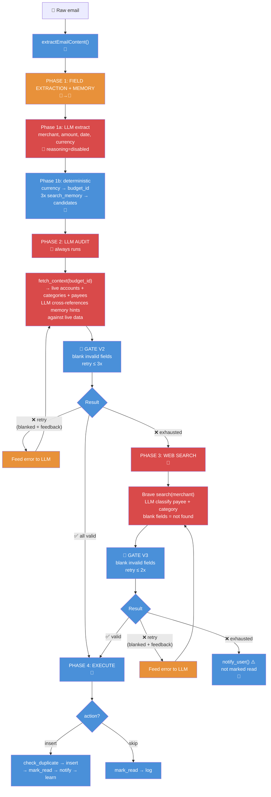

# Orchestrator Redesign — Implementation Plan

> 2026-06-18. Replaces the current 5-phase pipeline with a cleaner 4-phase 
> memory-first design. Phase 2 always audits. Validation failures retry with feedback.

## LLM Model & Reasoning

| Phase | Task | Model | Reasoning | Rationale |
|-------|------|-------|-----------|-----------|
| 1a | Extract fields from raw email | `deepseek-chat` | `disabled` | Pattern matching — merchant/amount/date are formulaic in bank alerts |
| 2 | Audit memory vs live data | `deepseek-chat` | `adaptive` | Cross-referencing candidates against live lists |
| 3 | Web snippet classification | `deepseek-chat` | `adaptive` | Synthesizing web results into payee match |

Each phase creates a **fresh LLM instance** and closes it after completion. No state leaks.

## Flow Diagram



## Phase Details

### Phase 1a — LLM Field Extraction

Fresh LLM instance, `reasoning=disabled`. Input: raw email text (from `extractEmailContent()`). Output:

```json
{
  "merchant": "Toast Box",
  "amount_cents": -1280,
  "date": "2026-06-18",
  "currency": "SGD",
  "raw_description": "S$12.80 at Toast Box"
}
```

Currency detection: LLM pattern-matches `S$`/`SGD` → `"SGD"`, `RM`/`MYR` → `"MYR"`.

### Phase 1b — Deterministic Mapping

```
budget_id = currency === config.primaryCurrency ? config.primaryBudgetFile : config.secondaryBudgetFile

search_memory(merchant)                  → regex → payee candidate
search_memory(merchant + " account")     → regex → account candidate
search_memory(merchant + " category")    → regex → category candidate
```

Memory hints (candidates) are formatted into the Phase 2 prompt: e.g. `"Memory suggests: payee=Food, account=DBS Yuu, category=Groceries. Verify against live data below."`

### Phase 2 — LLM Audit

Fresh LLM instance, `reasoning=adaptive`. Single tool: `fetch_context(budget_id)`.
LLM receives memory candidates + live lists, cross-references, fills missing fields.

**Output schema:**

```json
{
  "action": "insert | skip",
  "merchant": "Toast Box",
  "amount_cents": -1280,
  "date": "2026-06-18",
  "currency": "SGD",
  "account_id": "uuid-from-live-list",
  "account_name": "DBS Yuu",
  "category_id": "uuid-from-live-list",
  "payee_name": "Food",
  "budget_id": "My Budget",
  "notes": "",
  "reasoning": "Matched Toast Box to Food payee, DBS Yuu account",
  "notify_message": "Logged S$12.80 at Toast Box"
}
```

**Rule:** Leave any field blank (`""`) if unsure. V2 gate validates against live data and blanks invalid values.

### Phase 3 — Web Search

Fresh LLM instance, `reasoning=adaptive`. Only runs if payee or category still blank after Phase 2.
Calls `resolve_merchant(merchant, budget_id)` which internally does Brave search + LLM classification.
Validates result against live payee/category lists via V3 gate.

### `fetch_context` Tool Schema

**Input:** `{ "budget_id": "My Budget" }`

**Handler:**
```
Promise.all([fetch_accounts, fetch_categories, fetch_payees])
```

**Output:**
```json
{
  "accounts":   [{ "id": "uuid", "name": "DBS Yuu", "closed": false }],
  "categories": [{ "id": "uuid", "name": "Groceries" }],
  "payees":     [{ "id": "uuid", "name": "Food" }]
}
```

## Validation Gates (deterministic, enforced every retry)

**Rule:** Before any retry, every LLM-chosen field is validated against the live `fetch_context` data. Any value that does NOT exist in the corresponding live list is **immediately blanked to `""`**. The LLM retry prompt receives only blank fields and a list of valid options — it never sees its own hallucinated values. This prevents hallucination amplification across retries.

### V2 — Post Phase 2 (max 3 retries)

| Check | How | Fail feedback |
|-------|-----|---------------|
| `account_id` in live accounts | `accounts.some(a => a.id === id)` | Blank field → `"Account not found. Pick from: [names]. Try again or leave blank."` |
| `category_id` in live categories | `categories.some(c => c.id === id)` | Blank field → `"Category not found. Pick from: [names]. Try again or leave blank."` |
| `payee_name` in live payees | `payees.some(p => p.name.toLowerCase() === name)` | Blank field → `"Payee not found. Pick from: [names]. Try again or leave blank."` |
| `amount_cents` numeric, negative | `typeof n === 'number' && n < 0` | Blank field → `"Amount must be negative integer cents. Try again."` |
| `date` valid, within 15 days | `!isNaN(Date.parse(d)) && abs(days) <= 15` | Blank field → `"Date is invalid or too far from today. Try again."` |

### V3 — Post Phase 3 (max 2 retries)

| Check | How | Fail feedback |
|-------|-----|---------------|
| `payee_name` in live payees | Same as V2 | Same as V2 |
| `category_id` in live categories | Same as V2 | Same as V2 |

## Routing

| From | Condition | To |
|------|-----------|----|
| Phase 1 | Always | Phase 2 |
| Phase 2 → V2 | Always | V2 |
| V2 | All fields valid | Phase 4 |
| V2 | Fail, retries < 3 | Gate blanks invalid → retry Phase 2 |
| V2 | Fail, retries exhausted | Gate blanks invalid → check routing below |
| Phase 3 → V3 | Always | V3 |
| V3 | All fields valid | Phase 4 |
| V3 | Fail, retries < 2 | Gate blanks invalid → retry Phase 3 |
| V3 | Fail, retries exhausted | Gate blanks invalid → notify |

**After V2 exhaustion (gate implementation):**
```
for (const field of invalidFields) llmOutput[field] = "";
if (!llmOutput.account_id)  → notify directly (Phase 3 can't help with accounts)
if (!llmOutput.payee_name)  → Phase 3 (web search)
if (!llmOutput.category_id) → Phase 3 (web search)
```

**After V3 exhaustion:** fields still blank → **notify**

## New Pipeline

```
Phase 1a: LLM EXTRACT         reasoning=disabled, fresh instance
Phase 1b: MEMORY LOOKUP       deterministic, currency→budget_id, 3x search_memory
Phase 2:  LLM AUDIT           reasoning=adaptive, fresh instance, 1 tool: fetch_context
   V2:    VALIDATION GATE     deterministic, blanks invalid fields, retry ≤ 3x
Phase 3:  WEB SEARCH          reasoning=adaptive, fresh instance
   V3:    VALIDATION GATE     deterministic, blanks invalid fields, retry ≤ 2x
Phase 4:  EXECUTE             deterministic dispatch: insert / skip / notify
```

## Files to Change

### Source files

| File | Change |
|------|--------|
| `modules/expense-tracker/src/orchestrator.js` | Restructure to 4 phases with V2/V3 validation gates. Fresh LLM instance per phase. Memory hints formatted into Phase 2 prompt. Remove Phase 1a loop, Phase 1b submit_decision, Phase 1.5, Phase 2 executeDecision. |
| `modules/expense-tracker/src/tools.js` | Add `fetch_context` TOOL definition + `_handle_fetch_context` handler (parallel fetch). Update `getLlmToolSchemas()` for Phase 2. `resolve_merchant` stays (used by Phase 3). |
| `modules/expense-tracker/src/memory.js` | Make `add()` async with semantic dedup. `learn_fact` fire-and-forget with error logging (`.catch()` → logger, does not block). |
| `modules/expense-tracker/src/prompts.js` | Update Phase 2 prompt: "leave blank if unsure", friendly `notify_message` tone ("I found a S$X.XX transaction at Merchant, logged it safely for you!"). Remove `generateKeywordSection()`, `KEYWORD_TABLE`. |
| `modules/expense-tracker/src/payee-resolver.js` | Remove. Logic now in Phase 1b (memory) + `resolve_merchant` (web). |
| `modules/expense-tracker/src/decision-executor.js` | Remove. Replaced by Phase 4 inline dispatch. |
| `modules/expense-tracker/src/keywords.js` | Remove. Replaced by memory + web search. |

### Skills / Docs

| File | Change |
|------|--------|
| `modules/hermes/skills/expense-tracker/SKILL.md` | Rewrite. New design: expense-tracker orchestrator handles all phases internally. |
| `design.md` | Update architecture for new 4-phase pipeline. |

### Test files

| File | Expected breakage |
|------|-------------------|
| `tests/orchestrator.test.js` | Structure changed |
| `tests/deterministic-orchestrator.test.js` | Same |
| `tests/resolve-merchant.test.js` | Should pass (unchanged) |
| `tests/prompts.test.js` | Keyword removed |
| `tests/memory.test.js` | `add()` async |
| `tests/tools.test.js` | `fetch_context` addition |

## Implementation Order

- [x] **Step 1 — `tools.js`**: Add `_handle_fetch_context` handler + TOOL definition

- [x] **Step 2 — `memory.js` (TDD)**: Write failing tests for async `add()` with semantic dedup first.
  1. Write tests: `add()` returns `{added, skipped, compacted}`, semantic duplicate rejection
  2. Implement: async `add()` with cosine similarity gate
  3. Verify: all memory tests pass

- [ ] **Step 3 — `orchestrator.js` (TDD)**: Write failing tests for 4-phase flow first.
  1. Write tests: Phase 1a extraction, 1b mapping, 2 audit + V2 gate, 3 web + V3 gate, 4 dispatch
  2. Implement: 4 phases + V2/V3 gates + fresh LLM per phase + memory hint formatting
  3. Verify: orchestrator + deterministic-orchestrator tests pass

- [ ] **Step 4 — `prompts.js` (TDD)**: Write tests for new prompt first.
  1. Write tests: "leave blank if unsure", friendly notify_message, no keyword section
  2. Implement: Remove keyword section, update Phase 2 prompt
  3. Verify: prompts tests pass

- [ ] **Step 5 — Remove**: `keywords.js`, `payee-resolver.js`, `decision-executor.js`

- [ ] **Step 6 — Update tests**: Fix remaining mocks for new structure

- [ ] **Step 7 — Run full test suite**

- [ ] **Step 8 — Update docs/skills**
