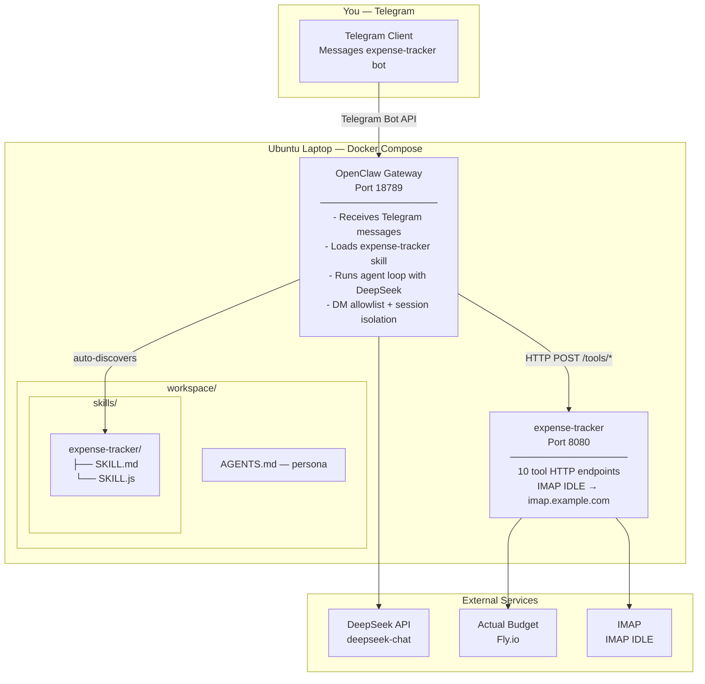

# Technical Plan: Gateway Baseline

**Feature:** gateway-baseline  
**Plan Version:** 1.0.0  
**Status:** Planned  
**Constitution Hash:** v4.0.0

---

## 1. Architecture



---

## 2. openclaw.json — Gateway Configuration (with Model Tiering)

See `gateway/openclaw.json` for the authoritative config. Key sections:

```json5
{
  // Skill discovery: workspace/skills/ (auto) + extraDirs (explicit)
  "skills": { "load": { "extraDirs": ["/home/node/skills"] } },
  // Model providers (API keys via env var substitution)
  "models": {
    "providers": {
      "deepseek": { "apiKey": "${DEEPSEEK_API_KEY}" },
      "google":    { "apiKey": "${GEMINI_API_KEY}" }
    }
  },
  // Browser CDP relay to Docker host Chrome
  "browser": {
    "noSandbox": true,
    "cdpUrl": "${CDP_URL}",
    "attachOnly": true
  },
  "agents": {
    "defaults": {
      "workspace": "/app/.openclaw/workspace",
      "sandbox": { "mode": "off", "browser": { "enabled": true } },
      "mediaGenerationAutoProviderFallback": false,
      "models": {
        "deepseek/deepseek-v4-flash":   { "params": { "context1m": true, "maxTokens": 384000 } },
        "deepseek/deepseek-v4-pro":     { "params": { "context1m": true, "maxTokens": 384000 } },
        "google/gemini-3.5-flash":      { "params": { "context1m": true, "maxTokens": 65536 } },
        "google/gemini-3.1-flash-lite": { "params": { "context1m": true, "maxTokens": 65536 } }
      },
      "memorySearch": { "provider": "gemini" },
      "compaction": {
        "reserveTokens": 40000,
        "reserveTokensFloor": 20000,
        "memoryFlush": { "enabled": true, "softThresholdTokens": 4000 }
      }
    },
    "list": [
      {
        "id": "orchestrator",
        "thinkingDefault": "adaptive",
        "model": {
          "primary": "deepseek/deepseek-v4-flash",
          "fallbacks": ["google/gemini-3.5-flash", "google/gemini-3.1-flash-lite"]
        },
        "subagents": { "allowAgents": ["thinker"], "delegationMode": "prefer" }
      },
      {
        "id": "thinker",
        "workspace": "/app/.openclaw/workspace-thinker",
        "thinkingDefault": "max",
        "model": {
          "primary": "deepseek/deepseek-v4-pro",
          "fallbacks": ["deepseek/deepseek-v4-flash"]
        }
      }
    ]
  },
  "bindings": [
    { "agentId": "orchestrator", "match": { "channel": "telegram", "accountId": "*" } }
  ],
  "gateway": { "port": 18789, "bind": "loopback", "mode": "local" },
  "messages": { "tts": { "auto": "tagged", "provider": "microsoft" } },
  "channels": {
    "telegram": {
      "enabled": true,
      "botToken": "${TELEGRAM_BOT_TOKEN}",
      "dmPolicy": "allowlist",
      "allowFrom": ["tg:${TELEGRAM_CHAT_ID}"]
    }
  }
}
```

### Design Rationale

Multi-agent model tiering routes tasks by complexity:

| Agent | Model | Thinking | Purpose |
|---|---|---|---|
| orchestrator | `deepseek-v4-flash` | `adaptive` | Classification, simple queries, delegation. 80% of messages. |
| thinker | `deepseek-v4-pro` | `max` | Complex reasoning, multi-step analysis. Spawned via `sessions_spawn`. |

The orchestrator's AGENTS.md includes tiering rules to classify tasks and delegate to thinker when needed. The thinker's AGENTS.md is a lean subset (tools + rules only — no tiering or persona). Per the [Sub-agents docs](https://docs.openclaw.ai/tools/subagents), sub-agents only receive `AGENTS.md` (no SOUL/USER/IDENTITY/MEMORY).

---

## 3. Agent Persona — workspace/AGENTS.md

Generated at startup from `gateway/AGENTS.md.template` with env-var substitution (`$USER_NAME`, `$ACTUAL_BUDGET_FILE`, `$MYR_BUDGET_FILE`, `$SYSTEM_PROMPT_EXTRA`, etc.). The template covers:

- **Two tool servers**: expense-tracker (Actual Budget) + portfolio-tracker (PP, IBKR, Google Sheets)
- **Model tiering**: orchestrator handles simple queries; complex tasks delegated to thinker via `sessions_spawn`
- **Command routing**: `/sync`, `/ibkr`, `/status`, `/sheet` → portfolio-tracker; expense queries → expense-tracker
- **Memory policy**: MEMORY.md is plugin-managed (read-only for agent), USER.md loaded at session start
- **Rules**: confirm before inserting, dual-currency (SGD/MYR), amounts in cents, duplicates skipped silently
- **`$SYSTEM_PROMPT_EXTRA`**: injected from env var for extended instructions (routing details, PDF workflow, deployment context)

The thinker agent has a separate lean `AGENTS.thinker.md.template` (tools + rules only — no persona, tiering, or memory policy).

---

## 4. Docker Compose — Service Topology

See `gateway/docker-compose.yml` for the authoritative definition. Summary:

| Service | Port | Source | Role |
|---|---|---|---|
| **openclaw** | 18789, 18800 | Custom Dockerfile (`gateway/Dockerfile`) extending `openclaw:latest-browser` | Gateway runtime, Telegram channel, agent orchestration, notify webhook |
| **expense-tracker** | 8080 | `modules/expense-tracker/` | Expense tracking tools (Actual Budget) |
| **actual-api** | 3000 | `gateway/actual-api/` | Actual Budget REST API bridge |
| **portfolio-tracker** | 8081 | `modules/portfolio-tracker/` | Portfolio sync, IBKR, PP, Google Sheets |
| **ktmb-booking** | 8082 | `modules/ktmb-booking/` | KTMB train booking + seat watcher |

Key details:
- Gateway uses a **custom entrypoint** (`docker-entrypoint.sh`) that generates workspace files from templates before starting OpenClaw
- Skills are **bind-mounted** at `/app/.openclaw/workspace/skills/` (expense-tracker, portfolio-tracker, image-generation, pdf)
- External ktmb-booking skill mounted via `skills.load.extraDirs` at `/home/node/skills/ktmb-booking`
- `openclaw_home` named volume persists workspace files; `openclaw_data` persists sessions and memory indexes
- `host.docker.internal` extra_host for Chrome CDP browser relay
- All inter-service communication over the internal Docker compose network

---

## 5. Skill Discovery

Skills are discovered through two complementary OpenClaw mechanisms:

1. **Workspace auto-discovery** (`workspace/skills/`): Any `SKILL.md` under the workspace skills directory is auto-loaded. Used for expense-tracker, portfolio-tracker, image-generation, and pdf skills.
2. **Explicit extra directories** (`skills.load.extraDirs`): Additional skill paths listed in `openclaw.json`. Used for ktmb-booking (`/home/node/skills/ktmb-booking`).

Both mechanisms are standard OpenClaw features. Workspace skills take precedence over extraDirs when names collide. No config-level skill allowlist is needed — discovery is purely filesystem-based.

```
Gateway starts
    → Reads openclaw.json
    → Auto-discovers SKILL.md files from workspace/skills/
    → Loads additional skills from skills.load.extraDirs
    → Injects SKILL.md instructions into agent system prompt
    → Agent can invoke tools from all discovered skill servers
```

---

## 6. End-to-End Message Flow

```
1. User sends to Telegram bot: "Track S$12.80 at Toast Box from DBS Yuu"

2. Telegram → webhook → Gateway (port 18789)
   Gateway checks allowFrom: user ID matches → allowed

3. Gateway agent receives message in isolated session (per-channel-peer)
   Agent loads persona from AGENTS.md
   Agent loads skill context from SKILL.md

4. Agent calls DeepSeek with system prompt + tools + user message

5. LLM returns tool_call: fetch_accounts({budget_id: "Test-SGD-Budget"})
   → SKILL.js → HTTP POST /tools/fetch-accounts → expense-tracker :8080
   → ActualBudgetClient → actual-api:3000 → @actual-app/api → AB server

6. Agent: "Found DBS Yuu. Let me check categories..."
   LLM calls fetch_categories({budget_id: "Test-SGD-Budget"})
   → matches "Food"

7. Agent to user: "I'll log S$12.80 at Toast Box, DBS Yuu (Food). Proceed?"

8. User: "yes"

9. Agent calls check_duplicate → not duplicate
   Agent calls insert_transaction → Actual Budget API → transaction created

10. Agent responds: "✅ Done! S$12.80 at Toast Box logged under DBS Yuu (Food)."
```

---

## 7. Security Model

| Concern | How Addressed |
|---|---|
| Bot token exposed | `${TELEGRAM_BOT_TOKEN}` env var substitution, never in git |
| Unauthorized access | `dmPolicy: "allowlist"` — only `allowFrom` IDs can message |
| Session isolation | `dmScope: "per-channel-peer"` — each user has separate session |
| Bot scope | Telegram Bot API — bot only sees messages sent to it. No access to chats, contacts, or groups |
| Gateway exposed | Bound to `0.0.0.0` within Docker network only. Host maps `18789` if needed |
| Expense-tracker exposed | Bound to `127.0.0.1:8080` — only gateway on same host can reach it |

### dmPolicy Rationale

`allowlist` is preferred over `pairing` for this single-user deployment:
- One known Telegram user — no need for a pairing code flow
- Simpler config: just the user ID in `allowFrom`
- Equally secure: the bot only responds to the configured ID regardless of mechanism

---

## 8. Explicit Non-Goals (Decisions)

| Decision | Rationale |
|---|---|
| No custom bootstrap limits | OpenClaw defaults (20000/60000 chars) sufficient for current workspace files |
| No sandboxing (`mode: "off"`) | `off` is a documented OpenClaw sandbox mode; sandboxing adds Docker-in-Docker complexity with no benefit for a single-user trusted deployment |
| No compaction user notifications | Silent compaction is the OpenClaw default; user doesn't need to see housekeeping |
| No session pruning | Pruning exists for Anthropic prompt-cache cost savings; DeepSeek doesn't use prompt caching, so pruning has no benefit |
| No HEARTBEAT.md, TOOLS.md, BOOT.md | All optional per OpenClaw workspace spec. AGENTS.md already covers tool conventions; no heartbeat configured; boot handled by entrypoint |
