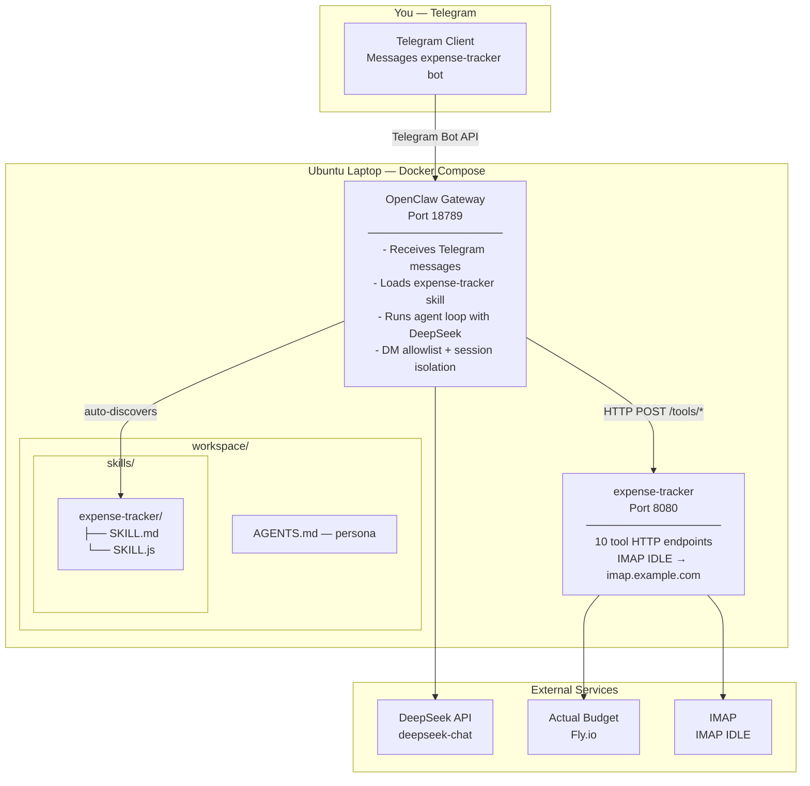

# Technical Plan: Gateway Baseline

**Feature:** gateway-baseline  
**Plan Version:** 1.0.0  
**Status:** Planned  
**Constitution Hash:** v3.0.0  

---

## 1. Architecture



---

## 2. openclaw.json — Gateway Configuration (with Model Tiering)

```json5
{
  "agents": {
    "defaults": {
      "workspace": "/app/.openclaw/workspace",
      "models": {
        "deepseek/deepseek-v4-flash":   { "params": { "context1m": true, "maxTokens": 384000 } },
        "deepseek/deepseek-v4-pro":     { "params": { "context1m": true, "maxTokens": 384000 } },
        "google/gemini-3.5-flash":      { "params": { "context1m": true, "maxTokens": 65536 } },
        "google/gemini-3.1-flash-lite": { "params": { "context1m": true, "maxTokens": 65536 } }
      },
      "memorySearch": { "provider": "gemini" }
    },
    "list": [
      {
        "id": "orchestrator",
        "thinkingDefault": "minimal",
        "model": {
          "primary": "deepseek/deepseek-v4-flash",
          "fallbacks": ["google/gemini-3.5-flash", "google/gemini-3.1-flash-lite"]
        },
        "subagents": {
          "allowAgents": ["thinker"],
          "delegationMode": "prefer"
        }
      },
      {
        "id": "thinker",
        "workspace": "/app/.openclaw/workspace-thinker",
        "thinkingDefault": "max",
        "model": {
          "primary": "deepseek/deepseek-v4-pro",
          "fallbacks": ["deepseek/deepseek-v4-flash"]
        }
      }
    ]
  },
  "bindings": [
    { "agentId": "orchestrator", "match": { "channel": "telegram", "accountId": "*" } }
  ],
  "gateway": { "port": 18789, "bind": "loopback", "mode": "local" },
  "channels": {
    "telegram": {
      "enabled": true,
      "botToken": "${TELEGRAM_BOT_TOKEN}",
      "dmPolicy": "allowlist",
      "allowFrom": ["tg:YOUR_TELEGRAM_USER_ID"]
    }
  }
}
```

### Design Rationale

Multi-agent model tiering routes tasks by complexity:

| Agent | Model | Thinking | Purpose |
|---|---|---|---|
| orchestrator | `deepseek-v4-flash` | `off` | Classification, simple queries, delegation. 80% of messages. |
| thinker | `deepseek-v4-pro` | `max` | Complex reasoning, multi-step analysis. Spawned via `sessions_spawn`. |

The orchestrator's AGENTS.md includes tiering rules to classify tasks and delegate to thinker when needed. The thinker's AGENTS.md is a lean subset (tools + rules only — no tiering or persona). Per the [Sub-agents docs](https://docs.openclaw.ai/tools/subagents), sub-agents only receive `AGENTS.md` (no SOUL/USER/IDENTITY/MEMORY).

---

## 3. Agent Persona — workspace/AGENTS.md

The persona file lives in the workspace so users can customize it without touching config:

```markdown
# AGENTS.md

You are a personal finance assistant with access to Actual Budget. You help the
user track expenses, check accounts, and review spending. You are friendly,
conversational, and always explain what you're doing.

## Your Tools

- fetch_accounts — look up available accounts
- fetch_categories — look up spending categories
- fetch_payees — look up payees/merchants
- fetch_recent_transactions — check recent spending
- insert_transaction — log a new expense
- check_duplicate — verify a transaction isn't a repeat
- notify_user — alert the user if something needs attention

## Rules

1. Always confirm before inserting. Tell the user: "I'll log S$X.XX at [merchant]
   under [account] ([category]). Shall I proceed?"
2. The user's budgets are in SGD and MYR. Detect the currency from the amount
   (S$, SGD, RM, MYR). Ask if unsure.
3. If you can't match an account or category, show the user their options — don't
   guess.
4. Always check for duplicates before inserting.
5. Be conversational but efficient. Don't over-explain simple confirmations.
6. If the user just says "track" or gives an amount without context, ask for
   the missing details (merchant, account).
7. When the user asks about their spending, summarize clearly with amounts and
   categories.
```

---

## 4. Docker Compose — Environment Variables

```yaml
services:
  openclaw:
    image: ghcr.io/openclaw/openclaw:latest
    ports:
      - "18789:18789"
    volumes:
      - ./openclaw.json:/app/openclaw.json:ro
      - ./workspace:/app/workspace
      - openclaw_data:/app/data
    environment:
      - OPENCLAW_CONFIG_PATH=/app/openclaw.json
      - OPENCLAW_HOME=/app
      - TELEGRAM_BOT_TOKEN=${TELEGRAM_BOT_TOKEN}
    restart: unless-stopped

  expense-tracker:
    build:
      context: ../modules/expense-tracker
      dockerfile: docker/Dockerfile
    ports:
      - "127.0.0.1:8080:8080"
    volumes:
      - ../modules/expense-tracker/data:/app/data
      - ../modules/expense-tracker/.env:/app/.env:ro
    restart: unless-stopped

volumes:
  openclaw_data:
```

`TELEGRAM_BOT_TOKEN` is set in the host environment or a `.env` file next to `docker-compose.yml`.

---

## 5. Skill Registration Flow

```
Gateway starts
    → Reads openclaw.json
    → agents.defaults.skills = ["expense-tracker"]
    → Searches workspace/skills/ for matching SKILL.md files
    → Finds workspace/skills/expense-tracker/SKILL.md
    → Loads SKILL.md instructions into agent system prompt
    → Loads SKILL.js tool functions
    → Agent is now ready to process expense-tracking requests
```

No manual registration. The `skills` allowlist + workspace directory structure is all that's needed.

---

## 6. End-to-End Message Flow

```
1. User sends to Telegram bot: "Track S$12.80 at Toast Box from DBS Yuu"

2. Telegram → webhook → Gateway (port 18789)
   Gateway checks allowFrom: user ID matches → allowed

3. Gateway agent receives message in isolated session (per-channel-peer)
   Agent loads persona from AGENTS.md
   Agent loads skill context from SKILL.md

4. Agent calls DeepSeek with system prompt + tools + user message

5. LLM returns tool_call: fetch_accounts({budget_id: "Test-SGD-Budget"})
   → SKILL.js → HTTP POST /tools/fetch-accounts → expense-tracker :8080
   → ActualBudgetClient → actual-api:3000 → @actual-app/api → AB server

6. Agent: "Found DBS Yuu. Let me check categories..."
   LLM calls fetch_categories({budget_id: "Test-SGD-Budget"})
   → matches "Food"

7. Agent to user: "I'll log S$12.80 at Toast Box, DBS Yuu (Food). Proceed?"

8. User: "yes"

9. Agent calls check_duplicate → not duplicate
   Agent calls insert_transaction → Actual Budget API → transaction created

10. Agent responds: "✅ Done! S$12.80 at Toast Box logged under DBS Yuu (Food)."
```

---

## 7. Security Model

| Concern | How Addressed |
|---|---|
| Bot token exposed | `${TELEGRAM_BOT_TOKEN}` env var substitution, never in git |
| Unauthorized access | `dmPolicy: "allowlist"` — only `allowFrom` IDs can message |
| Session isolation | `dmScope: "per-channel-peer"` — each user has separate session |
| Bot scope | Telegram Bot API — bot only sees messages sent to it. No access to chats, contacts, or groups |
| Gateway exposed | Bound to `0.0.0.0` within Docker network only. Host maps `18789` if needed |
| Expense-tracker exposed | Bound to `127.0.0.1:8080` — only gateway on same host can reach it |
