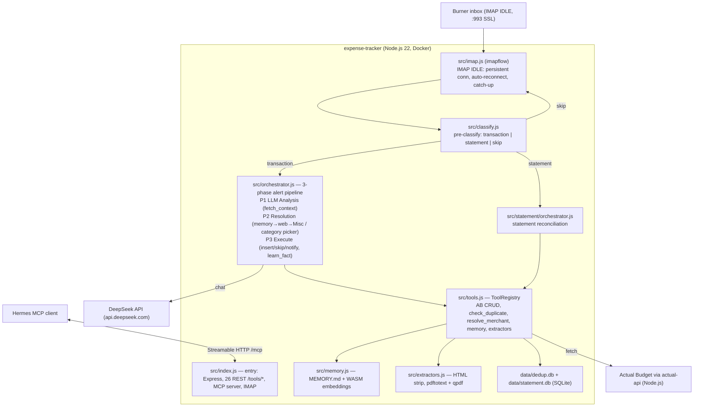

# Technical Plan: Automated Expense Tracking

**Feature:** expense-tracking  
**Plan Version:** 2.0.0  
**Status:** Implemented  
**Constitution Hash:** v1.0.0  

> **v2.0.0 consolidation (spec-drift audit, `specs/030-spec-drift/`).** The original plan targeted a **Python 3.12** toolchain; the module was fully ported to **Node.js**. Section 1 (Technology Stack) and the architecture file references below have been corrected to the actual JS implementation. The detailed behavioral pseudocode in later sections describes language-agnostic logic that still holds — the **authoritative implementation is the JS source under `modules/expense-tracker/src/`** (see `modules/expense-tracker/docs/design.md` for the current component map).

---

## 1. Technology Stack

| Layer | Choice | Version | Rationale |
|---|---|---|---|
| Runtime | Node.js | 22 (ESM) | Single runtime shared with actual-api and other modules; strong async I/O |
| LLM Provider | DeepSeek | `deepseek-chat` | $0.14/1M input, $0.28/1M output, OpenAI-compatible API, strong at structured extraction |
| LLM Client | `openai` (Node SDK) | latest | DeepSeek is OpenAI-API-compatible (`baseURL: "https://api.deepseek.com/v1"`) |
| IMAP Library | `imapflow` | latest | IMAP IDLE + inbox browsing (list/read) |
| HTTP Client | `fetch` (built-in) | Node 22 | Native fetch for actual-api Node.js service |
| HTML Parsing | MIME-aware extractor | — | `src/extractors.js` strips HTML email bodies to text |
| PDF Text | `pdftotext` (poppler) + `qpdf` | system bins | Extract text from PDF attachments; `qpdf` decrypts encrypted PDFs (binaries in Docker image) |
| Memory | `MEMORY.md` + WASM embeddings | — | `src/memory.js` semantic fact store (replaces `mappings.json`) |
| Config | `.env` + `process.env` | — | 12-factor app; `src/config.js` Config class |
| Dedup/Statement DB | `better-sqlite3` | latest | Single-file journals (`data/dedup.db`, `data/statement.db`) |
| MCP | `@modelcontextprotocol/sdk` | latest | Streamable HTTP MCP server (`src/mcp-server.js`) — 22 tools |
| Logging | JSON-line to stdout | — | `src/logging.js` structured logs |
| Container | Docker Compose | — | `docker/Dockerfile` + `modules/docker-compose.yml` |

---

## 2. Architecture Diagram



---

## 3. Data Flow (Per-Email Sequence)

```
Email arrives at burner inbox
    │
    ▼
IMAP IDLE detects new message → fires callback
    │
    ▼
Raw email fetched (MIME envelope + body + attachments)
    │
    ▼
extract_email_content() / extract_pdf_text() tool (src/extractors.js):
    ├── HTML body → MIME-aware strip → plain text
    ├── Plain text body → normalize whitespace, strip signatures, truncate
    └── PDF attachment → pdftotext (qpdf decrypt if encrypted) → text
    │
    ▼
Agent Orchestrator builds LLM conversation:
    ├── System prompt (static instructions + rules)
    ├── Tool definitions (10 function schemas in JSON)
    └── User message: "Process this email:\n\n{extracted_content}"
    │
    ▼
LLM responds with tool_call(s):
    Example: [fetch_accounts, fetch_categories, fetch_recent_transactions]
    │
    ▼
Orchestrator (Node.js) executes requested tools, returns results to LLM
    │
    ▼
LLM makes final decision:
    ├── HAPPY PATH: insert_transaction(account_id, amount, category, date, description)
    │   └── mark_email_read() ← only mark read on successful insert
    ├── SKIP: log_decision("not a transaction") ← leave unread (re-process on restart)
    └── NOTIFY: notify_user(reason, email_content) ← leave unread (manual review)
    │
    ▼
On successful insert: mark_email_read() + log_decision("inserted")
```

---

## 4. Tool Schema Definitions (OpenAI Function Calling Format)

### 4.1 `extract_email_content`
```json
{
  "name": "extract_email_content",
  "description": "Extract and clean the text content of the current email. Handles HTML and PDF attachments.",
  "parameters": {
    "type": "object",
    "properties": {
      "include_headers": {
        "type": "boolean",
        "description": "Whether to include From/Subject/Date headers"
      }
    }
  }
}
```

### 4.2 `fetch_accounts`
```json
{
  "name": "fetch_accounts",
  "description": "Fetch the list of all active accounts from Actual Budget. Returns account names and IDs.",
  "parameters": {
    "type": "object",
    "properties": {
      "budget_id": {
        "type": "string",
        "description": "Budget ID to query (e.g., 'My-SGD-Budget')"
      }
    },
    "required": ["budget_id"]
  }
}
```

### 4.3 `fetch_categories`
```json
{
  "name": "fetch_categories",
  "description": "Fetch the list of all active categories and category groups from Actual Budget.",
  "parameters": {
    "type": "object",
    "properties": {
      "budget_id": {
        "type": "string",
        "description": "Budget ID to query"
      }
    },
    "required": ["budget_id"]
  }
}
```

### 4.4 `fetch_recent_transactions`
```json
{
  "name": "fetch_recent_transactions",
  "description": "Fetch recent transactions for a specific account to help detect duplicates and understand spending patterns.",
  "parameters": {
    "type": "object",
    "properties": {
      "budget_id": {"type": "string"},
      "account_id": {"type": "string"},
      "days": {"type": "integer", "description": "Number of days to look back (default: 7)"}
    },
    "required": ["budget_id", "account_id"]
  }
}
```

### 4.5 `insert_transaction`
```json
{
  "name": "insert_transaction",
  "description": "Insert a new transaction into Actual Budget. Amount is in cents (e.g., S$12.80 = -1280 for spending).",
  "parameters": {
    "type": "object",
    "properties": {
      "budget_id": {"type": "string"},
      "account_id": {"type": "string"},
      "date": {"type": "string", "description": "YYYY-MM-DD format"},
      "amount_cents": {"type": "integer", "description": "Negative for spending, positive for income. In the currency's smallest unit (cents)"},
      "imported_description": {"type": "string", "description": "Merchant name / payee"},
      "category_id": {"type": "string", "description": "Category UUID, or null if uncertain"},
      "notes": {"type": "string", "description": "Metadata: msg_id, source email, detected currency"}
    },
    "required": ["budget_id", "account_id", "date", "amount_cents", "imported_description"]
  }
}
```

### 4.6 `check_duplicate`
```json
{
  "name": "check_duplicate",
  "description": "Check if a transaction already exists in the dedup journal. Returns true if duplicate found.",
  "parameters": {
    "type": "object",
    "properties": {
      "date": {"type": "string", "description": "YYYY-MM-DD"},
      "amount_cents": {"type": "integer"},
      "account_id": {"type": "string"},
      "merchant": {"type": "string"}
    },
    "required": ["date", "amount_cents", "account_id", "merchant"]
  }
}
```

### 4.7 `mark_email_read`
```json
{
  "name": "mark_email_read",
  "description": "Mark the current email as read (\\Seen flag) in the IMAP inbox.",
  "parameters": {"type": "object", "properties": {}}
}
```

### 4.8 `notify_user`
```json
{
  "name": "notify_user",
  "description": "Send a notification email to the user's main inbox. Use this when the LLM cannot confidently process an email.",
  "parameters": {
    "type": "object",
    "properties": {
      "subject": {"type": "string", "description": "Notification subject"},
      "body": {"type": "string", "description": "Detailed explanation of the issue and the original email content for reference"}
    },
    "required": ["subject", "body"]
  }
}
```

### 4.9 `log_decision`
```json
{
  "name": "log_decision",
  "description": "Log the final decision for this email (inserted, skipped, notified) with reasoning.",
  "parameters": {
    "type": "object",
    "properties": {
      "action": {"type": "string", "enum": ["inserted", "skipped", "notified", "error"]},
      "reasoning": {"type": "string"},
      "transaction_id": {"type": "string", "description": "Actual Budget transaction ID if inserted"}
    },
    "required": ["action", "reasoning"]
  }
}
```

### 4.10 `get_budget_ids`
```json
{
  "name": "get_budget_ids",
  "description": "Get the list of available budget IDs from Actual Budget. Use this to discover available budgets.",
  "parameters": {"type": "object", "properties": {}}
}
```

---

## 5. LLM System Prompt (Core Instructions)

The system prompt is the **only place** where business logic lives. It is stored in `src/prompts.js` (Phase-1 analysis prompt) as a JS string constant; `src/statement/prompts.js` holds the statement/classification prompts.

```
You are an expense-tracking agent connected to Actual Budget. Your job is to
process receipt and transaction alert emails forwarded to a burner inbox.

RULES (non-negotiable):
1. NEVER insert a transaction unless you are confident in ALL of: amount, 
   currency, date, merchant, and account.
2. If currency is not SGD or MYR → call notify_user(), do NOT insert.
3. If you cannot extract an amount → call notify_user(), do NOT insert.
4. If you cannot match an account → call notify_user() with the list of 
   available accounts, do NOT insert.
5. Always call fetch_accounts() and fetch_categories() before matching.
6. Always call check_duplicate() before insert_transaction().
7. Categories are optional — if uncertain, leave category_id as null.
8. Amounts are in INTEGER CENTS. S$12.80 = -1280. Negative for spending.
9. The user's Actual Budget date format is DD/MM/YYYY. Convert all dates to 
   YYYY-MM-DD before calling insert_transaction().
10. If the email is a promotional message, bank statement summary, or 
    anything NOT a single transaction → log_decision("skipped"). Do NOT mark as read.
11. Only call mark_email_read() after a successful insert_transaction().
12. Always explain your reasoning in the response before making tool calls.
13. After all actions are complete, call log_decision() with the final outcome.

WORKFLOW:
1. extract_email_content()
2. Identify: currency, amount, merchant, date, potential account
3. If any required field is ambiguous → notify_user()
4. Determine which budget (SGD → $BUDGET_FILE, MYR → $MYR_BUDGET_FILE)
5. fetch_accounts(budget_id)
6. Match account by name similarity
7. fetch_categories(budget_id)
8. Match category by merchant context (or leave null)
9. fetch_recent_transactions(budget_id, account_id, days=3)
10. check_duplicate(date, amount_cents, account_id, merchant)
11. insert_transaction(...)
12. mark_email_read() ← ONLY after successful insert
13. log_decision("inserted", ...)
```

---

## 6. Actual Budget API Integration Details

### Endpoints Used

| Method | Endpoint | Purpose |
|---|---|---|
| GET | `/budgets` | List all budget IDs |
| GET | `/budgets/{id}/accounts` | List accounts |
| GET | `/budgets/{id}/categories` | List categories with group info |
| GET | `/budgets/{id}/payees` | List payees (reference only) |
| GET | `/budgets/{id}/transactions?account={acct_id}&since={date}` | Recent transactions for dedup context |
| POST | `/budgets/{id}/transactions` | Create new transaction |

### Transaction POST Payload

```json
{
  "date": "2026-06-04",
  "amount": -1280,
  "account": "22caada9-a118-4767-a0b3-577952728282",
  "imported_description": "Toast Box",
  "notes": "OpenClaw | msg_id: <abcd1234@example.com> | source: alerts@example.com | currency: SGD",
  "cleared": false,
  "category": "a9e755b1-f94f-45b0-be77-fe83c0180042"
}
```

### Auth

Actual Budget's API uses a simple API key or token. Configured via `ACTUAL_BUDGET_API_KEY` environment variable, sent as `Authorization: Bearer <key>` header.

---

## 7. IMAP IDLE Implementation

### Connection

- **Host:** `imap.example.com`
- **Port:** 993 (SSL/TLS)
- **Credentials:** `IMAP_USERNAME` / `IMAP_PASSWORD` from environment
- **Mailbox:** `INBOX`
- **Auth note:** Most IMAP providers support app-specific passwords. Generate an app password under your email provider's settings. OAuth2 is supported as an alternative but adds complexity.

### IDLE Loop (illustrative pseudocode — actual impl: `src/imap.js` with imapflow)

```text
async idleLoop():
    while True:
        try:
            await self.connect()
            await self.login()
            await self.select("INBOX")
            
            # Process any unread emails first (catch-up)
            for msg in self.fetch_unread():
                # Pre-check: skip recently processed UIDs (60-min cooldown)
                if self.dedup.is_recently_processed(msg.uid, cooldown_minutes=60):
                    continue
                try:
                    await self.callback(msg)
                    self.dedup.record_processed(msg.uid)  # only on success
                except Exception:
                    pass  # UID not recorded, retry next cycle
            
            # Enter IDLE mode
            await self.idle_start()
            while True:
                response = await self.wait_for_idle(timeout=300)  # 5 min timeout
                if response:  # New email or flag change
                    await self.idle_done()
                    # Same UID pre-check for emails arriving during IDLE
                    for msg in self.fetch_unread():
                        if self.dedup.is_recently_processed(msg.uid, cooldown_minutes=60):
                            continue
                        try:
                            await self.callback(msg)
                            self.dedup.record_processed(msg.uid)
                        except Exception:
                            pass
                    await self.idle_start()
        except (ConnectionError, TimeoutError):
            await asyncio.sleep(5)  # Backoff before reconnect
        except Exception as e:
            logger.error("IDLE loop error", error=str(e))
            await asyncio.sleep(10)
```

---

## 8. Dedup Journal Schema

Two SQLite tables handle deduplication at different pipeline layers:

### Transaction dedup (`dedup`)

```sql
CREATE TABLE IF NOT EXISTS dedup (
    hash TEXT PRIMARY KEY,
    date TEXT NOT NULL,
    amount_cents INTEGER NOT NULL,
    account_id TEXT NOT NULL,
    payee_name TEXT NOT NULL,
    created_at TEXT DEFAULT (datetime('now'))
);
```

Hash computed over: `SHA-256(date|amount_cents|account_id|payee_name)`. Entry recorded **after** successful insertion (not before the check), preventing false positives if the LLM calls `check_duplicate` multiple times in one session.

### UID pre-check (`processed_uids`)

```sql
CREATE TABLE IF NOT EXISTS processed_uids (
    uid TEXT PRIMARY KEY,
    processed_at TEXT NOT NULL
);
```

Checked at the IMAP layer **before** any LLM dispatch. If a message UID was recorded within the last 60 minutes, the email is skipped entirely (no classification, no orchestrator, no LLM calls). The UID is recorded only after successful callback completion — failed emails are retried on the next IMAP cycle.

Hash computation:
```
SHA-256(key) where key = "date|amount_cents|account_id|payee_name"
```

---

## 9. Environment Variables

| Variable | Required | Description |
|---|---|---|
| `DEEPSEEK_API_KEY` | ✅ | DeepSeek API key |
| `ACTUAL_BUDGET_URL` | ✅ | `http://your-server.example.com` |
| `ACTUAL_BUDGET_PASSWORD` | ✅ | Actual Budget server password |
| `ACTUAL_PRIMARY_BUDGET_FILE` | ✅ | Primary budget file ID or name |
| `ACTUAL_BUDGET_ENCRYPTION_PASSWORD` | ❌ | Optional encryption password |
| `IMAP_HOST` | ✅ | `imap.example.com` |
| `IMAP_PORT` | ❌ | Default: `993` |
| `IMAP_USERNAME` | ✅ | Burner email address (email account) |
| `IMAP_PASSWORD` | ✅ | IMAP app-specific password |
| `NOTIFICATION_SMTP_HOST` | ✅ | SMTP server for notifications |
| `NOTIFICATION_SMTP_PORT` | ❌ | Default: `587` |
| `NOTIFICATION_EMAIL` | ✅ | Your main email address for notifications |
| `NOTIFICATION_EMAIL_PASSWORD` | ✅ | SMTP password |
| `DEDUP_DB_PATH` | ❌ | Default: `data/dedup.db` |
| `LOG_LEVEL` | ❌ | Default: `INFO` |

---

## 10. Docker Configuration

### Dockerfile (High-Level)

```dockerfile
FROM node:22-slim

# poppler-utils (pdftotext) + qpdf (decrypt encrypted PDFs)
RUN apt-get update && apt-get install -y --no-install-recommends \
    poppler-utils \
    qpdf \
    && rm -rf /var/lib/apt/lists/*

WORKDIR /app

COPY package.json .
RUN npm install --production

COPY src/ ./src/

# Create persistent volume mount point for dedup/statement DB + MEMORY.md
RUN mkdir -p /app/data

EXPOSE 8080

CMD ["node", "src/index.js"]
```

### docker-compose.yml (High-Level)

```yaml
services:
  expense-tracker:
    build:
      context: ../modules/expense-tracker
      dockerfile: docker/Dockerfile
    ports:
      - "8080:8080"
    volumes:
      - ./data:/app/data
      - ./.env:/app/.env:ro
    restart: unless-stopped
```

---

## 11. File Skeleton (Structural Stubs)

```
darren-openclaw/
├── .speckit/
│   ├── constitution.md
│   ├── agent.md
│   └── features/
│       └── expense-tracking/
│           ├── spec.md
│           ├── plan.md
│           └── tasks.md
├── src/
│   ├── index.js                    # Entry: Express, 26 REST /tools/*, MCP, IMAP wiring
│   ├── config.js                   # Env-var Config class
│   ├── mcp-server.js               # MCP Streamable HTTP server (22 tools)
│   ├── orchestrator.js             # 3-phase alert pipeline + DeepSeekClient
│   ├── prompts.js                  # Phase-1 prompt + category picker prompt
│   ├── tools.js                    # ToolRegistry: schemas + handlers
│   ├── memory.js                   # MEMORY.md fact store + WASM embeddings
│   ├── extractors.js               # HTML strip + pdftotext/qpdf PDF text
│   ├── imap.js                     # IMAP IDLE (imapflow) + inbox browsing
│   ├── classify.js                 # Pre-classification + dispatch routing
│   ├── dedup.js                    # SHA-256 dedup journal (better-sqlite3)
│   ├── logging.js                  # JSON-line structured logging
│   └── statement/
│       ├── orchestrator.js         # Statement reconciliation pipeline
│       ├── prompts.js              # Classification + statement prompts
│       └── matcher.js              # Fuzzy match: amount/date/merchant
├── docker/
│   └── Dockerfile
├── docs/
│   └── design.md                   # Module design (current component map)
├── data/                           # Persistent: dedup.db, statement.db, MEMORY.md
├── .env.example
├── package.json
└── README.md
```

---

## 12. Cost Estimate

| Resource | Monthly Cost |
|---|---|
| Fly.io VM #2 (free tier, 256MB) | $0.00 |
| DeepSeek API (~100 emails/month) | ~$0.10 |
| IMAP burner account | $0.00 (free tier) |
| **Total** | **~$0.10/month** |

---

## 13. Risk Register

| Risk | Likelihood | Mitigation |
|---|---|---|
| DeepSeek API downtime | Low | 3 retries with backoff; on failure, leave email unread + notify user |
| IMAP IDLE connection drops | Medium | Auto-reconnect with catch-up fetch of unread emails |
| Actual Budget API schema change | Low | Version-locked in Actual Budget; check release notes |
| LLM hallucinates transaction data | Medium | Guardrails in system prompt; check_duplicate catches repeats; notify_user on uncertainty |
| blocks automated IMAP access | Low | Use app-specific password; OAuth2 fallback available |
| 256MB RAM insufficient for Tesseract OCR | Medium | Make PDF/OCR optional; can process PDFs as plain text attachment fallback |