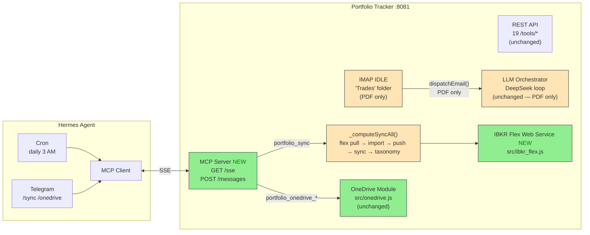

# Plan: Portfolio Tracker MCP (Phase 1)

**Spec**: 022-portfolio-tracker-mcp
**Spec Version**: 1.1.0
**Status**: Draft

## Summary

Add an MCP SSE server to portfolio-tracker exposing tools in three groups: **sync** (includes IBKR flex pull), **OneDrive auth** (interactive OAuth setup), and **OneDrive IO** (pull/push). Follows the expense-tracker MCP pattern (spec 021) — a thin wrapper over existing tool logic. REST endpoints, IMAP IDLE, and the LLM orchestrator are all preserved.

**Key design change from v1.0.0:** IBKR flex import is no longer a standalone MCP tool. A new `src/ibkr_flex.js` module pulls the latest flex XML from IBKR Flex Web Service REST endpoint. This is folded into the `portfolio_sync` pipeline. The IMAP handler no longer processes IBKR flex emails — it handles PDF trade confirmations only.

## Architecture Target



## Implementation Phases

| Phase | Description | Tasks | Effort |
|-------|-------------|-------|--------|
| 1 | MCP server in portfolio-tracker | T001-T006 | 2h 30m |
| 2 | Hermes config & cron | T007-T009 | 45m |
| 3 | Validation & deploy | T010-T014 | 1h 15m |

**Total**: ~4h 30m

## Key Decisions

1. **MCP transport**: HTTP SSE (not stdio). portfolio-tracker runs in separate container — same as expense-tracker.
2. **Tool naming**: `portfolio_sync`, `portfolio_onedrive_*` (not the internal REST names).
3. **Email stays in portfolio-tracker**: Hermes does NOT handle portfolio email. IMAP IDLE on "Trades" folder handles PDF trade confirmations only.
4. **IBKR flex pulled via web service**: New `src/ibkr_flex.js` fetches from IBKR Flex Web Service REST endpoint. No email-based IBKR processing. Deterministic, no LLM.
5. **IBKR import uses PP native extractor**: `IBFlexStatementExtractor` via Java CLI `import` command. Zero LLM.
6. **LLM orchestrator preserved**: The internal DeepSeek-powered AgentOrchestrator stays for PDF trade confirmations only.
7. **OneDrive OAuth as MCP tools**: The existing `src/onedrive.js` already handles all Microsoft Graph API interactions. We expose two new MCP tools for interactive OAuth setup via `src/onedrive_oauth.js`.
8. **Cron coexistence**: Hermes cron and portfolio-tracker's internal apscheduler both run `portfolio_sync`. Sync is idempotent.
9. **Additive**: Zero existing code removed.

## Files Changed

### New Files
- `modules/portfolio-tracker/src/mcp-server.js` — MCP SSE server (~120 LOC)
- `modules/portfolio-tracker/src/onedrive_oauth.js` — OneDrive OAuth helpers (auth URL generation, code→token exchange) (~40 LOC)
- `modules/portfolio-tracker/src/ibkr_flex.js` — IBKR Flex Web Service pull (~50 LOC)

### Modified Files
- `modules/portfolio-tracker/package.json` — Add `@modelcontextprotocol/sdk`, `zod`
- `modules/portfolio-tracker/src/index.js` — Register `GET /sse` + `POST /messages`
- `modules/portfolio-tracker/src/tools.js` — Add IBKR flex pull to `_computeSyncAll()` pipeline
- `modules/portfolio-tracker/src/config.js` — Add `IBKR_FLEX_TOKEN`, `IBKR_FLEX_QUERY_ID` env vars
- `modules/hermes/config.yaml` — Add `portfolio-tracker` MCP server + cron config

## MCP Tool Schemas

### `portfolio_sync`

```
name: portfolio_sync
description: Trigger full portfolio sync — OneDrive pull → IBKR flex pull → Java CLI import → AB balance sync (3 accounts) → OneDrive push → taxonomy export to Google Sheets. No LLM involvement.
parameters: {} (no required parameters)
returns: {
  pull: {success, error?},
  flex_pull: {success, error?},
  flex_import: {status, trades_imported, dividends_imported, other_imported, securities_created, items_skipped, errors[]},
  push: {success, error?},
  sync_targets: [{account_id, name, amount, currency}],
  taxonomy_export: {status, cells_written, errors?},
  portfolio_status: {total_value_sgd, equity_value_sgd, fx_rates_used}
}
```

### OneDrive Tools

```
portfolio_onedrive_auth_url:
  description: Get the Microsoft OAuth URL for one-time OneDrive authorization. User visits this URL in a browser, logs in, and copies the redirect URL.
  parameters: {}
  returns: { url: string }

portfolio_onedrive_auth_complete:
  description: Complete OneDrive OAuth by exchanging the authorization code from the redirect URL for a refresh token. Saves the token to disk for future headless use.
  parameters:
    redirect_uri: { type: string, description: "The full redirect URL from the browser address bar after authorizing" }
  returns: { success: boolean, error?: string }

portfolio_onedrive_status:
  description: Check if OneDrive is authorized (refresh token exists on disk).
  parameters: {}
  returns: { authorized: boolean, token_path: string, client_id: string }

portfolio_onedrive_pull:
  description: Download latest Portfolio.portfolio from OneDrive via Microsoft Graph API. Requires prior OAuth setup.
  parameters: {}
  returns: { success: boolean, path?: string, error?: string }

portfolio_onedrive_push:
  description: Upload current local Portfolio.portfolio to OneDrive via Microsoft Graph API. Requires prior OAuth setup.
  parameters: {}
  returns: { success: boolean, path?: string, error?: string }
```

### Interactive OAuth Flow (Hermes orchestrates)

```
User: /onedrive setup
Hermes: calls portfolio_onedrive_auth_url() → gets URL
Hermes: "Open this URL in your browser: https://login.microsoftonline.com/..."
User: [visits URL, logs in, authorizes, copies redirect URL]
User: [pastes redirect URL] https://login.microsoftonline.com/common/oauth2/nativeclient?code=...
Hermes: extracts code, calls portfolio_onedrive_auth_complete({redirect_uri: "..."})
Portfolio-tracker: POSTs to Microsoft token endpoint, saves refresh token
Hermes: "OneDrive authorized! ✅"
```

## New Module: `src/ibkr_flex.js`

Fetches the latest IBKR flex query XML from the IBKR Flex Web Service.

```javascript
// src/ibkr_flex.js (NEW)

const IBKR_SEND_URL = "https://ndcdyn.interactivebrokers.com/AccountManagement/FlexWebService/SendRequest";
const IBKR_GET_URL = "https://ndcdyn.interactivebrokers.com/AccountManagement/FlexWebService/GetStatement";
const USER_AGENT = "Node.js/24";

/**
 * Pull the latest IBKR flex query XML from IBKR Flex Web Service.
 * Returns decoded XML string, or null if the request fails.
 */
export async function pullFlexXml() {
    const token = process.env.IBKR_FLEX_TOKEN;
    const queryId = process.env.IBKR_FLEX_QUERY_ID;

    if (!token || !queryId) {
        console.log(JSON.stringify({
            event: "ibkr_flex_skipped",
            reason: "IBKR_FLEX_TOKEN or IBKR_FLEX_QUERY_ID not set",
        }));
        return { success: false, error: "Not configured" };
    }

    try {
        // Step 1: Request the flex statement
        const params = new URLSearchParams({ t: token, q: queryId, v: "3" });
        const resp = await fetch(`${IBKR_FLEX_URL}?${params}`, {
            signal: AbortSignal.timeout(30000),
        });

        if (!resp.ok) {
            throw new Error(`IBKR Flex Web Service returned HTTP ${resp.status}`);
        }

        const text = await resp.text();

        // IBKR returns either the XML directly (base64-encoded) or a reference code
        // that requires a second request. The reference looks like:
        // <FlexQueryResponse><Status>Warn</Status><ReferenceCode>...</ReferenceCode>...</FlexQueryResponse>
        if (text.includes("<ReferenceCode>")) {
            // Extract reference code and retry
            const refMatch = text.match(/<ReferenceCode>(.*?)<\/ReferenceCode>/);
            if (refMatch) {
                const refParams = new URLSearchParams({ t: token, q: refMatch[1], v: "3" });
                const refResp = await fetch(`${IBKR_FLEX_URL}?${refParams}`, {
                    signal: AbortSignal.timeout(30000),
                });
                if (!refResp.ok) {
                    throw new Error(`IBKR Flex reference request failed: HTTP ${refResp.status}`);
                }
                const refText = await refResp.text();
                return { success: true, xml: refText };
            }
        }

        return { success: true, xml: text };
    } catch (e) {
        console.log(JSON.stringify({
            event: "ibkr_flex_error",
            error: e.message,
        }));
        return { success: false, error: e.message };
    }
}
```

## Rollback

If MCP causes issues:
1. Comment out `portfolio-tracker` from Hermes `mcp_servers:` and restart Hermes
2. REST endpoints and IMAP IDLE continue working independently
3. Internal apscheduler continues running cron syncs
4. Remove `GET /sse` + `POST /messages` routes if needed (no-op without Hermes connecting)
