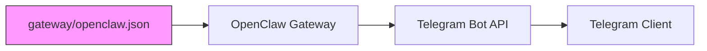

# Technical Plan: Telegram Link Preview Disable

**Feature:** telegram-link-preview  
**Plan Version:** 1.0.0  
**Status:** Implemented
**Constitution Hash:** v4.0.0  

---

## 1. Change Summary

Add a single property to the existing `channels.telegram` block in `gateway/openclaw.json`:

```diff
  "channels": {
      "telegram": {
          "enabled": true,
          "botToken": "${TELEGRAM_BOT_TOKEN}",
          "dmPolicy": "allowlist",
-         "allowFrom": ["tg:${TELEGRAM_CHAT_ID}"]
+         "allowFrom": ["tg:${TELEGRAM_CHAT_ID}"],
+         "linkPreview": false
      }
  }
```

---

## 2. Architecture Impact

**Zero architectural impact.** This is a leaf config change:



The `linkPreview` flag is a standard OpenClaw channel config option. It is passed through to the Telegram Bot API's `sendMessage` endpoint as `link_preview_options.is_disabled: true` (or equivalent depending on OpenClaw's internal mapping).

| Aspect | Impact |
|--------|--------|
| **Docker image** | None — no rebuild needed |
| **Docker compose** | None — restart only |
| **Other services** | None — Telegram-only config |
| **Agent behavior** | None — purely presentation |
| **API contracts** | None |

---

## 3. Affected Files

| File | Change | Risk |
|------|--------|------|
| `gateway/openclaw.json` | Add `"linkPreview": false` to `channels.telegram` | Minimal |
| `specs/015-telegram-link-preview/spec.md` | New spec | n/a |
| `specs/015-telegram-link-preview/plan.md` | New plan | n/a |
| `specs/015-telegram-link-preview/tasks.md` | New tasks | n/a |
| `gateway/tests/config.schema.test.js` | New test | n/a |

---

## 4. Test Strategy

### Unit: Config Schema Validation

A Node.js test (`gateway/tests/config.schema.test.js`) will:
1. Parse `gateway/openclaw.json` as JSON
2. Assert `config.channels.telegram.linkPreview === false`
3. Assert the config parses without errors
4. Assert no other telegram keys were accidentally removed

### Integration: Docker Compose Config

```bash
docker compose -f gateway/docker-compose.yml config
```

Must show no parse errors.

### Manual: Production Smoke Test

After deploy, send a message containing a URL to the bot and verify no link preview renders.

---

## 5. Deployment

```
git pull → docker compose restart openclaw
```

No build step required. The `openclaw.json` file is bind-mounted read-only; the entrypoint copies it into the writable volume on every start.
