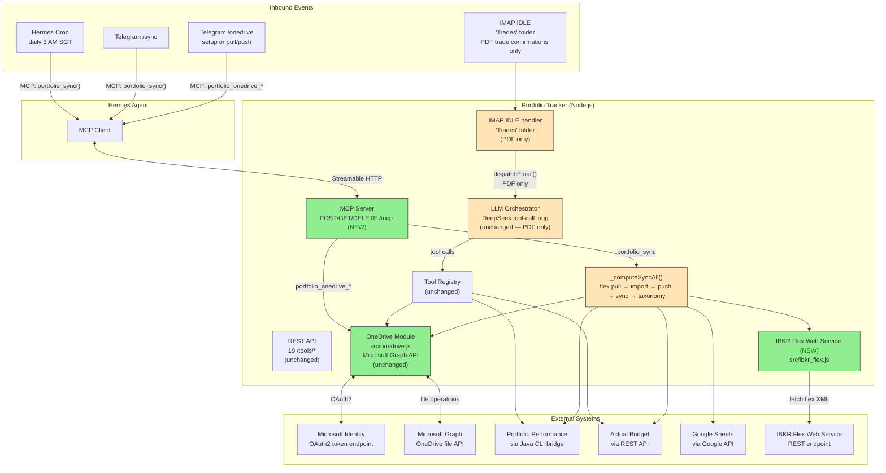

# Feature Specification: Portfolio Tracker

**Feature:** portfolio-tracker
**Spec Version:** 1.1.0
**Status:** Specified
**Created:** 2026-06-18
**Constitution Hash:** v4.0.0

---

## Overview

Add an MCP server to the portfolio-tracker module so Hermes Agent can trigger portfolio operations directly via MCP tool calls. Phase 1 exposes tools in three groups: **sync** (includes IBKR flex pull), **OneDrive auth** (interactive OAuth setup), and **OneDrive IO** (pull/push).

This follows the expense-tracker MCP pattern (spec 021): a thin SSE wrapper over existing tool logic. REST endpoints, IMAP IDLE, and the LLM orchestrator are all **preserved** — MCP is purely additive.

**Key design change from v1.0.0:** IBKR flex import is no longer a standalone MCP tool. Instead, `portfolio_sync` pulls the latest flex query XML from IBKR Flex Web Service (deterministic REST endpoint), imports it via the Java CLI's native `IBFlexStatementExtractor`, and then proceeds with the existing sync pipeline. The IMAP handler no longer processes IBKR flex emails — it only handles PDF trade confirmations.

---

## Use Cases



### Use Case 1: portfolio_sync (includes IBKR flex pull)

```
Trigger: Hermes cron (daily 3 AM SGT) OR Telegram /sync command
  → Hermes calls MCP tool portfolio_sync()
    → portfolio-tracker runs _computeSyncAll():
      1. OneDrive pull (latest Portfolio.portfolio)
      2. Fetch IBKR flex query XML from IBKR Flex Web Service
         → POST to IBKR endpoint with token + query ID
         → receive base64-encoded flex XML
      3. Import flex XML via Java CLI: java -jar pp-cli.jar import --ibkr-xml /tmp/ibkr.xml
         → PP native IBFlexStatementExtractor (same as PP desktop UI):
           a. Parse XML → trades, dividends, deposits, fees, interest, taxes, corp actions
           b. Match securities by CONID → ISIN → ticker + exchange suffix
           c. Auto-create missing securities
           d. Pair dividend taxes with dividends (post-processing)
           e. Handle currency conversion rates from XML
           f. Insert all items into Portfolio.portfolio
      4. Fetch AB budget targets (3 accounts)
      5. Update PP account balances via Java CLI
      6. OneDrive push (modified file back)
      7. Taxonomy export to Google Sheets
    → returns structured result to Hermes
```

**LLM orchestrator is NOT involved** — `_computeSyncAll()` is deterministic code. Flex fetch is REST-based.

### Use Case 2: OneDrive OAuth Setup (NEW)

```
Trigger: Hermes Telegram /onedrive setup command (first-time setup)
  → Hermes calls MCP tool portfolio_onedrive_auth_url()
    → returns { url: "https://login.microsoftonline.com/..." }
  → Hermes shows the URL to the user with instructions
  → User visits URL in browser, logs in, authorizes
  → Browser redirects to blank page
  → User copies the full redirect URL, sends it back via Telegram
  → Hermes extracts the authorization code from the URL
  → Hermes calls MCP tool portfolio_onedrive_auth_complete({redirect_uri: "..."})
    → exchanges code for refresh token
    → saves refresh token to ONEDRIVE_REFRESH_TOKEN_PATH on disk
    → returns { success: true }
  → Hermes confirms "OneDrive authorized! ✅"
```

**This is a one-time interactive setup** — after the refresh token is saved, all future
pulls and pushes are headless (token refresh via Microsoft Graph API).

### Use Case 3: Standalone OneDrive Pull/Push

```
Trigger: Hermes Telegram /onedrive pull (or push)
  → Hermes calls MCP tool portfolio_onedrive_pull() or portfolio_onedrive_push()
    → calls existing pullFromOneDrive() / pushToOneDrive() in src/onedrive.js
    → returns { success, path?, error? }
  → Hermes reports result to user
```

Useful for debugging or when the user only wants to sync the file without running the full balance sync.

---

## User Stories

### US-1: portfolio_sync via MCP (Priority: P1) 🎯 MVP

**As** Hermes Agent,
**I want** to call `portfolio_sync` via MCP to trigger the full one-shot sync cycle,
**So that** balances, IBKR trades, and taxonomies are all refreshed in a single call.

**Acceptance Criteria:**
- MCP tool `portfolio_sync` registered with no required parameters
- Internally calls the existing `_computeSyncAll()` pipeline, now extended with IBKR flex pull
- Pipeline: OneDrive pull → IBKR flex fetch → Java CLI import → AB sync → OneDrive push → taxonomy export
- Returns structured JSON with pull/push status, import results, sync targets, and taxonomy export result
- LLM orchestrator is NOT involved (deterministic code path)
- REST `/tools/pp-sync-all` endpoint remains functional

### US-2: IBKR Flex Web Service Pull (Priority: P1) 🎯 MVP

**As** the sync pipeline,
**I want** to pull the latest IBKR flex query XML from IBKR's Flex Web Service,
**So that** new trades are fetched automatically during sync without manual XML uploads.

**Acceptance Criteria:**
- New `src/ibkr_flex.js` module with a `pullFlexXml()` function
- POSTs to IBKR Flex Web Service endpoint with configured token + query ID
- Returns the flex XML response (base64-decoded if needed)
- Called from `_computeSyncAll()` between OneDrive pull and balance sync
- Handles network errors gracefully (non-fatal to sync — logs and continues)
- Config via env vars: `IBKR_FLEX_TOKEN`, `IBKR_FLEX_QUERY_ID`

### US-3: OneDrive OAuth Setup via MCP (Priority: P1) 🎯 MVP

**As** a user setting up portfolio-tracker for the first time,
**I want** Hermes to walk me through OneDrive OAuth authorization interactively via Telegram,
**So that** I don't need to SSH into the server or run shell scripts to authorize OneDrive.

**Acceptance Criteria:**
- `portfolio_onedrive_auth_url` returns the Microsoft OAuth URL (constructed from `ONEDRIVE_CLIENT_ID`)
- `portfolio_onedrive_auth_complete({redirect_uri})` extracts the authorization code from the redirect URL, exchanges it for a refresh token via `POST https://login.microsoftonline.com/common/oauth2/v2.0/token`, and saves it to `ONEDRIVE_REFRESH_TOKEN_PATH`
- Hermes orchestrates the interactive flow: URL → user visits → user pastes redirect → token saved
- After setup, `portfolio_onedrive_status` reports `{ authorized: true }`

### US-4: Standalone OneDrive Pull/Push (Priority: P2)

**As** a user who wants to manually sync the PP file,
**I want** to trigger OneDrive pull and push independently via MCP,
**So that** I can sync the file without running the full balance sync.

**Acceptance Criteria:**
- `portfolio_onedrive_pull` downloads latest `Portfolio.portfolio` from OneDrive (via Microsoft Graph API)
- `portfolio_onedrive_push` uploads the current local `Portfolio.portfolio` to OneDrive
- `portfolio_onedrive_status` reports whether OneDrive is configured and authorized
- All three use the existing `src/onedrive.js` functions (`pullFromOneDrive`, `pushToOneDrive`)

### US-5: Hermes MCP Registration (Priority: P1) 🎯 MVP

**As** the system operator,
**I want** portfolio-tracker's MCP server registered in Hermes configuration,
**So that** Hermes discovers and can invoke the portfolio tools.

**Acceptance Criteria:**
`modules/hermes/config.yaml` lists `portfolio-tracker` under `mcp_servers:` with Streamable HTTP transport
- Hermes auto-discovers all portfolio MCP tools
- MCP connection survives portfolio-tracker restarts (Hermes auto-reconnects)

### US-6: Cron via Hermes (Priority: P2)

**As** the system operator,
**I want** `portfolio_sync` triggered daily at 3 AM SGT via Hermes cron,
**So that** the sync schedule is managed in one place.

**Acceptance Criteria:**
- Hermes invokes `portfolio_sync` on schedule (configurable via `PP_SYNC_ALL_CRON`)
- Portfolio-tracker's internal apscheduler remains but can be deprecated later

### US-7: Telegram commands via Hermes (Priority: P2)

**As** a user on Telegram,
**I want** `/sync` and `/onedrive` commands routed through Hermes,
**So that** I can manage my portfolio without the OpenClaw gateway.

**Acceptance Criteria:**
- `/sync` → `portfolio_sync` (includes IBKR flex pull)
- `/onedrive setup` → interactive OAuth flow
- `/onedrive status` → `portfolio_onedrive_status`
- `/onedrive pull` → `portfolio_onedrive_pull`
- `/onedrive push` → `portfolio_onedrive_push`

### US-8: Backward Compatibility (Priority: P2)

**As** the system operator,
**I want** all existing functionality to remain intact alongside MCP.

**Acceptance Criteria:**
- All 19 REST `/tools/*` endpoints still work
- IMAP IDLE handler still monitors "Trades" folder (PDF trade confirmations only — IBKR flex is now pulled via web service)
- AgentOrchestrator and DeepSeek LLM loop continue to work (PDF only)
- Dedup journal and memory store unchanged

---

## What the LLM Orchestrator Does

The LLM orchestrator (`AgentOrchestrator.processEmail()`) handles **PDF trade confirmations only**.
IBKR flex processing is now done by PP's native `IBFlexStatementExtractor` via the Java CLI `import` command —
no LLM involvement. The orchestrator is preserved for:

| Step | What the LLM Decides |
|---|---|
| 1. Parse PDF | Extracts text from PDF trade confirmations via OCR |
| 2. Fetch context | Calls `fetch_pp_accounts` + `fetch_pp_securities` to get live PP data |
| 3. Match securities | LLM reasons over description text to find `security_id` |
| 4. Insert | Calls `insert_pp_transaction` for each matched trade (dedup-checked) |
| 5. Push + Sync | Calls `pp-push` + `pp-sync-all` |

---

## MCP Tool Reference

### Sync (includes IBKR flex pull)

| Tool | Params | Returns |
|---|---|---|
| `portfolio_sync` | none | `{pull, flex_import?, push, sync_targets, taxonomy_export, portfolio_status}` |

### OneDrive Auth

| Tool | Params | Returns |
|---|---|---|
| `portfolio_onedrive_auth_url` | none | `{url: string}` — Microsoft OAuth URL to visit |
| `portfolio_onedrive_auth_complete` | `redirect_uri: string` | `{success, error?}` — exchanges code for refresh token |
| `portfolio_onedrive_status` | none | `{authorized: boolean, token_path: string, client_id: string}` |

### OneDrive IO

| Tool | Params | Returns |
|---|---|---|
| `portfolio_onedrive_pull` | none | `{success, path?, error?}` — downloads from OneDrive |
| `portfolio_onedrive_push` | none | `{success, path?, error?}` — uploads to OneDrive |

---

## New Module: `src/ibkr_flex.js`

Fetches the latest IBKR flex query XML from the IBKR Flex Web Service REST endpoint.
This is a deterministic HTTP call — no LLM, no parsing, just fetch-and-return.

**Endpoint:** `https://ndcdyn.interactivebrokers.com/AccountManagement/FlexWebService/SendRequest`

**Two-step protocol:**
1. `POST SendRequest?t=<token>&q=<query_id>&v=3` → returns `<FlexStatementResponse>` with `<ReferenceCode>` and `<Url>`
2. `GET <Url>?t=<token>&q=<ReferenceCode>&v=3` → returns the actual flex query XML

**Standalone:** Can be run directly: `node src/ibkr_flex.js [output-path]`

```
Environment variables:
  IBKR_FLEX_TOKEN      — IBKR Flex Web Service token (from Account Management)
  IBKR_FLEX_QUERY_ID   — The flex query ID to pull

Function:
  pullFlexXml() → returns { success: boolean, xml?: string, error?: string }
    → Step 1: POST to IBKR SendRequest endpoint with token + query ID
    → Step 2: If response contains `<ReferenceCode>`, GET from the returned URL
    → Returns the flex query XML string
```

---

## Edge Cases

| Scenario | Expected Behavior |
|---|---|
| OneDrive auth called when already authorized | `auth_url` still returns URL (can re-authorize); `auth_complete` overwrites existing token |
| `auth_complete` called with invalid/bad redirect URI | Returns `{success: false, error: "..."}` |
| `onedrive_pull` called before OAuth setup | Returns `{success: false, error: "refresh token not found"}` |
| MCP connection drops mid-call | Hermes retries; portfolio-tracker handles same as REST timeout |
| IBKR Flex Web Service unreachable during sync | Logs warning, skips flex import, continues with balance sync + taxonomy |
| IBKR Flex Web Service returns no new trades | Import step returns `trades_imported: 0` — sync continues |
| Java CLI `import` with duplicate trades | PP native extractor handles dedup; returns `items_skipped > 0` |
| Hermes cron and apscheduler both trigger sync | Idempotent — delta = 0 if already synced |

---

## Non-Goals (Phase 1)

- ❌ Hermes handling email (email stays in portfolio-tracker's IMAP IDLE — PDF only)
- ❌ IMAP IDLE processing IBKR flex (now pulled via web service, not email)
- ❌ Removing the existing REST API
- ❌ Removing the IMAP IDLE handler
- ❌ Removing the LLM orchestrator
- ❌ Migrating memory to Hermes
- ❌ Adding CPF/POEMS tools via MCP
- ❌ `portfolio_ibkr_flex` as a standalone MCP tool (folded into `portfolio_sync`)

---

## Implementation Details

### MCP Server Architecture (Streamable HTTP)

The MCP server uses Streamable HTTP transport (NOT SSE). Why: SSE breaks on container restart causing session mismatch. Streamable HTTP creates fresh transport per session, transparent to Hermes auto-reconnect.

- Express app mounts `POST /mcp`, `GET /mcp`, `DELETE /mcp` routes
- Session management: per-session StreamableHTTPServerTransport instances keyed by `Mcp-Session-Id` header
- On container restart, stale sessions discarded; Hermes creates new session transparently
- `sessionIdGenerator` uses `randomUUID()`
- Tools registered via `server.tool(name, description, zodSchema, handler)`
- Results returned as `{ content: [{ type: "text", text: JSON.stringify(result) }] }`

### REST Tools (19 — preserved for backward compatibility)

| # | Tool | Type | Description |
|---|---|---|---|
| 1 | `parse_ibkr_flex_query` | Parse | Parse IBKR flex query XML (⚠ deprecated — IBKR flex now pulled via web service; retained for LLM orchestrator backward compat) |
| 2 | `extract_email_content` | Parse | Extract text from email (PDF attachment support) |
| 3 | `fetch_pp_accounts` | Read | List PP accounts via Java CLI |
| 4 | `fetch_pp_securities` | Read | List PP securities with ISIN/ticker/currency |
| 5 | `fetch_pp_portfolio` | Read | Full portfolio structure |
| 6 | `insert_pp_transaction` | Write | Insert trade/dividend/deposit into PP |
| 7 | `update_pp_balance` | Write | Update account balance |
| 8 | `pp-pull` | Write | Download latest PP file from OneDrive |
| 9 | `pp-push` | Write | Upload PP file to OneDrive |
| 10 | `pp-sync-all` | Sync | Full balance sync: pull → AB budgets → update → push → taxonomy → Sheets |
| 11 | `query_pp_taxonomies` | Read | Holdings aggregated by taxonomy |
| 12 | `update_google_sheet` | Write | Write taxonomy data to Google Sheets |
| 13 | `notify_user` | Write | Legacy gateway webhook notification (MCP path now preferred) |
| 14 | `check_duplicate` | Read | SHA-256 lookup in SQLite dedup journal |
| 15 | `learn_mapping` | Write | Persist security/account associations |
| 16 | `log_decision` | Write | Audit trail entry |
| 17 | `ask_user_confirmation` | Interactive | Pause for user approval before inserting |
| 18 | `get_pp_status` | Read | Portfolio performance summary |
| 19 | `query_pp_security` | Read | Query security by ticker/ISIN/name |

REST endpoints served at `POST /tools/<slug>`. MCP server exposes equivalent functionality via structured JSON.

### Key Design Decisions

| Decision | Rationale |
|---|---|
| MCP Streamable HTTP over SSE | SSE breaks on container restart (session mismatch). Streamable HTTP creates fresh transport per session — transparent to Hermes auto-reconnect. |
| Hermes MCP for notifications, not gateway webhook | Hermes migration transfers channel ownership from OpenClaw gateway to Hermes. MCP response is the single notification path. |
| IMAP for PDF trade confirmations only | IBKR flex is pulled via REST web service, not email. IMAP handles PDF confirmations exclusively. |
| Java CLI subprocess | Uses PP's own XML parser; serialized via mutex lock to prevent file corruption |
| Dedup journal (SQLite) | Prevents duplicate trade inserts on re-processing |
| PP native IBFlexStatementExtractor for flex import | Uses PP's own parser (same logic as PP desktop UI); handles CONID→ISIN matching, dividend tax pairing, auto-create securities |
| Node.js runtime (not Python) | Migrated from Python to Node.js for unified module stack |

### Startup & Config

Critical env vars enforced at startup (fail fast if missing):
`DEEPSEEK_API_KEY`, `ACTUAL_BUDGET_URL`, `ACTUAL_BUDGET_PASSWORD`, `ACTUAL_PRIMARY_BUDGET_FILE`, `ACTUAL_SECONDARY_BUDGET_FILE`, `ONEDRIVE_CLIENT_ID`, `IBKR_FLEX_TOKEN`, `IBKR_FLEX_QUERY_ID`, `IBKR_PP_SGD_ACCOUNT`, `IBKR_PP_USD_ACCOUNT`, `GOOGLE_SERVICE_ACCOUNT_JSON`, `GOOGLE_SHEET_ID`

---

## References

- Hermes MCP Guide: https://hermes-agent.nousresearch.com/docs/guides/use-mcp-with-hermes
- Spec 021: Hermes Migration (expense-tracker MCP pattern)
- Spec 007: IBKR Flex Query XML Import to PP
- Spec 005: Balance Sync, Cron & Taxonomy Export
- IBKR Flex Web Service: https://www.interactivebrokers.com/api/doc.html#tag/Flex-Web-Service
