# Plan: KTMB MCP Conversion

**Spec**: 023-ktmb-mcp
**Spec Version**: 1.0.0
**Status**: Draft

## Summary

Replace the aiohttp REST server with a **FastMCP** server (Python `mcp` SDK). Exposes all 15 booking tools via **Streamable HTTP** transport (`POST /mcp`). Existing REST endpoints preserved as plain Starlette routes. The MCP server wraps the existing `ToolRegistry`, refactored so it does **not** import from `ktmb_core` (except `reset_password`). Worker locking is strictly singleton via PID-based lock file. Booking notifications route through the existing **generic Hermes webhook** (`/webhooks/notify`). Worker polls 3-4 times per 60s cron trigger (`POLL_INTERVAL=15`, `MAX_RUNTIME=55`).

## Architecture Target

```mermaid
flowchart TB
    subgraph Triggers["Inbound Events"]
        TG["👤 Telegram User<br/>/ktmb book, /ktmb status, etc."]
        CRON["⏰ Hermes Cron<br/>every 15s<br/>→ ktmb_trigger_worker"]
    end

    subgraph Hermes["Hermes Agent :8644"]
        MCP_C["MCP Client<br/>(streamable HTTP)"]
        WEBHOOK["Webhook Receiver<br/>POST /webhooks/notify<br/>(generic, shared)"]
    end


    subgraph KTMB["KTMB Booking :8082"]
        MCP_S["FastMCP Server<span style='color:green'> NEW</span><br/>POST /mcp<br/>(streamable HTTP)"]
        REST["Starlette Routes<br/>15 POST /tools/*<br/>(preserved)"]
        REGISTRY["ToolRegistry<br/>(refactored)<br/>NO ktmb_core imports<br/>except reset_password"]
        WORKER["Background Worker<br/>daemon thread<br/>🔒 strictly singleton<br/>acquire_lock() gate"]
        SERVER["ktmb_server.py<br/>SQLite order CRUD + dedup<br/>(unchanged)"]
        CORE["ktmb_core.py<br/>login, scrape seats,<br/>captcha, book, pay<br/>(unchanged)"]
    end

    subgraph External["External Systems"]
        KTMB_WEB["KTMB Website<br/>shuttleonline.ktmb.com.my"]
    end

    TG -->|"MCP tool calls"| MCP_C
    CRON -->|"MCP: ktmb_trigger_worker"| MCP_C
    MCP_C <-->|"streamable HTTP<br/>POST /mcp"| MCP_S
    MCP_S -->|"14 ktmb_* tools"| REGISTRY
    REST -->|"15 POST /tools/*"| REGISTRY
    REGISTRY -->|"create/list/delete"| SERVER
    REGISTRY -->|"pause/resume/trigger"| WORKER
    REGISTRY -->|"reset_password only"| CORE
    WORKER -->|"scrape + book"| CORE
    WORKER -->|"status updates"| SERVER
    CORE -->|"HTTP scraping"| KTMB_WEB
    WORKER -->|"success / error<br/>notifications"| WEBHOOK
    WEBHOOK -->|"deliver via Telegram"| TG

    style MCP_S fill:#90EE90,stroke:#333
    style REST fill:#FFE4B5,stroke:#333
    style WORKER fill:#FFE4B5,stroke:#333
    style REGISTRY fill:#FFE4B5,stroke:#333
    style SERVER fill:#FFE4B5,stroke:#333
    style CORE fill:#FFE4B5,stroke:#333
```



### Use Cases

```mermaid
flowchart TB
    subgraph UC1["Use Case 1: Book Train Ticket"]
        A1["👤 User: '/ktmb book JB→SG June 20 08:45'"]
        A2["🤖 Hermes: ktmb_get_passenger()"]
        A3["🤖 Hermes: ktmb_booking_window()"]
        A4["🤖 Hermes: ktmb_validate_booking()"]
        A5["🤖 Hermes: ktmb_create_booking({...})"]
        A6["📋 Returns: {job_id, status: 'watching'}"]
        A7["⏰ Cron (60s) → trigger_worker → 🔒 acquire_lock"]
        A8["🔄 Worker polls KTMB site, books when seats found"]
        A9["📤 Worker → POST /webhooks/notify → Hermes"]
        A10["📱 Hermes relays success/error to Telegram"]
        A1 --> A2 --> A3 --> A4 --> A5 --> A6 --> A7 --> A8 --> A9 --> A10
    end

    subgraph UC2["Use Case 2: Check / Cancel / Schedules"]
        B1["👤 User: '/ktmb status' or '/ktmb cancel' or '/ktmb schedules'"]
        B2["🤖 Hermes calls: ktmb_list_orders / ktmb_order_status / ktmb_cancel_order / ktmb_get_schedules"]
        B3["📋 Returns result directly to user"]
        B1 --> B2 --> B3
    end

    subgraph UC3["Use Case 3: System Management (Admin)"]
        C1["👤 Admin: '/ktmb system' or '/ktmb pause' or '/ktmb resume'"]
        C2["🤖 Hermes: ktmb_system_status() → worker_running, paused, pid"]
        C3["🔧 Hermes: ktmb_system_pause() / ktmb_system_resume()"]
        C4["📋 Hermes: ktmb_worker_logs() for debugging"]
        C1 --> C2 --> C3 --> C4
    end

    subgraph UC4["Use Case 4: Password Reset (Admin)"]
        D1["👤 Admin: '/ktmb reset-password'"]
        D2["🤖 Hermes: ktmb_reset_password()"]
        D3["📧 KTMB emails password reset link"]
        D4["⏳ Worker polls IMAP, extracts new password (~2 min)"]
        D5["🔄 ktmb_reset_password returns new password"]
        D6["🤖 Hermes updates KTMB_PASSWORD in .env"]
        D1 --> D2 --> D3 --> D4 --> D5 --> D6
    end

    subgraph UC5["Use Case 5: Cron Worker (every 15s, singleton)"]
        E1["⏰ Hermes cron fires every 15s"]
        E2["🤖 Hermes calls ktmb_trigger_worker() via MCP"]
        E3["🔒 Worker calls acquire_lock() — lock file + PID check"]
        E4{"Lock acquired?"}
        E5["✅ Process all watching jobs in a loop"]
        E6["❌ Already running → skip (returns immediately)"]
        E7["🔓 release_lock() when done or on error"]
        E8["📤 On booking success/error → POST /webhooks/notify"]
        E1 --> E2 --> E3 --> E4
        E4 -- yes --> E5 --> E8 --> E7
        E4 -- no --> E6
    end

    subgraph UC6["Use Case 6: Save Passenger Profile"]
        F1["👤 User: '/ktmb save-passenger'"]
        F2["🤖 Hermes collects: name, passport, expiry, contact, gender"]
        F3["🤖 Hermes: ktmb_save_passenger({...})"]
        F4["📋 Returns: {success, profile} → persisted to JSON file"]
        F1 --> F2 --> F3 --> F4
    end
```



## Implementation Phases

| Phase | Description | Tasks | Effort |
|-------|-------------|-------|--------|
| 1 — Refactor | Extract `worker_lock.py`, clean tool registry imports, rename webhook to generic | T001-T004 | 45m |
| 2 — MCP Server | Create `src/mcp_server.py` (FastMCP), replace main.py, add `mcp` dep | T005-T007 | 1h 30m |
| 3 — Worker updates | Change notify URL to Hermes webhook, verify singleton lock | T008-T009 | 30m |
| 4 — Hermes Config | Add KTMB MCP server + 60s cron | T010-T012 | 20m |
| 5 — Validation | Rebuild, verify MCP discovery, E2E test booking flow | T013-T015 | 30m |

**Total**: ~3h 35m

## Key Decisions

1. **MCP transport**: Streamable HTTP via `POST /mcp` (single endpoint, firewall-friendly). Not SSE. Hermes auto-detects transport — no `transport` field needed in config.
2. **Cron: 60 seconds, POLL_INTERVAL=15**: Worker runs 3-4 poll cycles per trigger (55s max runtime). Faster seat checks without increasing cron frequency.
3. **Strictly singleton worker**: `acquire_lock()` in `ktmb_core.py` (extracted to `src/worker_lock.py`) uses PID-based lock file (`/tmp/ktmb_worker.lock`). Only one process holds the lock. Duplicate cron triggers are rejected.
4. **Tool registry isolation**: Registry does NOT import from `ktmb_core` (lock helpers extracted to `src/worker_lock.py`, exposed via `ktmb_worker`). Only exception: `reset_password` (legitimately needs `ktmb_core` — password reset flow uses IMAP + KTMB auth).
5. **Generic Hermes webhook for notifications**: Existing `POST /webhooks/notify` route on Hermes (shared with expense-tracker). Worker posts `{message: "..."}` for both success and error. Hermes relays to Telegram. Replaces `http://openclaw:18789/api/notify`.
6. **aiohttp → FastMCP**: Full replacement. MCP server uses FastMCP (Python `mcp` SDK). REST endpoints served as Starlette routes. Single process, single port (8082).
7. **Python MCP SDK**: `mcp` PyPI package. MCP server wraps the existing `ToolRegistry.execute_tool()` — single source of truth between MCP and REST.
8. **Cron coexistence**: Hermes cron replaces the gateway cron module's 60s trigger. Gateway cron can be disabled once MCP is stable.

## Files Changed

### New Files

- `modules/ktmb/src/worker_lock.py` — Lock helpers extracted from `ktmb_core.py`: `is_worker_running`, `acquire_lock`, `release_lock`, `check_stop_file`. Move-only — zero logic changes (~40 LOC)
- `modules/ktmb/src/mcp_server.py` — FastMCP server wrapping `ToolRegistry`. Replaces aiohttp main.py (~150 LOC)

### Modified Files

- `modules/ktmb/src/agent/tools.py` — Remove `ktmb_core` imports (except `reset_password`); import lock helpers from `worker_lock`; refactor `_handle_system_status` to call `is_worker_running()`/`check_stop_file()` instead of raw file I/O
- `modules/ktmb/src/main.py` — Replaced by `src/mcp_server.py` (FastMCP). REST routes reimplemented as Starlette HTTP endpoints
- `modules/ktmb/src/tools_api.py` — Removed (REST routes now live in `mcp_server.py` as Starlette routes)
- `modules/ktmb/ktmb_core.py` — Import lock helpers from `src/worker_lock.py`; update `NOTIFY_URL` default to `http://hermes:8644/webhooks/notify`
- `modules/ktmb/ktmb_worker.py` — Import lock helpers from `src/worker_lock.py`; notify URL → Hermes webhook (`POST /webhooks/notify`)
- `modules/ktmb/requirements.txt` — Replace `aiohttp` with `mcp`; add `uvicorn` (FastMCP dependency)
- `modules/hermes/config.yaml` — Add `ktmb-booking` MCP server; rename `expense` webhook route → `notify` (generic)
- `modules/docker-compose.yml` — Update `KTMB_NOTIFY_URL` → `http://hermes:8644/webhooks/notify`; add `KTMB_NOTIFY_TOKEN`; add `KTMB_POLL_INTERVAL=15`

## MCP Tool Schemas

### `ktmb_get_schedules`

```
name: ktmb_get_schedules
description: Get KTMB shuttle train schedules for one or both directions (jb-to-sg, sg-to-jb).
parameters:
  direction: {type: string, optional, description: "jb-to-sg or sg-to-jb. Omit for both."}
returns: Direction schedules with departure times and counts
```

### `ktmb_booking_window`

```
name: ktmb_booking_window
description: Get today's date, max booking date (5 months out), and days remaining.
parameters: {} (no required parameters)
returns: {today: string, max_booking_date: string, days_remaining: number}
```

### `ktmb_validate_booking`

```
name: ktmb_validate_booking
description: Validate a booking request before submitting. Checks date range, timeslot validity, direction.
parameters:
  date: {type: string, required, description: "YYYY-MM-DD"}
  direction: {type: string, required, description: "jb-to-sg or sg-to-jb"}
  time: {type: string, required, description: "HH:MM departure time"}
returns: {valid: boolean, errors: string[], direction: string, from: string, to: string}
```

### `ktmb_create_booking`

```
name: ktmb_create_booking
description: Create a KTMB booking order. Creates a "watching" job that the worker will auto-book when seats become available. Dedup: same date+direction+time+passport reuses existing job.
parameters:
  date: {type: string, required, description: "YYYY-MM-DD"}
  direction: {type: string, required, description: "jb-to-sg or sg-to-jb"}
  time: {type: string, required, description: "HH:MM departure time"}
  name: {type: string, required, description: "Passenger full name"}
  passport: {type: string, required, description: "Passport number"}
  expiry: {type: string, required, description: "Passport expiry YYYY-MM-DD"}
  contact: {type: string, required, description: "Contact number 7-15 digits"}
  gender: {type: string, required, description: "M or F"}
returns: {success: boolean, job_id: string, status: "watching", duplicate?: boolean}
```

### `ktmb_list_orders`

```
name: ktmb_list_orders
description: List all booking orders for a passport number.
parameters:
  passport: {type: string, required, description: "Passport number"}
returns: {success: boolean, orders: [{job_id, status, direction, date, time, passenger, retries, last_error}]}
```

### `ktmb_order_status`

```
name: ktmb_order_status
description: Get detailed status of a booking order including seat map, last poll time, retries, payment URL, and errors.
parameters:
  job_id: {type: string, required, description: "Order job ID"}
returns: {job_id, status, direction, date, time, passenger_name, retries, last_poll, seat_map, error, payment_url?, completed_at?}
```

### `ktmb_cancel_order`

```
name: ktmb_cancel_order
description: Cancel a watching booking order. Only orders in 'watching' status can be cancelled.
parameters:
  job_id: {type: string, required}
returns: {deleted: boolean}
```

### `ktmb_save_passenger`

```
name: ktmb_save_passenger
description: Save a passenger profile for reuse in future bookings. Persisted to JSON file.
parameters:
  name: {type: string, required}
  passport: {type: string, required}
  expiry: {type: string, required, description: "YYYY-MM-DD"}
  contact: {type: string, required}
  gender: {type: string, required, description: "M or F"}
returns: {success: boolean, profile: object}
```

### `ktmb_get_passenger`

```
name: ktmb_get_passenger
description: Retrieve the saved passenger profile, if one exists.
parameters: {}
returns: {found: boolean, profile?: object}
```

### `ktmb_system_status`

```
name: ktmb_system_status
description: Check worker health — whether it's running, paused, its PID, and last notification cooldown state.
parameters: {}
returns: {worker_running: boolean, worker_paused: boolean, worker_pid?: number, last_notifications?: object}
```

### `ktmb_system_pause`

```
name: ktmb_system_pause
description: Emergency pause the background worker by creating a stop file. Worker checks on next poll cycle.
parameters: {}
returns: {success: boolean, paused: boolean, message: string}
```

### `ktmb_system_resume`

```
name: ktmb_system_resume
description: Resume the background worker by removing the stop file.
parameters: {}
returns: {success: boolean, resumed: boolean, message: string}
```

### `ktmb_worker_logs`

```
name: ktmb_worker_logs
description: Retrieve recent worker log entries, optionally filtered by job_id.
parameters:
  lines: {type: number, optional, description: "Number of log lines (default 50)"}
  job_id: {type: string, optional, description: "Filter by booking job ID"}
returns: {success: boolean, logs: [{timestamp, level, logger, correlation_id, event}]}
```

### `ktmb_trigger_worker`

```
name: ktmb_trigger_worker
description: Trigger one worker poll cycle. Called by Hermes cron every 15s. Singleton-gated — if worker is already running, returns immediately.
parameters: {}
returns: {success: boolean, triggered?: boolean, running?: boolean, message: string}
```

### `ktmb_reset_password`

```
name: ktmb_reset_password
description: Reset KTMB account password via email. Takes up to 2 minutes. Extracts new password from IMAP inbox.
parameters: {}
returns: Password reset result with new password
```

## Worker Lock (Singleton)

Extracted from `ktmb_core.py` into `src/worker_lock.py`:

- **`acquire_lock()`** — Creates `/tmp/ktmb_worker.lock` with current PID. Checks existence first, then writes PID. Handles stale locks (dead PID, same-PID crashed thread). Move-only extraction — zero logic changes.
- **`release_lock()`** — Removes `/tmp/ktmb_worker.lock`.
- **`is_worker_running()`** — Checks lock file existence + PID liveness. Returns `True` only if lock is held by a live process.
- **`check_stop_file()`** — Checks `/tmp/ktmb_worker.stop` existence.

Imported by both `ktmb_worker.py` (for the worker itself) and `src/agent/tools.py` (for `_handle_trigger_worker` / `_handle_system_status`). `ktmb_core.py` re-imports from `src/worker_lock.py`.

## Hermes Webhook

The existing `expense` webhook route is renamed to `notify` (generic). Both expense-tracker and KTMB post to the same endpoint:

```yaml
# modules/hermes/config.yaml — renamed from expense → notify
platforms:
    webhook:
        routes:
            notify:
                secret: ${HERMES_WEBHOOK_SECRET}
                prompt: |
                    {SOUL_MD}

                    SYSTEM: Relay this notification. No questions, no follow-ups. One friendly line.

                    NOTIFICATION: {message}
                deliver: telegram
                deliver_extra:
                    chat_id: "${TELEGRAM_HOME_CHANNEL}"
```

Worker sends:
```json
POST http://hermes:8644/webhooks/notify
Authorization: Bearer ${HERMES_WEBHOOK_SECRET}
{"message": "✅ KTMB booking SUCCESS\nJob: abc12345\nDirection: jb-to-sg\nDate: 20 Jun 2026\nTime: 08:45\nPassenger: John Doe\nPayment: https://..."}
```

Or for errors:
```json
{"message": "❌ KTMB booking FAILED\nJob: abc12345\nDirection: jb-to-sg\nDate: 20 Jun 2026\nReason: login expired after max retries\nRetries: 5"}
```

## Hermes Cron

```json
// Seeded via modules/hermes/50-seed-defaults → /opt/data/cron/jobs.json
{
  "id": "ktmb-worker-trigger",
  "name": "KTMB Worker Trigger",
  "schedule": "*/60 * * * * *",
  "action": "mcp_tool_call",
  "server": "ktmb-booking",
  "tool": "ktmb_trigger_worker",
  "params": {}
}
```

Cron fires every 60s. Worker acquires lock, runs 3-4 poll cycles (up to 55s), releases lock. Concurrent triggers are rejected by the lock gate.

## Rollback

1. Comment out `ktmb-booking` from Hermes `mcp_servers:` + cron → restart Hermes
2. REST API + 15 `POST /tools/*` continue working (now Starlette routes)
3. Gateway cron module's 60s `POST /tools/trigger-worker` path remains functional
4. Restore `KTMB_NOTIFY_URL` to `http://openclaw:18789/api/notify` if needed
